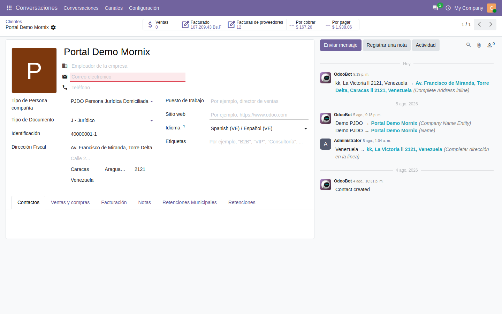

# Primeros pasos

Qué hay que dejar configurado antes de emitir la primera factura, y en qué orden.

## Antes de nada: el plan de cuentas

La localización no trae plan contable propio: usa el venezolano que aporta el
módulo `l10n_ve` de Odoo. Sin él no hay cuentas ni diarios, y nada de lo demás
funciona.

Se carga una sola vez, en **Contabilidad → Configuración → Ajustes**, en el
apartado del paquete de localización fiscal.

**Los tipos de cuenta los pone la localización.** La plantilla venezolana que
trae Odoo 20 deja casi todas las cuentas (236 de 278) como «Activo corriente»,
sean pasivos, patrimonio, ingresos o gastos, y con eso ni el Balance General ni
el Estado de Resultados ni el cierre de ejercicio salen bien. Al cargar el plan,
la localización tipifica cada cuenta por su código —1 activo, 2 pasivo, 3
patrimonio, 4 cuentas de orden, 5 ingresos, 6 costos, 7 gastos, 9 otros
ingresos y egresos— y carga los nombres en español. Las cuentas por cobrar, por
pagar, caja y bancos no se tocan.

Si el plan ya estaba cargado antes de esta versión, el equipo técnico corre el
retipado una vez (ficha técnica, §6.36); ya se hizo en `odoo20` y en `auromin`.

## Datos de la compañía

En **Ajustes → Compañías**:

| Campo | Para qué sirve |
|---|---|
| RIF | Sale en todos los comprobantes y en los archivos para el SENIAT |
| Moneda referencial | La divisa en la que se llevan los importes en paralelo (normalmente USD) |
| Agente de retención de IVA | Marca si la compañía retiene IVA a sus proveedores |
| Porcentaje de retención | 75 % o 100 %, según la providencia que le aplique |

El RIF se escribe con guiones: `J-12345678-9`. La validación comprueba el
formato y el dígito verificador.

## Contactos

Cada cliente y cada proveedor necesita, como mínimo:

- **Tipo de documento** y **Identificación**: son las dos mitades del RIF. Se
  escriben por separado y el sistema los une.
- **Tipo de persona**: jurídica domiciliada, jurídica no domiciliada, natural
  residente o natural no residente. **De esto depende el cálculo del ISLR**, así
  que un tipo mal puesto retiene de menos o de más.

En la pestaña **Retenciones** se indica si el contacto es agente de retención de
IVA y su porcentaje.

## Diarios

La localización necesita diarios propios, además de los de ventas y compras:

| Diario | Para qué |
|---|---|
| Retención de IVA (compras) | Asienta lo retenido a proveedores |
| Retención de ISLR (compras) | Ídem, para ISLR |
| Retención municipal | Los comprobantes del impuesto municipal |

Cada uno lleva su **cuenta contable** y su **secuencia** de numeración. Sin
secuencia, el comprobante no puede numerarse y la retención no se confirma.

## Numeración de facturas y control

En el diario de ventas se configuran dos secuencias distintas:

- **Número de factura**: el correlativo fiscal del documento.
- **Número de control**: el que exige la normativa, impreso por la imprenta
  autorizada.

Son independientes: pueden ir desincronizadas y es normal que lo estén.

> En las facturas de **proveedor**, ambos números se teclean a mano: vienen
> impresos en el documento que entrega el proveedor. Odoo solo genera correlativo
> para lo que emite la compañía.
