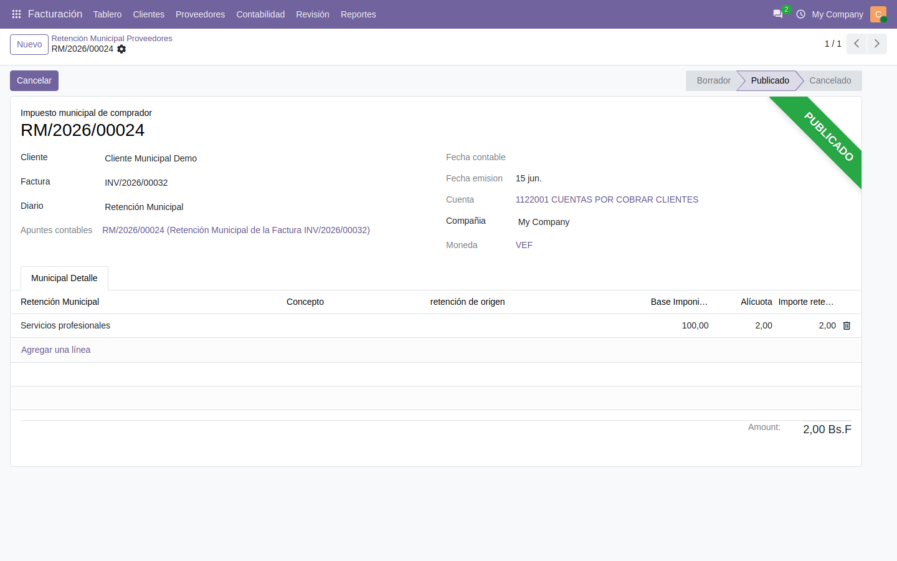

# Retención municipal

El impuesto sobre actividades económicas que retienen (o que se retiene) según
la ordenanza de cada alcaldía.

## Qué hay que configurar

1. **Activar la retención municipal** en Ajustes.
2. **Dar de alta la alcaldía**, con su número de licencia de actividades
   económicas.
3. **Cargar los conceptos**: cada uno con su código de actividad y su alícuota.
   Son datos de la ordenanza del municipio, así que no vienen precargados.
4. **Un diario de retención municipal**, con su cuenta contable y su secuencia.
5. En el **contacto**, marcar que está sujeto a retención municipal e indicar
   los diarios de venta y de compra.

## El flujo

1. En la línea de la factura se indica el **concepto municipal**.
2. Al publicar la factura, si el contacto está sujeto, se genera el comprobante
   con una línea por concepto.
3. El comprobante toma número, genera su asiento y **se concilia con la
   factura**: el saldo pendiente baja por lo retenido.

Desde la factura, el botón **Retención Municipal** lleva al comprobante.

## La base imponible

Cada concepto retiene **sobre la base de sus propias líneas**, no sobre el total
de la factura. Con dos conceptos en una misma factura, cada uno aplica su
alícuota a lo que le corresponde.

En facturas en divisa, la base se toma en bolívares **a la tasa de la factura**,
la misma con la que se asentó, no la del día en que se genera la retención.

## Deshacer

Devolver la factura a borrador deshace el comprobante y su asiento. Al volver a
publicarla se genera uno nuevo, con número nuevo.

## El reporte del período

En **Informes de Venezuela → Reporte de Retenciones Municipales**: se elige el
rango de fechas y si se quieren las de clientes, las de proveedores o ambas.

## El proveedor lo ve en su portal

En **Mi cuenta → Retenciones municipales**. Solo aparecen las que le hemos
practicado nosotros.
