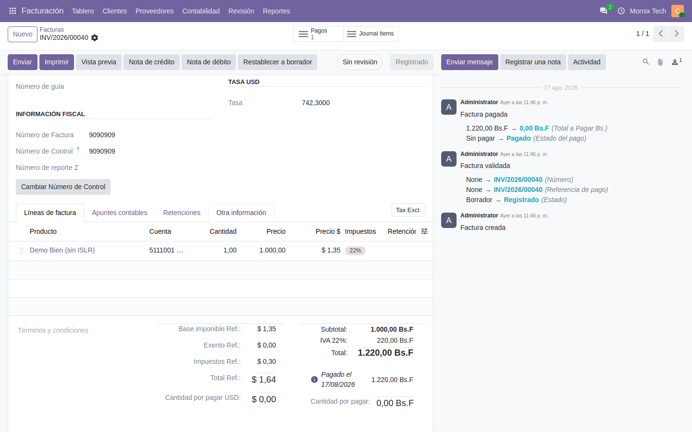

# Doble moneda

Cómo conviven el bolívar y la divisa en las facturas y en los saldos.

## La moneda referencial

Se configura una vez por compañía. Es la divisa en la que se llevan los importes
en paralelo al bolívar, normalmente el dólar.

## En la factura

Cada factura muestra su desglose de IVA por alícuota **siempre en bolívares**,
sea cual sea la moneda en la que se emitió. Junto a cada base va su impuesto, y
al final el total del documento.

La tasa aplicada se guarda **en la propia factura**: es la que se usó al
asentarla, y no cambia aunque la tasa del día cambie después. Todo lo que se
calcule sobre esa factura —retenciones, libros, reportes— usa esa misma tasa.

## Saldos del contacto en divisa

En la ficha del contacto, dos botones muestran el **total por cobrar** y el
**total por pagar** convertidos a la moneda referencial. Al pulsarlos se abren
los documentos que siguen abiertos.

El cálculo va apunte por apunte: los que ya están en la divisa se suman
directamente, y los demás se convierten con la tasa de su fecha. No es una
conversión del total al cambio de hoy.

## Diferencial cambiario en la moneda secundaria

Al cobrar una factura en bolívares semanas después de emitirla, en Bs queda
saldada sin más (mismos montos), pero cada apunte lleva su valor en divisa a la
tasa de **su** fecha: la cuenta quedaba abierta en dólares y el balance
comparado en USD no cuadraba.

Ahora, al conciliarse por completo un documento, si queda residuo en la moneda
secundaria el sistema genera solo un **asiento de diferencial en divisa**:

- Vale **cero en bolívares** — no toca la contabilidad legal ni los libros
  fiscales.
- Lleva el ajuste en divisa contra las cuentas de ganancia o pérdida cambiaria
  de la compañía.
- Se ve en el diario de diferencial cambiario, con la referencia de los
  documentos que lo originaron.

El diferencial en Bs que genera Odoo (el de las facturas en divisa) vale cero
en el libro en dólares, por la razón espejo: es un artefacto de la conversión.
Con ambas piezas, **toda cuenta conciliada cierra en las dos monedas**.
