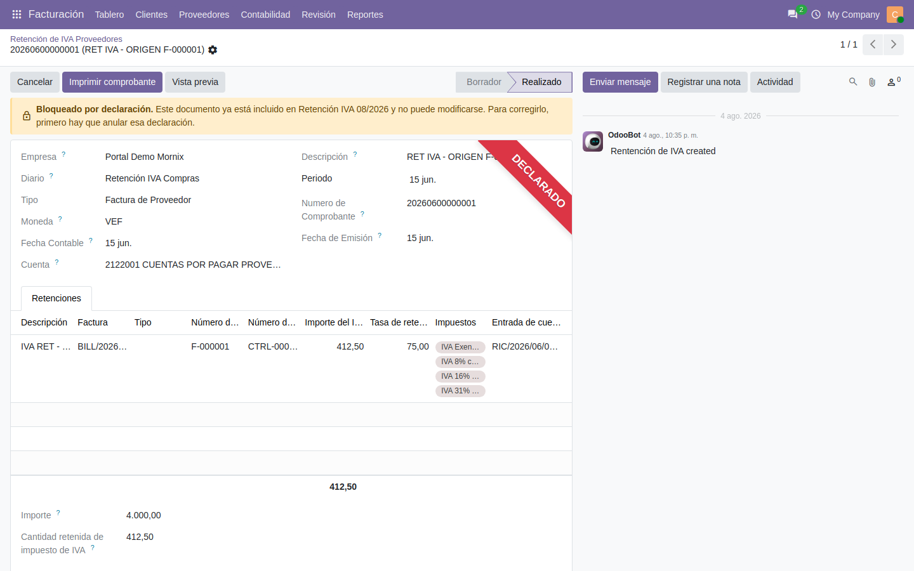

# Declaraciones y bloqueo

Qué pasa cuando se declara algo al SENIAT, y por qué después no se puede tocar.

## Los cuatro documentos que se declaran

| Documento | Dónde | Qué bloquea |
|---|---|---|
| TXT de retenciones de IVA | Informes de Venezuela → Generar TXT IVA | Los comprobantes de retención de IVA incluidos |
| XML de retenciones de ISLR | Informes de Venezuela → Generar archivo XML | Los comprobantes de ISLR incluidos |
| Libro fiscal de ventas | Informes de Venezuela → Libro fiscal de ventas | Las facturas de venta incluidas |
| Libro fiscal de compras | Informes de Venezuela → Libro fiscal de compras | Las facturas de compra incluidas |

## Qué significa «bloqueado»

Un documento declarado **no se puede modificar ni devolver a borrador**. Al
abrirlo aparece un aviso en la cabecera diciendo en qué declaración quedó
incluido, y una cinta roja de **DECLARADO** en la esquina.

Es a propósito: lo que se entregó al SENIAT y lo que está en el sistema tienen
que decir lo mismo. Si el documento cambiara después, dejarían de coincidir sin
que nadie se enterara.

## Cómo corregir algo ya declarado

1. Abrir la declaración que lo incluye — el aviso del documento dice cuál es.
2. Devolverla a borrador. Eso libera **todos** los documentos de esa
   declaración.
3. Corregir lo que haga falta.
4. Volver a generar y confirmar la declaración.

> Ojo: al devolver a borrador se liberan todos los documentos de esa
> declaración, no solo el que se quiere corregir. Conviene hacerlo cuando no
> haya nadie más trabajando sobre ese período.

## El bloqueo va por documento, no por fecha

Una factura nueva con fecha dentro de un período ya declarado **no nace
bloqueada**: no estaba en el libro cuando se confirmó, así que no se entregó.

Lo que hay que hacer con ella es regenerar la declaración de ese período, para
que entre. El sistema no lo hace solo, porque no puede saber si esa factura es
un olvido que hay que declarar o un error que se va a anular.

- Antes de cerrar un período, conviene revisar que no queden facturas del
  período fuera de la declaración.
