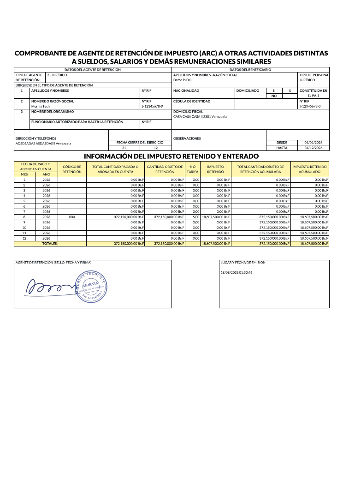

# ARC — comprobante anual de retenciones

El resumen anual de lo retenido a un proveedor por ISLR, que se le entrega para
su declaración de renta.

## Generarlo

En **Contabilidad → Informes de Venezuela → Listado de ARC Proveedores**:

| Campo | Qué poner |
|---|---|
| Compañía | La que practicó las retenciones |
| Fecha de inicio y fin | Normalmente el año fiscal completo |
| Proveedor | Uno solo: el ARC es por proveedor |
| Todos | Marcado, para incluir todos los conceptos |
| Concepto | Si se desmarca «Todos», los conceptos concretos a incluir |

Sale un PDF con el detalle mes a mes: código de concepto, cantidad pagada,
cantidad sujeta a retención, porcentaje e impuesto retenido, con los acumulados
del año.

## Qué entra

Solo los comprobantes de retención de ISLR **cerrados** («Realizado») del
proveedor y del rango indicado. Los que estén en borrador o confirmados sin
cerrar no aparecen: todavía no son definitivos.

Si no hay ninguno, el asistente avisa en vez de sacar un PDF vacío.

## Errores frecuentes

| Síntoma | Causa |
|---|---|
| «No hay retenciones en estado Realizado» | Los comprobantes del período no se han cerrado, o el rango de fechas no es el correcto |
| Faltan meses | Esos meses no tienen comprobantes cerrados |
| Un concepto sale con el código de otro | El concepto no tiene tarifas configuradas. Revisar en Configuración Fiscal de Venezuela → Tasas de retención de ingresos |
