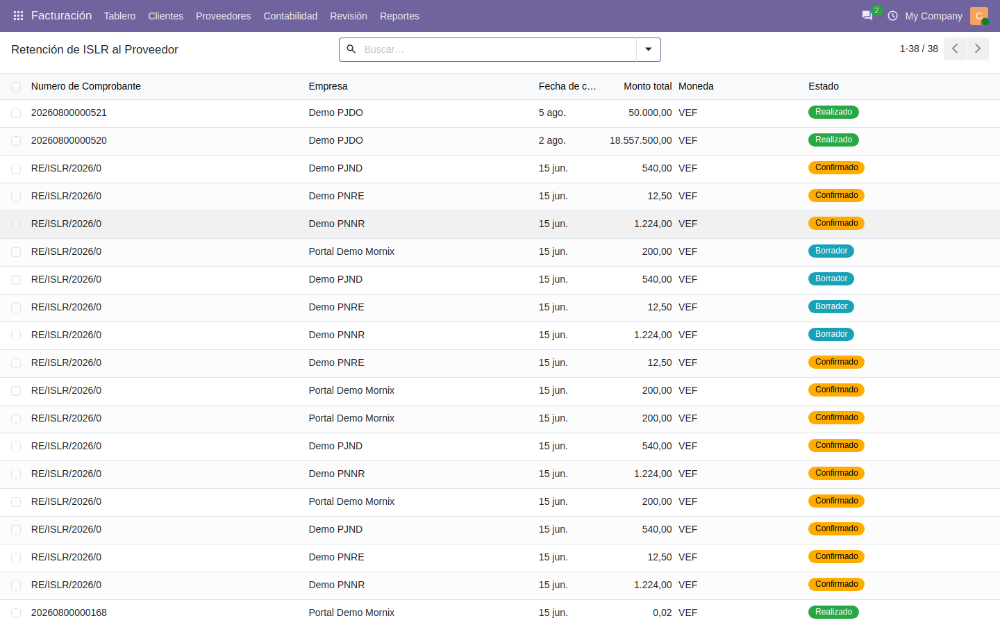
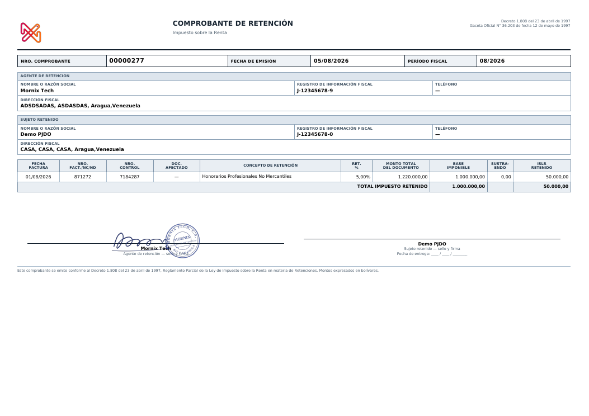

# Retención de ISLR

El comprobante de retención del impuesto sobre la renta, y por qué el tipo de
persona del contacto es lo que más importa.

## De qué depende el cálculo

De tres cosas, en este orden:

1. **El concepto** asociado al producto o servicio facturado.
2. **El tipo de persona** del proveedor: jurídica domiciliada, jurídica no
   domiciliada, natural residente o natural no residente.
3. **La tarifa** vigente para esa combinación, que incluye el porcentaje de
   retención, el porcentaje sujeto y el **sustraendo**.

> Un tipo de persona mal puesto en el contacto produce una retención
> silenciosamente equivocada: no da error, simplemente aplica otra tarifa.
> Merece la pena revisarlo antes de la primera factura de cada proveedor.

## Conceptos en el producto

Cada producto lleva su concepto de ISLR. Los que no están sujetos llevan el
concepto «no aplica». Si el producto no tiene concepto, esa línea no retiene.

## El flujo

1. Publicar la factura de proveedor.
2. **Generar la retención** desde la factura.
3. **Confirmar** el comprobante.
4. **Cerrarlo**. Son dos pasos distintos: el número de comprobante fiscal se
   asigna en el segundo, al cerrar, no al confirmar.

Desde la factura, el botón **Retención ISLR** lleva al comprobante.

## El XML para el SENIAT

En **Contabilidad → Informes de Venezuela**, el asistente de XML de ISLR genera
el archivo del período con los comprobantes cerrados.

Igual que con el TXT de IVA, **lo que entra en el XML queda bloqueado**.

## El ARC

El comprobante anual de retenciones, que se entrega a cada proveedor. Está en
**Informes de Venezuela → Listado de ARC Proveedores**: se elige el proveedor,
el rango de fechas y los conceptos, y sale el PDF con el detalle mes a mes.

## El proveedor lo ve en su portal

Igual que con el IVA: **Mi cuenta → Retenciones de ISLR**, con el listado y la
vista previa del comprobante.
