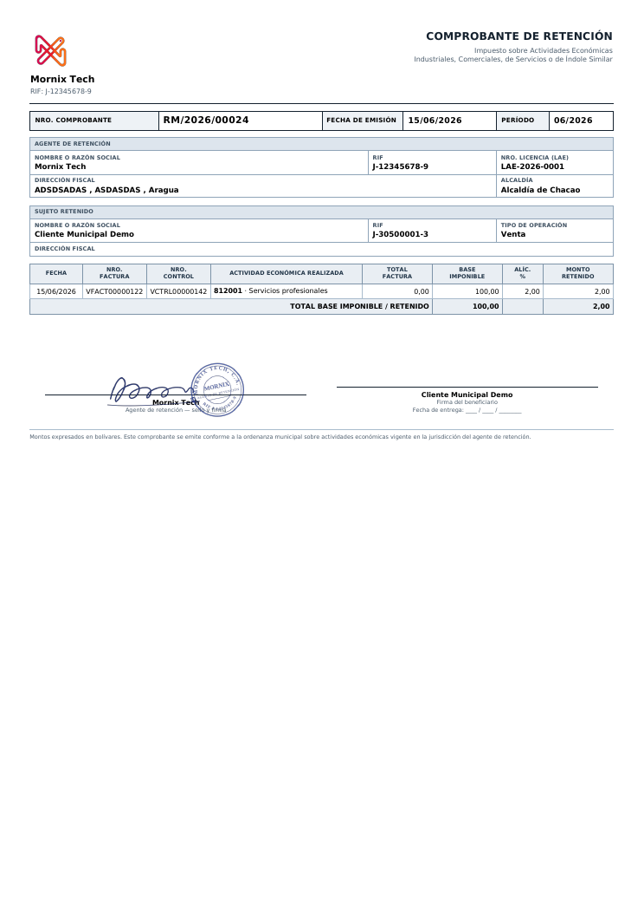

# Retención municipal

El impuesto sobre actividades económicas que retienen (o que se retiene) según
la ordenanza de cada alcaldía.

## Qué hay que configurar

1. **Activar la retención municipal** en Ajustes.
2. **Dar de alta la alcaldía**, con su número de licencia de actividades
   económicas.
3. **Cargar los conceptos**: cada uno con su código de actividad y su alícuota.
   Son datos de la ordenanza del municipio, así que no vienen precargados.
4. **Un diario de retención municipal**, con su cuenta contable y su secuencia.
5. En el **contacto**, marcar que está sujeto a retención municipal e indicar
   los diarios de venta y de compra.

## El flujo

1. En la línea de la factura se indica el **concepto municipal**.
2. Al publicar la factura, si el contacto está sujeto, se genera el comprobante
   con una línea por concepto.
3. El comprobante toma número, genera su asiento y **se concilia con la
   factura**: el saldo pendiente baja por lo retenido.

Desde la factura, el botón **Retención Municipal** lleva al comprobante.

## La base imponible

Cada concepto retiene **sobre la base de sus propias líneas**, no sobre el total
de la factura. Con dos conceptos en una misma factura, cada uno aplica su
alícuota a lo que le corresponde.

En facturas en divisa, la base se toma en bolívares **a la tasa de la factura**,
la misma con la que se asentó, no la del día en que se genera la retención.

## El comprobante manual

Cuando la retención no se generó sola —una factura anterior a la configuración,
o un concepto que no estaba en la línea—, se crea a mano desde **Retenciones
municipales → Nuevo**: al elegir la **Factura**, las líneas se llenan solas,
una por concepto municipal, con la **base imponible ya convertida a
bolívares** y su alícuota; solo hay que revisar y **Publicar**.

**Por qué no deja publicar en cero**: un comprobante con importe 0,00 se
numeraba, generaba su asiento con las dos líneas vacías y quedaba enlazado a la
factura sin retener nada. Ahora avisa: *«La retención municipal está en 0,00:
revise la base imponible y la alícuota»*.

## Deshacer

**Cancelar** en el comprobante deshace su asiento y lo deja cancelado. La
factura **no se toca**: está cobrada y quizá declarada, y un comprobante mal
hecho no es motivo para anularla (antes el sistema exigía cancelar la factura
primero).

Devolver la factura a borrador también deshace el comprobante y su asiento. Al
volver a publicarla se genera uno nuevo, con número nuevo.

## La nota de crédito

La retención de una nota de crédito **invierte** la de su factura: si la
factura abonó la cuenta del cliente y cargó la de retención, la nota de crédito
hace lo contrario, y el saldo del cliente queda en cero. En el **Reporte de
Retenciones Municipales** la fila de la nota de crédito sale con total, base y
retenido en negativo.

**Ejemplo.** Factura de 200.000 Bs con retención municipal del 2 % = 4.000 Bs:
el asiento abona 4.000 a la cuenta por cobrar del cliente. Nota de crédito por
la misma factura: el asiento **carga** 4.000 a la cuenta por cobrar; los dos
apuntes se compensan y el cliente no debe ni se le debe nada por ese concepto.

## El reporte del período

En **Informes de Venezuela → Reporte de Retenciones Municipales**: se elige el
rango de fechas y si se quieren las de clientes, las de proveedores o ambas.

## El proveedor lo ve en su portal

En **Mi cuenta → Retenciones municipales**. Solo aparecen las que le hemos
practicado nosotros.
