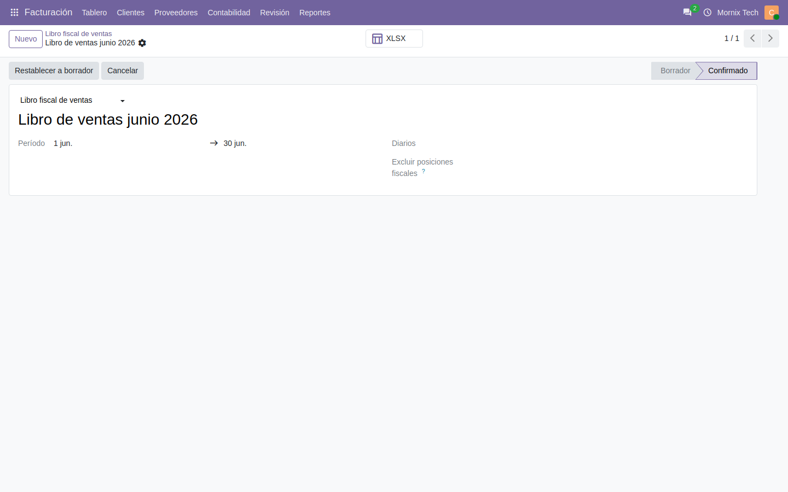

# Libros de compras y de ventas

Los libros que exige el SENIAT, y qué revisar antes de darlos por buenos.

## Generarlos

En **Contabilidad → Informes de Venezuela → Libros fiscales**:

1. Se elige el tipo (compras o ventas) y el período.
2. Se generan las líneas: entran todas las facturas y notas de crédito
   publicadas del período.
3. Se descarga en Excel.

## Antes de confirmar: facturas sin clasificar

El libro reparte cada factura por alícuota de IVA: exenta, reducida, general y
adicional. Para saber en cuál va, mira **cómo está clasificado cada impuesto**.

**Un impuesto sin clasificar aporta cero al libro, sin avisar**: la factura sale
listada con las columnas en blanco y el total no cuadra.

Por eso, al confirmar, el sistema comprueba si hay facturas con impuestos sin
clasificar y las lista. Si aparece alguna, hay que clasificar el impuesto en
**Contabilidad → Configuración → Impuestos** y volver a generar.

## El bloqueo

**Confirmar un libro bloquea las facturas que entraron en él.** No se pueden
modificar ni devolver a borrador: ya están declaradas. Cada factura muestra un
aviso con la declaración que la incluye.

Para corregir una factura declarada hay que devolver el libro a borrador
primero. Eso libera todas las facturas de ese libro.

> El bloqueo va por **documento incluido**, no por fecha. Una factura nueva con
> fecha dentro de un período ya declarado **no** nace bloqueada: no estaba en el
> libro cuando se confirmó. Lo que hay que hacer con ella es regenerar el libro.

## Resumen de ventas y compras

Aparte de los libros, hay un **Resumen** que agrupa el período por alícuota y lo
compara con el período anterior. Sirve para cuadrar antes de declarar.

El período anterior se deduce del rango pedido: si se piden 16 días o menos, se
entiende quincena y compara con la quincena anterior; si es más, compara con el
mes anterior.
