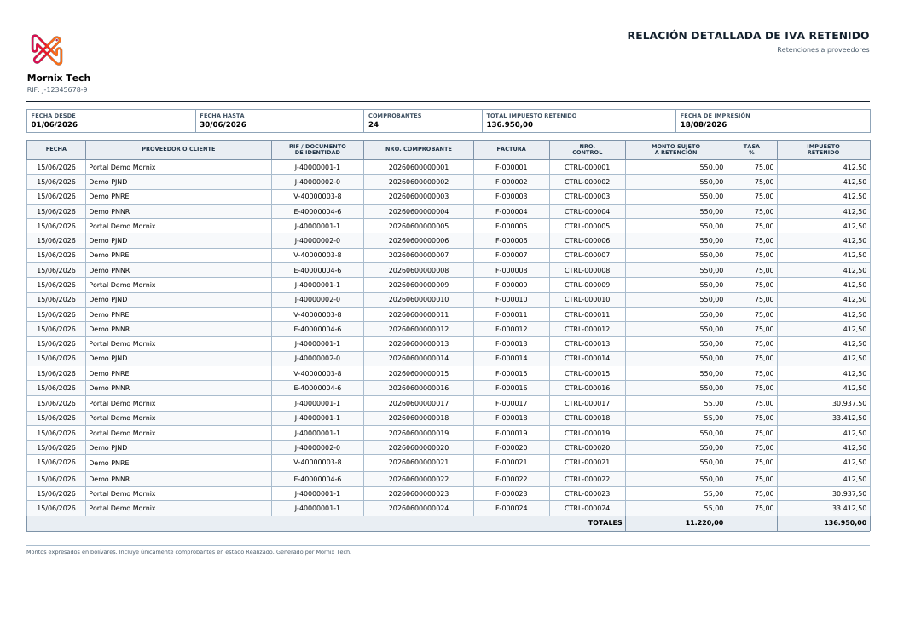
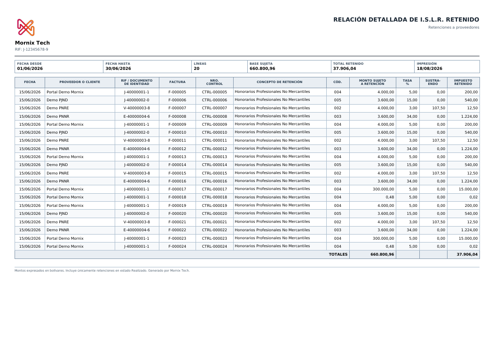
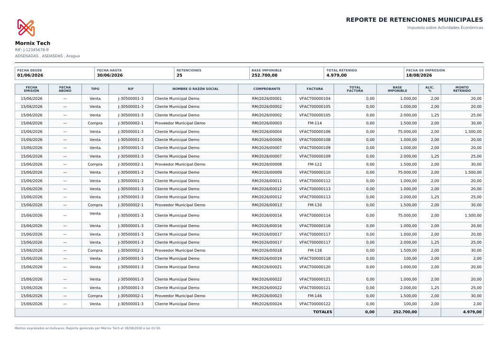

# Resumen y listados

Los informes que sirven para cuadrar antes de declarar, o para revisar lo hecho.

## Resumen de ventas y compras

Agrupa el período por alícuota y lo compara con el período anterior. Es el
informe que se usa para cuadrar antes de presentar.

El **período anterior se deduce del rango pedido**: si se piden 16 días o
menos, se entiende quincena y compara con la quincena anterior; si es más,
compara con el mes anterior.

> Compruébalo la primera vez: si el rango pedido no es exactamente una quincena
> o un mes, la comparación puede no ser la que esperas.

## Listado de retenciones de IVA

**Informes de Venezuela → Listado Retención IVA**. Se elige el rango de fechas
y si se quieren las de clientes, las de proveedores o las de un contacto
concreto. Sale en Excel.

Sirve para revisar lo emitido en un período sin abrir comprobante por
comprobante.

## Listado de retenciones de ISLR

**Informes de Venezuela → Listado Retención ISLR**. Igual que el anterior, con
el rango de fechas y el filtro de clientes o proveedores.

## Reporte de retenciones municipales

**Informes de Venezuela → Reporte de Retenciones Municipales**. Rango de fechas
y si son de clientes, de proveedores o ambas. Hay que marcar al menos una de
las dos: si no, el asistente avisa en vez de sacar las dos mezcladas.

## Cuál usar para qué

| Necesitas | Usa |
|---|---|
| Cuadrar el IVA antes de declarar | Resumen de ventas y compras |
| Entregar al SENIAT | Libros fiscales y TXT/XML |
| Revisar lo retenido en un período | Los listados en Excel |
| Dar a un proveedor su comprobante | El PDF del comprobante, o su portal |
| Dar a un proveedor el resumen del año | El ARC |
