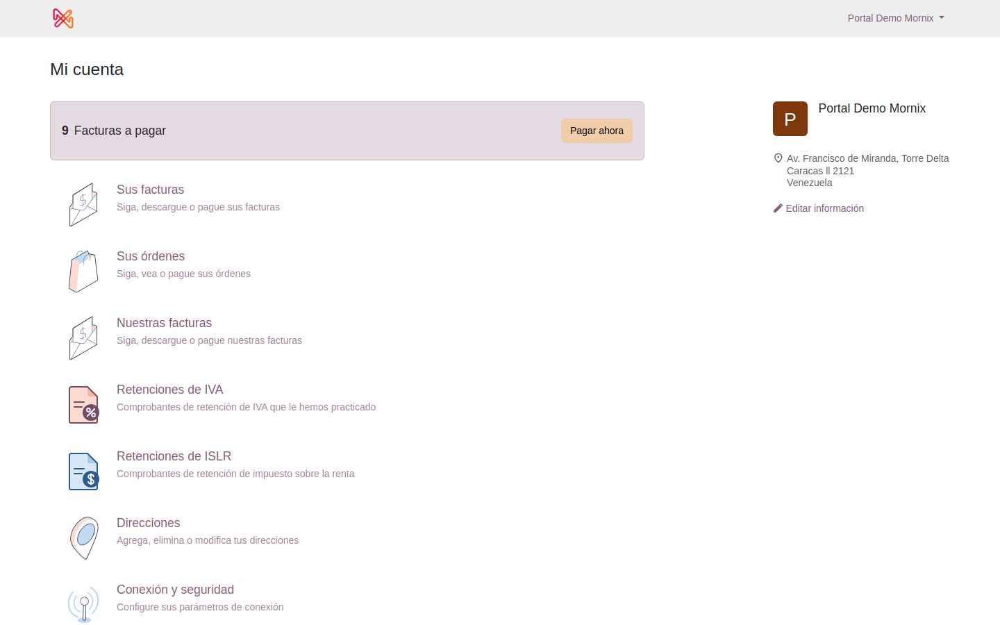
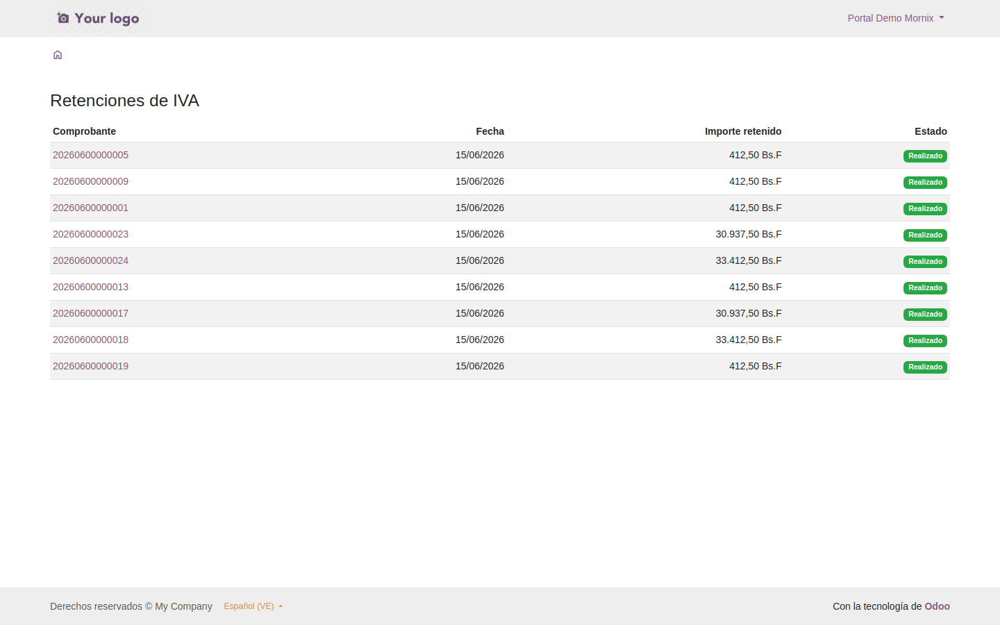

# El portal del proveedor

Un proveedor con acceso al portal puede consultar y descargar sus comprobantes
sin pedirlos por correo.

## Qué ve

En **Mi cuenta** aparecen tres apartados, cada uno con su contador:

- **Retenciones de IVA**
- **Retenciones de ISLR**
- **Retenciones municipales**

Cada uno lista sus comprobantes con fecha, importe retenido y estado. Al pulsar
uno se abre la vista previa, con el comprobante tal como sale impreso y botones
para descargarlo o imprimirlo.

> Un usuario **interno** con permisos de contabilidad ve todos los
> comprobantes desde su portal, igual que ve todas las facturas. Los apartados
> solo aparecen cuando hay algo que enseñar: si el contador está en cero, la
> tarjeta se oculta —comportamiento del portal de Odoo, no de la localización—.

## Qué NO ve

| Regla | Por qué |
|---|---|
| Solo los suyos | Los de su contacto y los de sus sucursales, nada más |
| Solo los confirmados | Un borrador todavía puede cambiar de importe |
| Solo los que emitimos nosotros | Las retenciones que **él** nos practica las documenta él: ese comprobante no es nuestro |
| Solo lectura | El portal no modifica nada |

## Enviarle el enlace

En el comprobante, el botón **Vista previa** abre exactamente lo que ve el
proveedor. Ese enlace lleva un token propio del documento, así que **funciona
sin iniciar sesión**: se le puede pasar por correo a alguien que no tenga
usuario en el sistema.

El botón solo aparece en las retenciones a proveedores y con el comprobante ya
confirmado.

## Dar acceso a un proveedor

Desde su ficha de contacto, con la acción de conceder acceso al portal, igual
que para que vea sus facturas. No hace falta configurar nada más: los
apartados de retenciones aparecen solos.
