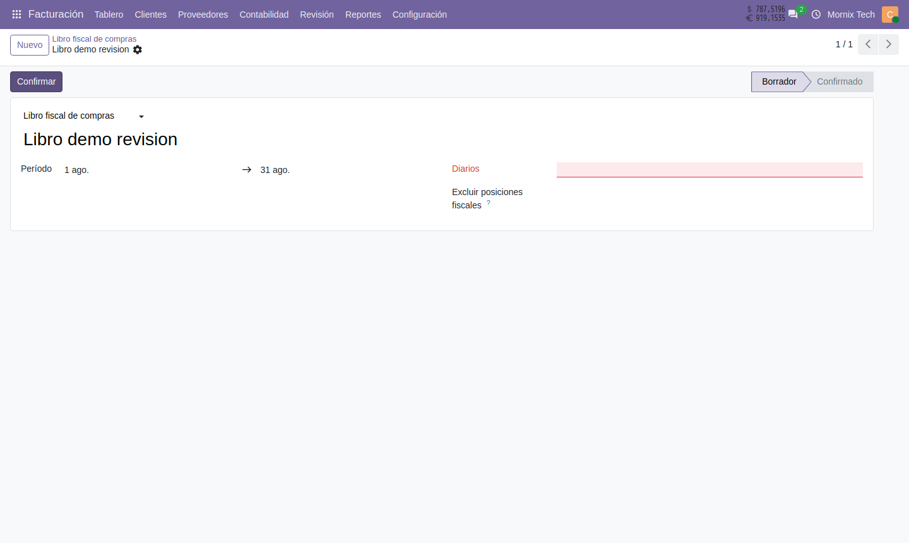
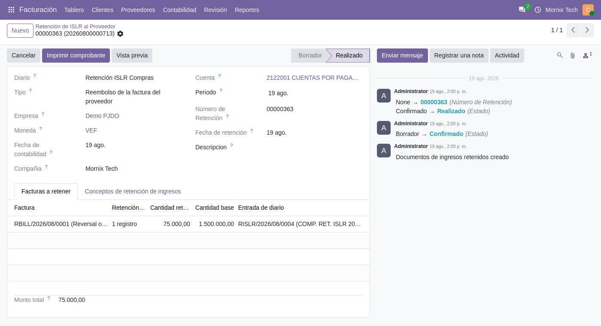
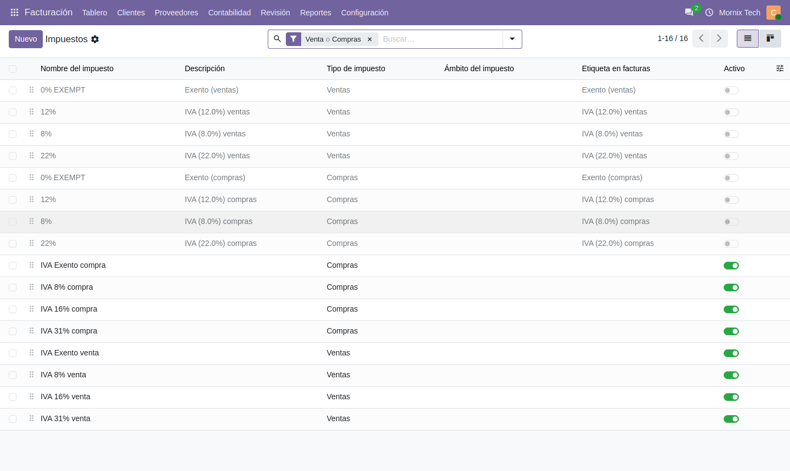
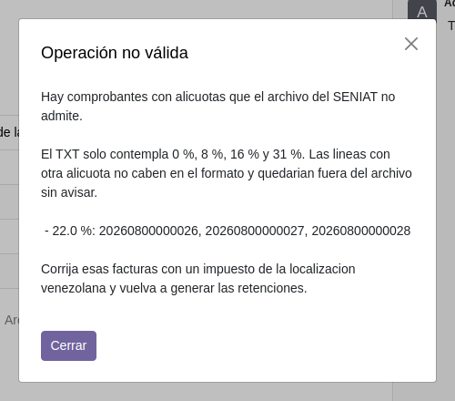
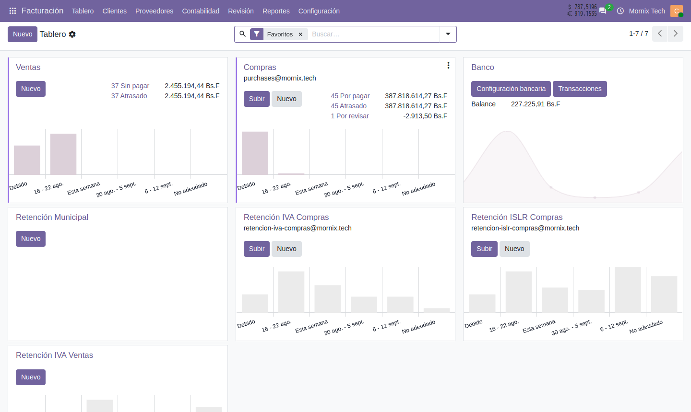
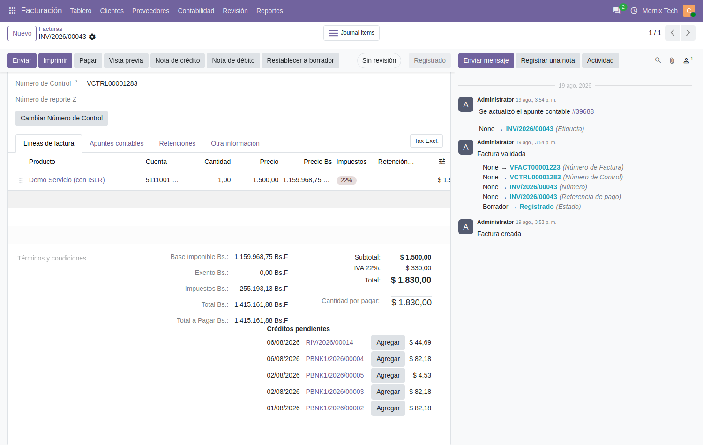
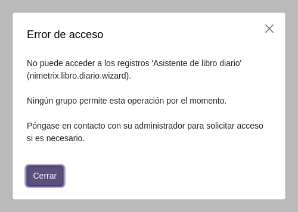
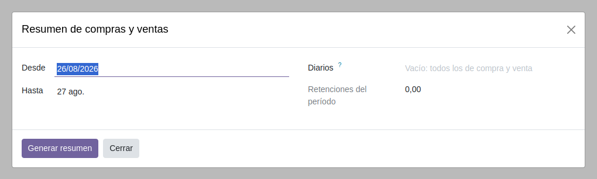
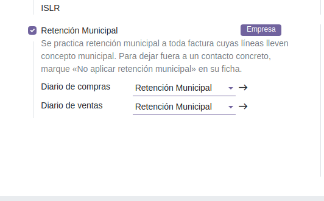
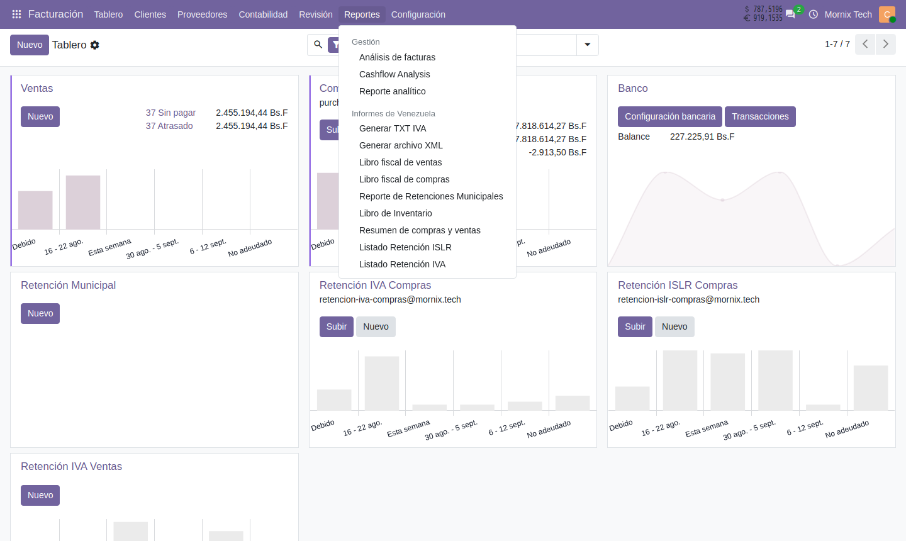

# Respuesta a la revisión de la localización

Este documento recoge, punto por punto, qué se hizo con cada observación del
documento **«Revisión de la localización»**.

Un resumen antes de entrar en detalle:

| # | Observación | Estado |
|---|---|---|
| 1 | El libro fiscal se confirma sin diarios y luego no vuelve a borrador | Resuelto |
| 2 | El ISLR pide dos validaciones; dejar una, como el IVA | Resuelto |
| 3 | No se generan las líneas del TXT de IVA | Resuelto |
| 4 | No se pueden crear diarios nuevos | Explicado: es así en Odoo |
| 5 | La factura en dólares no muestra el equivalente en bolívares | Resuelto |
| 6 | Libro diario, sin migrar | Migrado |
| 7 | Resumen de compras y ventas, sin migrar | Estaba migrado: le faltaba el menú |
| 8 | Prorrateo de IVA, sin poder validar | Resuelto con el punto 7 |
| 9 | IGTF sin tener que crear un producto | Pendiente |
| 10 | Retención municipal: llevarla a los ajustes de la compañía | Resuelto |
| 11 | Los impuestos, con los porcentajes correctos | Resuelto |

Dos de las observaciones —la 3 y la 11— resultaron ser **el mismo problema**, y
otra —la 7— resultó no ser tal.

---

## 1. El libro fiscal ya no se queda atrapado

**Qué pasaba.** El libro se dejaba confirmar sin diarios seleccionados y a
partir de ahí no había salida: el campo Diarios es obligatorio, pero también
de solo lectura fuera de borrador. El registro no se podía guardar —falta un
obligatorio— ni corregir —está bloqueado—, así que el botón «Restablecer a
borrador» nunca llegaba a ejecutarse.

**Qué se hizo.** La obligatoriedad vivía únicamente en la pantalla. Ahora la
comprueba el propio botón de confirmar, y el aviso explica por qué:

> Seleccione al menos un diario antes de confirmar el libro. Sin diarios el
> libro no sabe qué facturas declarar, y una vez confirmado el campo queda
> bloqueado.

Los libros que ya estuvieran atrapados vuelven a borrador con normalidad.

---

## 2. El ISLR se confirma en un solo paso

**Qué pasaba.** «Confirmar» solo movía el estado: no numeraba, no generaba
asiento y no tocaba las facturas. Todo el trabajo real esperaba a un segundo
botón, «Hecho». Un comprobante podía quedarse indefinidamente confirmado a
ojos del usuario pero **sin número ni asiento contable**.

**Qué se hizo.** Confirmar hace ahora el ciclo completo, igual que en la
retención de IVA. La barra de estado va directa de **Borrador a Realizado**.

> **Los 12 comprobantes que quedaron a medias.** Al hacer el cambio había doce
> comprobantes en estado «Confirmado». Borrar el botón «Hecho» los habría
> dejado sin forma de completarse, así que el botón sobrevive **solo para
> ellos**, con un aviso que lo explica. En los comprobantes nuevos no aparece.

---

## 3 y 11. El TXT salía vacío porque el IVA era del 22 %

Son la misma cosa, y conviene leerlas juntas.

**Qué pasaba.** El archivo del SENIAT solo contempla las alícuotas legales:
**0 %, 8 %, 16 % y 31 %**. Una línea al 22 % no cabe en ninguna columna del
formato, así que el generador no sumaba nada, no creaba fila y producía un
archivo vacío **sin un solo aviso**. Se entregaba creyendo que ese período no
había tenido retenciones.

No había cambiado ninguna configuración: el TXT de junio-julio tiene 72 líneas
porque aquellas facturas van al 16 %.

**De dónde salía el 22 %.** La plantilla contable genérica de Odoo instala sus
propios impuestos —12 %, 22 %, 8 %, 0 % EXEMPT— junto a los de la localización.
Convivían en la misma lista, sin nada que los distinguiera al facturar.

**Qué se hizo.** Los genéricos quedan desactivados. No se borran: las facturas
que ya los usan conservan su asiento; lo que desaparece es la posibilidad de
volver a elegirlos.

Y el generador **ya no calla**. Si encuentra una alícuota que no cabe en el
formato, se detiene y dice cuáles son los comprobantes afectados:

> **Atención.** Las facturas ya emitidas al 22 % siguen mal y el TXT las
> seguirá señalando. Hay que rehacerlas con un impuesto de la localización. En
> la base había 23 apuntes afectados.

---

## 4. Los diarios sí se crean, pero desde el Tablero

**Qué pasa.** No es un fallo de la localización ni de permisos. La lista de
diarios de *Configuración* lleva en el propio Odoo 20 una marca que oculta el
botón «Nuevo» a propósito.

El usuario tiene todos los permisos necesarios: se comprobó creando un diario
sin ningún problema.

**Dónde se crean.** En el **Tablero de Contabilidad**, que es donde Odoo espera
que se haga:

Si prefieren tener el botón también en la lista de Configuración, es un cambio
pequeño; va contra la convención de Odoo, así que se deja a su criterio.

---

## 5. La factura en dólares ya muestra los bolívares

**Qué pasaba.** Los totales en bolívares se calculaban y estaban puestos en los
pedidos de venta y de compra, pero se habían retirado del pie de la factura por
considerarse repetidos con el «Desglose de IVA». Ese desglose vive en otra
pestaña, así que en la pantalla de totales una factura en dólares no enseñaba
su equivalente en bolívares por ningún lado.

**Qué se hizo.** Vuelven al pie, junto a los totales en divisa. Son
informaciones distintas: aquí el total a pagar, en el desglose el reparto por
alícuota que alimenta el libro fiscal.

---

## 6. Libro diario

**Qué pasaba.** No estaba migrado. El módulo de v18 dependía además de
`account_accountant`, que es de Odoo Enterprise.

**Qué se hizo.** Se migró sin esa dependencia —era nominal: el cálculo es SQL y
la salida hoja de cálculo o PDF, nada usaba Enterprise—. Está en
**Facturación → Reportes → Informes de Venezuela → Libro Diario**, sale en
bolívares o en divisa, y en PDF y en XLSX.

Cuatro cosas del código de v18 lo habrían roto en la versión nueva, y todas
eran silenciosas hasta el momento de generar. La más delicada: el código de
cuenta se tomaba sin mirar a qué compañía pertenecía, de modo que el libro de
una empresa podía imprimir los códigos de otra.

> **Una precisión.** Este informe agrupa **por cuenta contable** y suma débitos
> y créditos del período: es el formato que ya se usaba en v18. No es el libro
> diario cronológico, asiento por asiento, que describe el Código de Comercio.
> Si hiciera falta ese, es otro informe.

---

## 7 y 8. El resumen de compras y ventas ya estaba migrado

**Qué pasaba.** El informe funcionaba y generaba su hoja, pero **no tenía ni
acción ni menú**: desde la pantalla no existía, y por eso se daba por no
migrado.

**Qué se hizo.** Se le puso su entrada en **Informes de Venezuela**.

Con esto queda resuelto también el punto 8: el **prorrateo de IVA** de los
ajustes de la compañía se calcula dentro de este mismo informe, así que ya se
puede comprobar su efecto.

---

## 10. La retención municipal se configura una sola vez

**Qué pasaba.** Para dejarla operativa había que entrar en la ficha de **cada
contacto**, marcar una casilla y elegir dos diarios. Y por partida doble,
porque esos diarios eran distintos en cada compañía. El contacto que se
olvidaba no retenía y nadie se enteraba hasta la declaración; el que se
configuraba a medias generaba su retención con el diario vacío.

**Qué se hizo.** Ahora manda la compañía:

| Qué decide | Dónde vive |
|---|---|
| Si se practica retención municipal | Ajustes de la compañía |
| Con qué diarios se asienta | Ajustes de la compañía |
| Si a esta factura le toca | Que la línea lleve concepto municipal |
| Si a este contacto **no** | Casilla de exclusión en su ficha |

Que el disparo sea el **concepto municipal** no es un atajo: el impuesto sobre
actividades económicas depende de la actividad, que es justo lo que el concepto
identifica, no de a quién se factura.

La configuración anterior se conservó: los diarios que estaban en las fichas
subieron solos a la compañía correspondiente.

---

## 9. IGTF sin crear un producto

**Pendiente.** Es el único punto que queda. En el repositorio de v18 existe el
módulo `nimetrix_igtf`, que es el punto de partida.

---

## Menú de informes

Las dos entradas nuevas —Libro Diario y Resumen de compras y ventas— aparecen
junto a los informes que ya conocían:

