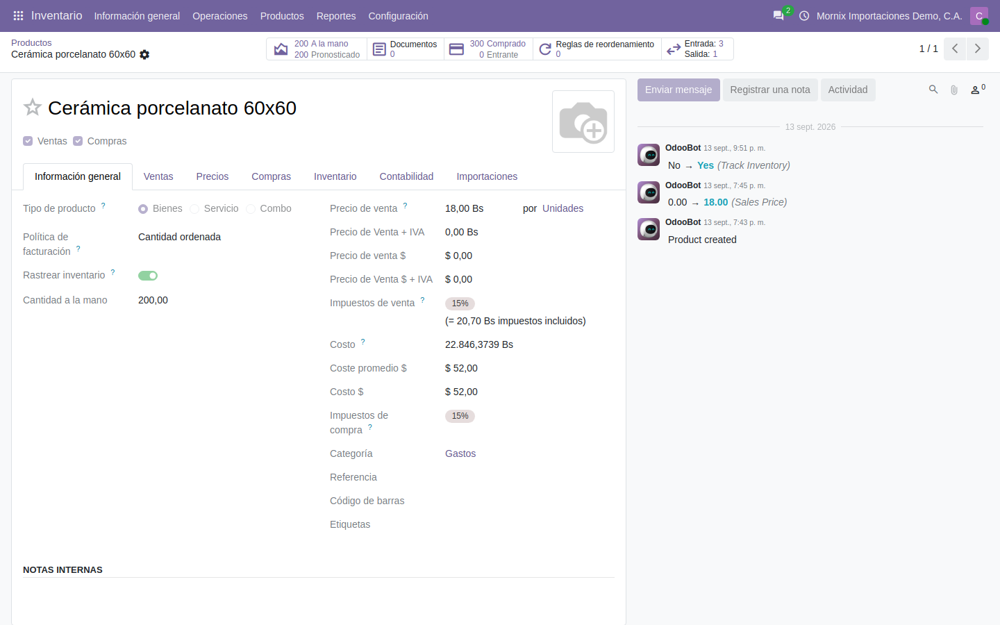

# El costo en divisa

Cuánto costó cada unidad **en dólares**, sin reconvertir bolívares a la tasa de
hoy: cada movimiento de inventario guarda su valor en divisa y la tasa con la
que entró, y de ahí sale el coste promedio en divisa del producto.

## Para qué

En Venezuela el costo en bolívares de una mercancía envejece en semanas: lo que
entró a 36,50 por dólar se lee, tres meses después, junto a compras a 40,00 y
nadie sabe ya cuánto costó «en dólares». Y las decisiones —el precio de venta,
el margen, reponer o no— se toman en dólares. El costo en divisa contesta
**cuánto costó de verdad**, en la moneda en la que se piensa.

## Por qué está hecho así

- **No es «costo en Bs ÷ tasa de hoy».** Eso es lo que hace cualquiera con una
  calculadora, y es lo que engaña: una baldosa que costó 18 $ cuando el dólar
  estaba a 36,50 (657 Bs) «vale» 16,43 $ cuando el dólar pasa a 40,00. No costó
  menos; cambió la tasa. Por eso cada movimiento guarda **su** valor en divisa
  y **su** tasa, una vez, y no se vuelve a tocar.
- **Sigue la valoración de Odoo 20**, no una tabla aparte. v20 quitó las capas
  de valoración y dejó el valor en el propio movimiento (`Valor`); el costo en
  divisa hace lo mismo (`Valor $`) y el coste promedio en divisa del producto se
  calcula igual que el de bolívares: lo que hay, entre lo que se tiene.
- **La tasa es la del documento**, no la del día del asiento. Una compra a
  36,50 vale sus dólares a 36,50 aunque se reciba tres días después; un flete
  facturado a 37,20 entra al costo a 37,20. Es la única forma de que el costo
  en divisa cuadre con lo que se pagó.
- **Vive en la localización** (`l10n_ve_mornix`), no en un módulo aparte: es
  parte de cómo se lleva el inventario en Venezuela, igual que el libro de
  inventario o las guías de despacho.

## 1. Dónde se ve

| Pantalla | Qué enseña |
|---|---|
| **Inventario → Productos → ficha**, junto a **Costo** | **Coste promedio $**: el valor en divisa de las existencias entre la cantidad disponible |
| **Inventario → Informes → Movimientos** (columnas opcionales) | **Valor $** y **Tasa** de cada movimiento valorado, junto al **Valor** en Bs |
| **Inventario → Informes → Valoración** → movimientos | Lo mismo, para cuadrar la valoración en las dos monedas |
| **Costos en destino**, líneas de gasto | **Tasa** y **Costo $** de cada gasto; en los ajustes, **Valor original $** y **Costo adicional $** |
| **Costo $** de la ficha (si está la doble moneda) | Se **mantiene igual al coste promedio $** en los productos con costo promedio o FIFO |

## 2. De dónde sale el valor en divisa de cada movimiento

| Movimiento | Valor $ | Tasa |
|---|---|---|
| **Entrada por compra** | Precio unitario en divisa de la línea de la orden (con su descuento) × cantidad recibida | La de la orden de compra |
| **Devolución de una venta** | Lo que valía la salida devuelta, a prorrata | La del día |
| **Otra entrada** (ajuste, transferencia) | Cantidad × coste promedio $ del producto; si no tiene, **Costo $** de la ficha; si tampoco, Bs ÷ tasa | La del día |
| **Salida** (venta, consumo, ajuste) | Cantidad × coste promedio $ del producto en ese momento | La del día |
| **Costo en destino** validado | Se **suma** a la entrada: lo que le tocó en divisa a cada producto | La de cada gasto (su factura) |

**Ejemplo, con la importación de la guía de importaciones** (tasa 36,50):

| Paso | Cantidad | Valor Bs | Valor $ | Tasa | Coste promedio $ |
|---|---:|---:|---:|---:|---:|
| Recepción de la compra (100 × 18 $) | +100 | 65.700,00 | 1.800,00 | 36,50 | 18,00 |
| Costo en destino: flete 2.500 $ + aduana 900 $ | — | +124.100,00 | +3.400,00 | 36,50 | **52,00** |
| Entrega a un cliente | −20 | 37.960,00 | 1.040,00 | 36,50 | 52,00 |
| **Existencia** | **80** | **151.840,00** | **4.160,00** | | **52,00** |

Y lo que pasa cuando cambia la tasa: una segunda compra de **100 × 20 $ a
40,00** entra por 80.000 Bs y 2.000 $. El coste promedio en divisa pasa a
(4.160 + 2.000) ÷ 180 = **34,22 $**; el de bolívares, a (151.840 + 80.000) ÷ 180
= 1.288,00 Bs. Dividir 1.288 entre la tasa de hoy (40,00) daría 32,20 $: **dos
dólares menos de lo que costó**. Ese es el error que el costo en divisa evita.

## 3. Paso a paso: leer el costo en divisa de un producto

1. **Inventario → Productos → Productos**, abra el producto.
2. Junto a **Costo** (en bolívares) está **Coste promedio $**. Si el producto
   tiene la doble moneda, **Costo $** dice lo mismo: se sincroniza solo.
3. Para ver de dónde sale: **Inventario → Informes → Movimientos**, filtre por
   el producto, y active las columnas **Valor $** y **Tasa** (icono de columnas,
   a la derecha). Cada entrada y cada salida con su cifra en divisa.
4. El **Valor $** de las entradas menos el de las salidas es el **Valor total $**
   del producto; entre la existencia, el coste promedio.

## 4. Paso a paso: un costo en destino en las dos monedas

1. **Inventario → Operaciones → Costos en destino → Nuevo**, elija la
   recepción.
2. En **Costos adicionales**, por cada gasto: el producto de servicio, la
   **Tasa** (la de la factura del gasto; se propone la del día) y el **Costo $**.
   El **Costo** en bolívares se calcula solo (Costo $ × Tasa). Si prefiere
   escribir los bolívares, el **Costo $** se deduce con la tasa.
3. **Calcular**. En **Ajustes de valoración**, cada producto muestra **Valor
   original $**, **Costo adicional $** y **Valor nuevo $** junto a los de
   bolívares.
4. **Validar**. El **Valor $** de la recepción sube con el reparto, el coste
   promedio $ del producto se recalcula y **Costo $** de la ficha lo sigue.

Desde **Importaciones**, el botón **Crear costos de destino** del costo de
destino ya llena **Costo $** y **Tasa** con la factura de cada gasto: no hay que
teclear nada (guía [El costo de destino](../60-importaciones/03-el-costo-de-destino.md)).

## 5. Qué no hace (todavía)

- **No revaloriza al cambiar la tasa.** Es deliberado: el valor en divisa de lo
  que ya entró no cambia porque cambie el dólar.
- **La factura del proveedor no corrige el valor en divisa.** v20 ajusta el
  valor en bolívares cuando la factura difiere de la orden; el valor en divisa
  se queda con el de la orden. Si el proveedor factura otro precio en divisa,
  el ajuste se hace con un costo en destino (positivo o negativo).
- **Fabricación**: el costo en divisa de un producto fabricado no se calcula
  desde sus componentes; entra al coste promedio $ que tenga la ficha. La
  fabricación no está en el alcance de esta migración.
- **Sin producto almacenable no hay costo**: igual que en bolívares, un
  producto sin «Rastrear inventario» no se valora.
- **Los movimientos anteriores a esta versión** no traen valor en divisa: una
  base que ya tenía inventario necesita que el equipo técnico corra el
  recálculo del histórico una vez (ficha técnica de la localización, §6.34).
  Hasta entonces el coste promedio $ sale más bajo de lo real.
