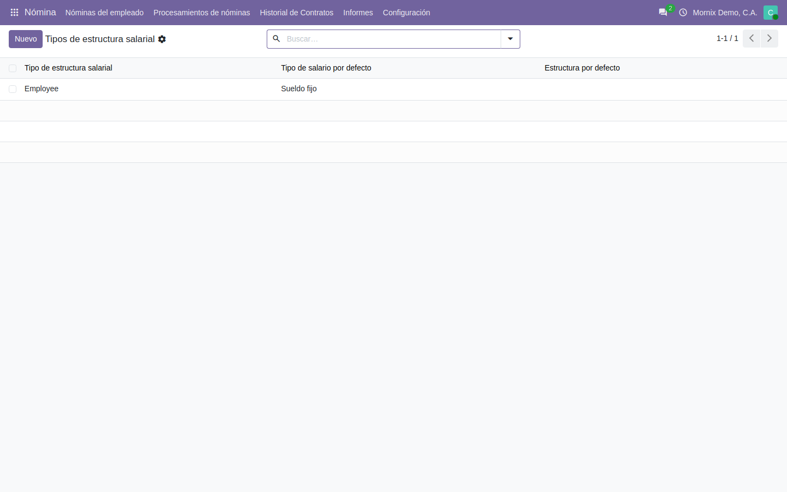
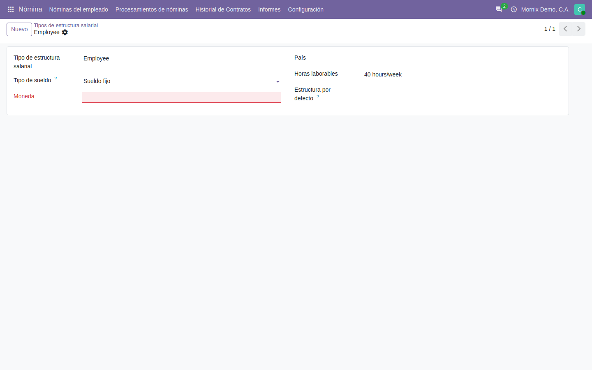
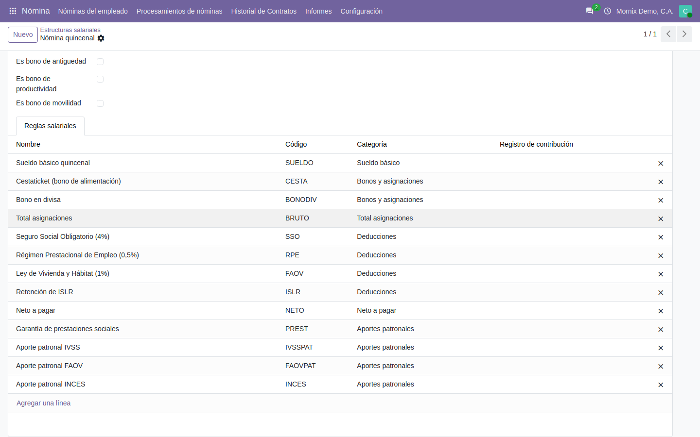
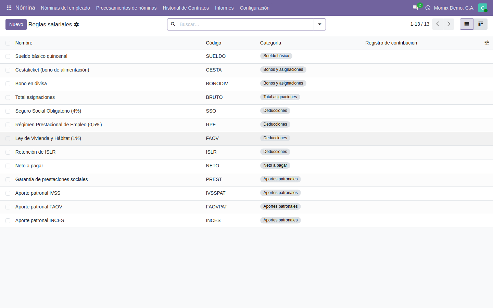
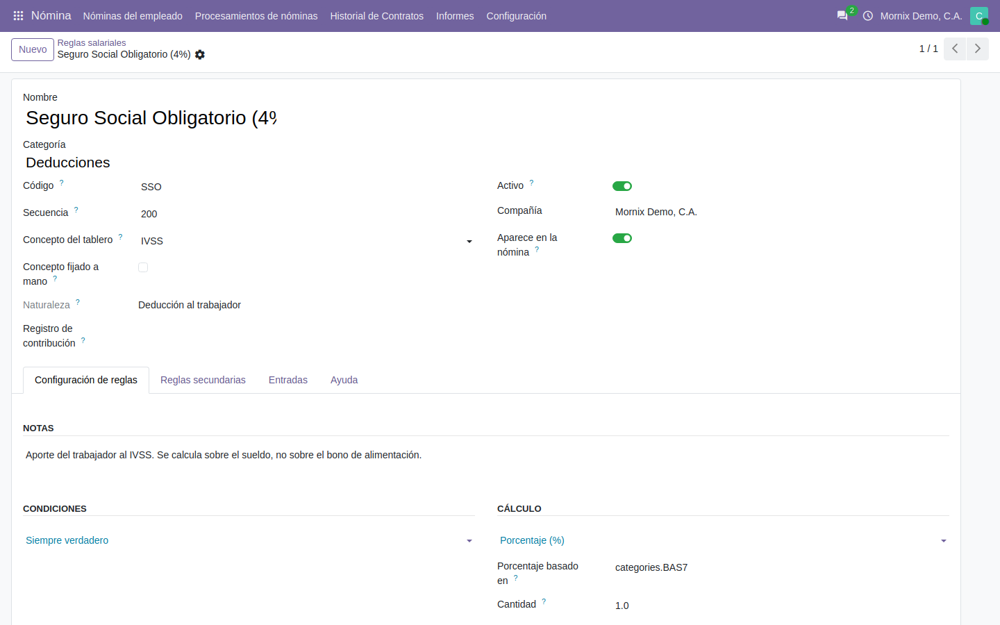
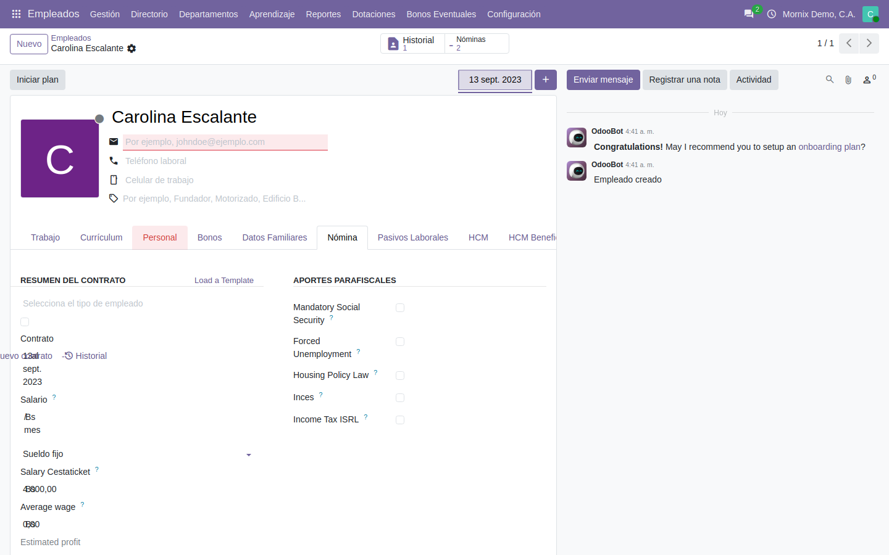

# Cómo se configura

Lo que hay que dejar puesto **una vez** para que la nómina se pueda calcular:
el tipo de estructura, la estructura con sus reglas, y los datos de nómina de
cada empleado.

> La nómina se apoya en el motor `payroll` de la OCA, no en el de Odoo
> Enterprise. Los nombres de pantalla pueden diferir de lo que se ve en la
> documentación oficial de Odoo.

## El orden importa

Se configura de arriba abajo, porque cada pieza necesita la anterior:

1. **Tipo de estructura** — la periodicidad y la moneda.
2. **Estructura salarial** — qué reglas se aplican y a qué departamentos.
3. **Reglas salariales** — cómo se calcula cada concepto.
4. **El contrato del empleado** — el sueldo y a qué estructura pertenece.

Lo que sigue es cada paso tal como se hace en pantalla. Los nombres de botones
y campos son los que se ven, incluidos los que quedaron en inglés.

## 1. El tipo de estructura

**Nómina → Configuración → Tipos de estructura.**

Agrupa estructuras que comparten la forma de pagar. **Los empleados entran a un
lote por su tipo de estructura**, no por su departamento: si un empleado no
aparece al generar recibos, lo primero que hay que mirar es si su contrato tiene
tipo de estructura y si es el del lote.

### Paso a paso: crear un tipo de estructura

1. **Nómina → Configuración → Tipos de estructura → Nuevo.**
2. **Tipo de estructura salarial**: el nombre. Por ejemplo, «Quincenal».
3. **Tipo de sueldo**: *Mensual* para sueldo fijo, *Por hora* para jornaleros.
   Manda en el cálculo.
4. **Moneda**: la del cálculo. En Venezuela, **VES**.
5. **País**: Venezuela.
6. **Horas laborables**: el calendario de trabajo que se aplica por defecto.
7. **Estructura por defecto**: déjelo vacío por ahora — la estructura todavía
   no existe. Se vuelve aquí en el paso 2.
8. **Guardar** (el icono de la nube, arriba a la izquierda).

## 2. La estructura salarial

**Nómina → Configuración → Estructuras salariales.**

La estructura dice **qué reglas se aplican** y en qué orden. Las reglas se
añaden en la pestaña de abajo; el orden de cálculo lo da la secuencia de cada
regla, no el orden de la lista. Los **departamentos** acotan a quién alcanza.

### Paso a paso: crear la estructura

1. **Nómina → Configuración → Estructuras salariales → Nuevo.**
2. **Nombre**: «Nómina quincenal».
3. **Referencia**: un código corto y estable, por ejemplo `QUINC`. Los informes
   y las fórmulas lo usan.
4. **Tipo de estructura**: el creado en el paso 1. Al elegirlo, **Moneda** y
   **Tipo de salario por defecto** se rellenan solos.
5. **Pago programado predeterminado**: *Quincenal*, *Mensual*… Es lo que
   propone el lote al crearse.
6. **Departamentos**: opcional. Si se deja vacío, la estructura vale para todos.
7. Pestaña **Reglas salariales → Agregar una línea**: elija las reglas. Si
   todavía no existen, guarde la estructura vacía y vuelva después del paso 3.
8. **Guardar.**
9. Vuelva a **Tipos de estructura**, abra el suyo y ponga esta estructura en
   **Estructura por defecto**. Es la que el sistema propone al generar recibos.

## 3. Las reglas salariales

**Nómina → Configuración → Reglas salariales.**

Cada regla es un concepto del recibo: el sueldo, un bono, una deducción. Lo que
la define:

| Campo | Qué decide |
|---|---|
| **Categoría** | Si suma, si resta y en qué total entra |
| **Secuencia** | El orden de cálculo. Una regla solo puede usar lo ya calculado |
| **Condición** | Si la regla aplica a este recibo |
| **Cálculo** | Importe fijo, porcentaje sobre otra categoría, o código Python |
| **Concepto del tablero** | En qué indicador del tablero suma (ver [El tablero](04-el-tablero.md)) |

### Paso a paso: crear una regla

Con el ejemplo del aporte del trabajador al Seguro Social (4 % del sueldo
básico, que se descuenta):

1. **Nómina → Configuración → Reglas salariales → Nuevo.**
2. **Nombre**: «Seguro Social Obligatorio (4%)».
3. **Categoría**: *Deducciones*. Es lo que hace que reste.
4. **Código**: el sistema propone uno (`DED200`). Escriba `SSO` si prefiere un
   código que se lea: **lo que se escribe a mano manda** y no se vuelve a
   recalcular.
5. **Secuencia**: `200`. Tiene que ser **mayor** que la del sueldo básico,
   porque se calcula sobre él. Regla práctica: asignaciones del 10 al 90,
   total bruto en 100, deducciones del 200 al 290, neto en 300.
6. **Concepto del tablero**: se propone *IVSS* por el código. Si no, elíjalo.
7. Pestaña **Configuración de reglas**:
   - Bloque **Condiciones**: *Siempre verdadero*, o *Rango*/*Expresión Python*
     si la regla aplica solo a algunos.
   - Bloque **Cálculo**: *Porcentaje (%)*.
   - **Porcentaje basado en**: `categories.BAS7`, la categoría del sueldo
     básico.
   - **Porcentaje**: `-4` — **negativo**, porque es una deducción.
     **Cantidad**: `1.0`.
8. Marque **Aparece en la nómina** para que salga impresa en el recibo.
9. **Guardar**, y añádala a la estructura (paso 2.7).

Otros cálculos habituales, con lo que va en cada campo:

| Concepto | Categoría | Tipo de importe | Valor |
|---|---|---|---|
| Sueldo quincenal | Sueldo básico | Código Python | `result = contract.wage / 2` |
| Cestaticket | Bonos y asignaciones | Código Python | `result = contract.cestaticket_salary / 2` |
| Total asignaciones | Total asignaciones | Código Python | `result = categories.BASIC` |
| Neto a pagar | Neto a pagar | Código Python | `result = categories.BASIC + categories.DED` |

> **El código de la regla se propone solo**, a partir del código de la categoría
> y la secuencia (`DED10`, `ALW20`). Si se escribe uno a mano, **manda el
> escrito**: no se vuelve a recalcular aunque cambie la secuencia. Esto importa
> porque las fórmulas y los informes buscan las reglas **por su código**.

### Las categorías son el armazón

Una regla de porcentaje se calcula sobre **una categoría**, no sobre otra regla:
el aporte al IVSS es «4 % de la categoría sueldo básico». Así, añadir un
concepto de sueldo nuevo lo incluye en la base sin tocar la deducción.

| Código | Qué agrupa |
|---|---|
| `BAS7` | Sueldo básico |
| `ALW` | Bonos y asignaciones |
| `GROSS` | Total de asignaciones |
| `DED` | Deducciones |
| `COMP` | Aportes patronales |
| `NET` | Neto a pagar |

> **Al añadir una categoría nueva hay que decirle al análisis de nómina que
> existe.** El informe suma por códigos de categoría, y una categoría que no
> esté en su lista **no se suma y no avisa**: el informe simplemente da de
> menos. Está en `l10n_ve_payroll_salary_rules_report`.

## 4. El contrato del empleado

**Empleados → ficha del empleado → pestaña Nómina.**

> **En Odoo 20 el contrato ya no es una pantalla aparte.** Es la pestaña
> «Nómina» de la ficha del empleado, y cada cambio de condiciones crea una
> **versión** nueva. El botón **Historial**, arriba, enseña todas.

### Paso a paso: dejar a un empleado listo para la nómina

1. **Empleados → abrir la ficha → pestaña Nómina.**
2. Bloque **Resumen del contrato**:
   - **Contrato**: la fecha de inicio del contrato. **Sin ella el empleado no
     entra en ningún lote**: para el sistema no tiene contrato en vigor.
   - **Salario** y, debajo, el tipo (*Sueldo fijo*).
   - **«Salary Cestaticket»**: el monto mensual del bono de alimentación, si la
     compañía lo paga.
   - El **tipo de estructura** (categoría de pago): el del paso 1.
3. Bloque **Aportes parafiscales**: marque lo que le aplica a esta persona —
   «Mandatory Social Security» (IVSS), «Forced Unemployment» (RPE), «Housing
   Policy Law» (FAOV), «Inces», «Income Tax ISRL» (y su porcentaje). Las
   reglas de nómina leen estas casillas para decidir si descuentan o no.
4. **Guardar.**
5. Si cambian las condiciones más adelante —un aumento, otro cargo—, no edite
   encima: **Nuevo contrato** crea una versión nueva y la anterior queda en el
   **Historial**.

> Varios rótulos de esta pestaña salen en inglés («Salary Cestaticket»,
> «Mandatory Social Security»): son campos de la localización que todavía no
> tienen traducción al español de Venezuela. Es cosmético, y está anotado.

## Errores frecuentes

| Síntoma | Causa |
|---|---|
| El empleado no aparece al generar recibos | Su contrato no tiene fecha de inicio, ya venció, o su tipo de estructura no es el del lote |
| El recibo sale sin líneas | La estructura no tiene reglas, o ninguna cumple su condición |
| Una deducción no descuenta | Su categoría no es de deducciones, o el porcentaje va en positivo |
| Un concepto no entra en el total | La regla se calcula después del total: revisar la secuencia |
| La regla cambió de código sola | Se creó sin código y cambió su secuencia: escriba el código a mano para fijarlo |
| El informe de análisis suma de menos | Hay una categoría que el informe no conoce |
