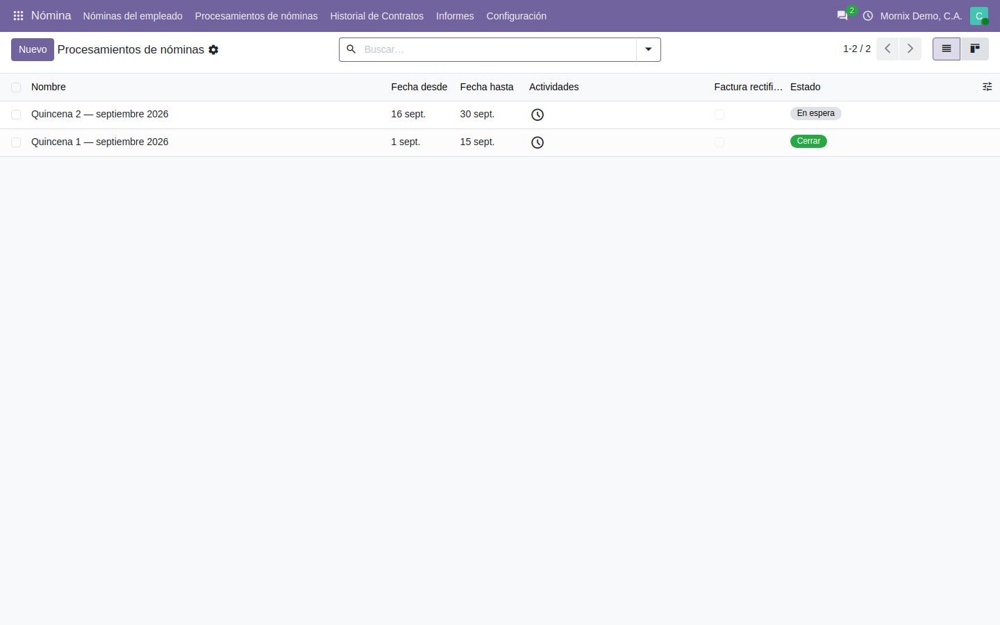
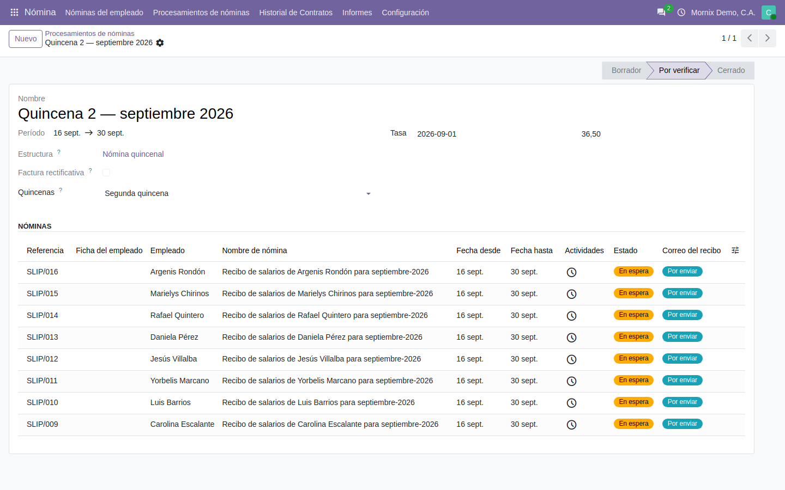
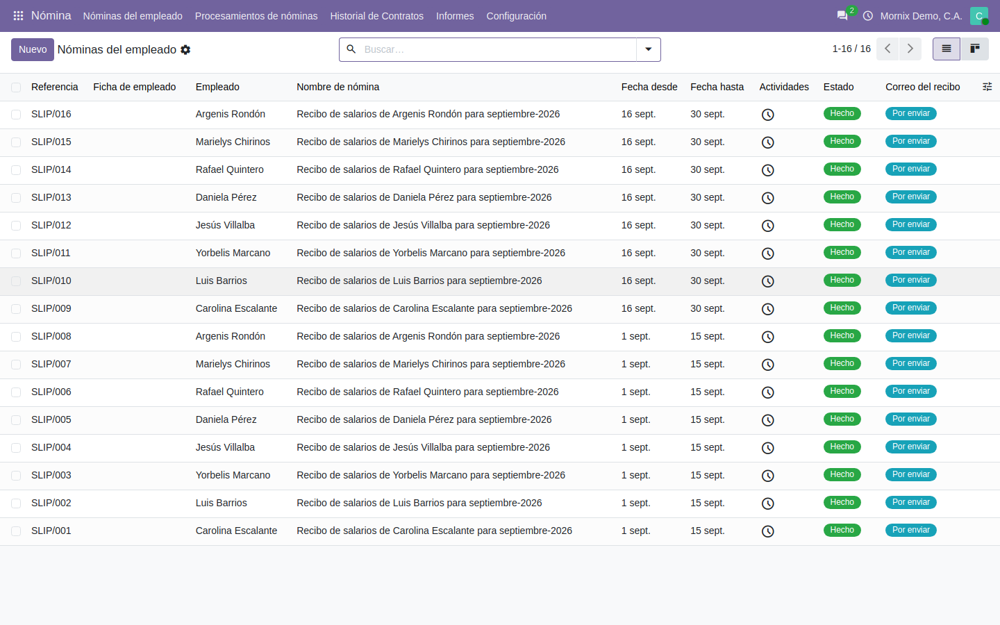
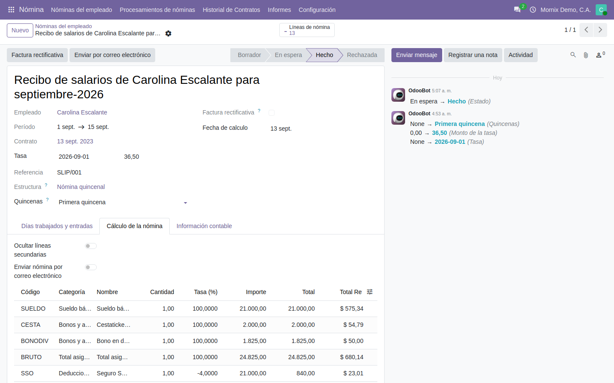

# Procesar una quincena

El recorrido completo de un pago, desde el lote vacío hasta los recibos
confirmados.

## El flujo

1. **Crear el lote** con el período y la estructura.
2. **Generar los recibos**: el sistema busca a quién le toca y crea uno por
   persona.
3. **Revisar** el cálculo, recibo a recibo si hace falta.
4. **Confirmar.** A partir de aquí los importes quedan fijos.

## 1. El lote

**Nómina → Procesamientos de nóminas.**

Un lote es una quincena, un mes o cualquier período que se pague junto.

### Paso a paso: crear el lote

1. **Nómina → Procesamientos de nóminas → Nuevo.**
2. **Nombre**: algo que se reconozca en la lista dentro de un año — «Quincena
   1 · septiembre 2026».
3. **Período**: desde y hasta. **Define qué contratos entran**: los que estaban
   en vigor en esas fechas.
4. **Estructura**: la de la nómina que se paga (*Nómina quincenal*).
5. **Quincenas**: *Primera* o *Segunda*. Aparece al elegir una estructura
   quincenal y es obligatorio: sin él el campo sale en rojo y no deja seguir.
6. **Tasa**: la tasa de cambio del período, si la estructura la pide. Ver
   abajo por qué importa.
7. **Guardar.** El lote queda en **Borrador**, sin recibos.

### La tasa se congela en el recibo

Cuando la estructura lo exige, el lote lleva una **tasa de nómina**: la que se
usa para leer los importes en divisa.

> **Es una tasa distinta de la del BCV del día.** Se elige al crear el lote y
> **queda congelada en cada recibo**: abrir un recibo de hace tres meses enseña
> los importes a la tasa con la que se pagó, no a la de hoy. Es lo que permite
> que un recibo antiguo siga cuadrando.

## 2. Generar los recibos

### Paso a paso: generar

1. Con el lote en **Borrador**, pulse **Generar recibos de nómina**.
2. Se abre una ventana con la lista de **Empleados** que entran. Revísela:
   - Quite a quien no corresponda (la x de su línea).
   - Si falta alguien, **no lo añada aquí**: cierre y revise su contrato (ver
     abajo). Añadirlo a mano genera un recibo que la estructura no sabe calcular.
3. **Generar.**
4. Resultado: el lote pasa a **Por verificar** y aparece un recibo por
   empleado, cada uno con sus líneas ya calculadas y en estado **En espera**.

Entra un empleado si, durante el período del lote:

- su contrato estaba en vigor —empezado y no vencido—, **y**
- su tipo de estructura es el de la estructura del lote.

> En Odoo 20 **el contrato ya no tiene estado**. «En vigor» es cuestión de
> fechas: no hay nada que «abrir» ni que «cerrar».

Los recibos de todos los lotes se ven juntos en **Nómina → Nóminas del
empleado**:

## 3. Revisar el cálculo

### Paso a paso: revisar un recibo

1. Desde el lote, pulse sobre el recibo (o **Nómina → Nóminas del empleado**).
2. Pestaña **Cálculo de la nómina**: la cuenta completa, línea a línea.
3. Pestaña **Días trabajados y entradas**: los días y horas que alimentaron el
   cálculo. Si un día no cuadra, el problema está aquí, no en la regla.
4. Si algo cambió después de generar —un dato del contrato, una regla—, pulse
   **Calcular hoja**: recalcula el recibo con los datos de ahora.
5. Si hay que corregir algo del propio recibo: **Cambiar a borrador**, corregir,
   **Calcular hoja** otra vez.
6. **Refrescar datos externos** vuelve a leer el contrato del empleado si se
   modificó después de crear el recibo.

Cómo se lee cada línea:

| Columna | Qué dice |
|---|---|
| **Importe** | La base del cálculo. En un porcentaje, **sobre cuánto** se aplica |
| **Tasa (%)** | El porcentaje. Negativo en las deducciones |
| **Total** | Lo que el concepto aporta al recibo |
| **Total Ref** | El mismo importe en la moneda de referencia, a la tasa del recibo |

> **Las deducciones se imprimen en positivo**, como en cualquier recibo de
> nómina, aunque por dentro se calculen en negativo —el neto se obtiene
> sumando—. La base, en cambio, no cambia de signo: el aporte del 4 % se lee
> «21.000,00 al −4 %», no «−21.000,00».
>
> Una deducción que aparezca **en negativo** no es un error de presentación: es
> una deducción que **suma** al neto, como la devolución de un descuento.

## 4. Confirmar

Confirmar deja los recibos en firme: el estado pasa de **En espera** a
**Hecho** y los importes ya no se recalculan.

### Paso a paso: confirmar uno a uno

1. Abra el recibo.
2. **Confirmar.** El estado pasa a **Hecho**.

### Paso a paso: confirmar todo el lote de una vez

1. **Nómina → Nóminas del empleado.** Filtre por el lote (busque su nombre).
2. Marque la casilla de la cabecera para seleccionar todos los recibos.
3. Menú **Acción → Cambiar estado**.
4. Elija **Hecho** y pulse **Ejecutar**.

Si hace falta deshacer un recibo ya confirmado: **Cancelar nómina** lo deja en
**Rechazada**, y desde ahí **Cambiar a borrador** permite corregir y volver a
calcular. Un recibo rechazado no entra en ningún informe.

> **El botón «Cerrar» del lote solo aparece con el lote en Borrador**, no en
> «Por verificar». El cierre real de la quincena es la confirmación de los
> recibos: con todos en **Hecho**, la quincena está cerrada aunque el lote siga
> diciendo «Por verificar». Está anotado como pendiente de revisar.

Solo a partir de la confirmación los recibos entran en el **análisis de
nómina** y en el **tablero** —que también cuentan, si se les pide, los que
están por verificar—.

## Errores frecuentes

| Síntoma | Causa |
|---|---|
| El asistente no propone a nadie | Ningún contrato en vigor en el período con ese tipo de estructura |
| «Quincenas» en rojo | La estructura es quincenal y falta decir cuál de las dos |
| La columna **Total Ref** sale en 0,00 | El lote no lleva tasa de nómina |
| Un empleado sale dos veces | Ya tenía un recibo en el lote: el asistente no duplica, revisar si hay dos lotes |
| No deja confirmar | El recibo no está **En espera**: recalcule primero con **Calcular hoja** |
| El recibo tiene líneas pero el total no cuadra | Revise la secuencia de las reglas: una que se calcula después del total no entra en él |
