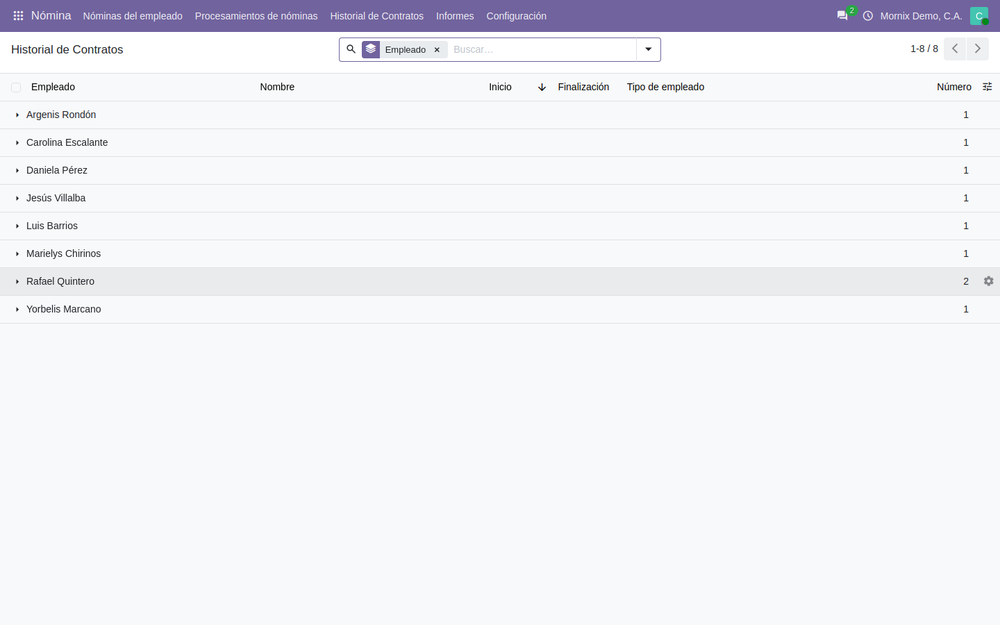
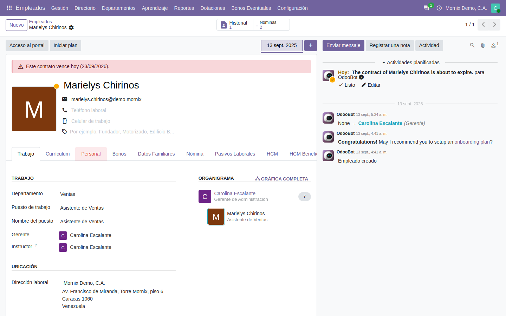
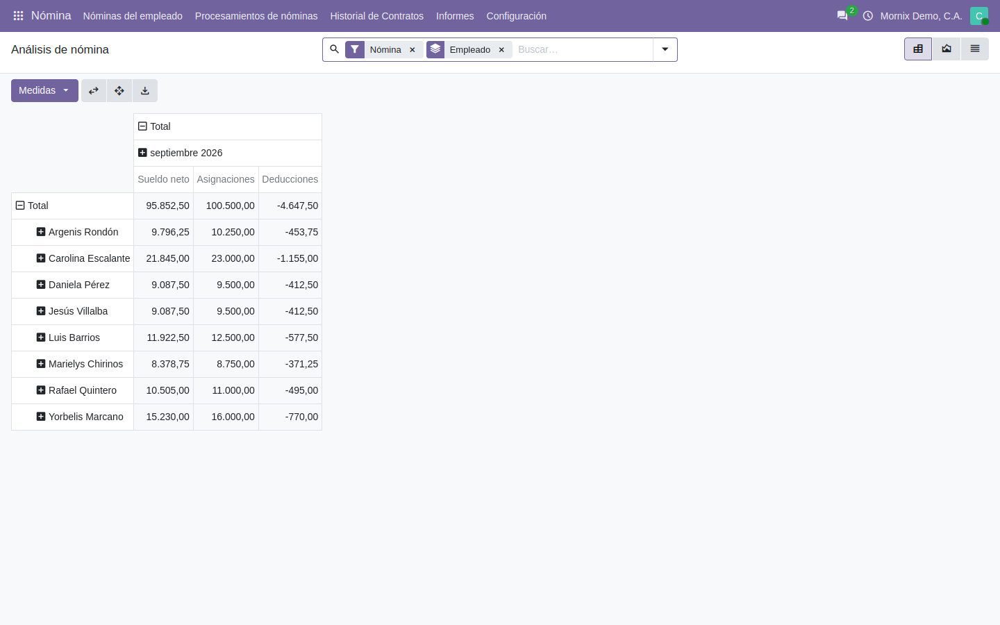

# Historial de contratos y análisis

Dos pantallas que se usan después de pagar: el historial laboral de cada
persona, y los números de la nómina cruzados como haga falta.

## El historial de contratos

**Nómina → Historial de Contratos**, o el botón **Historial** de la ficha del
empleado.

> **No es una tabla aparte.** En Odoo 20 cada cambio de condiciones —un aumento,
> un cambio de cargo, una renovación— crea una **versión** del contrato, y el
> historial es esa lista. Por eso no hay nada que «archivar» a mano: el pasado
> queda solo.

La lista se abre con los contratos **archivados incluidos**. Suelen ser justo
los antiguos, que es lo que se viene a buscar.

## El aviso de vencimiento

Un contrato a término avisa antes de vencer, en una franja roja sobre la ficha
del empleado:

Los días de antelación salen del **periodo de aviso de vencimiento** de la
compañía (Ajustes → Empleados). El aviso cambia de texto según el caso: «vence
en N días», «vence mañana», «vence hoy», o «venció el … y sigue en curso».

## Renovar un contrato

Cuando el contrato ya venció, la cabecera de la ficha enseña **Renovar
contrato**. El asistente:

1. Propone empezar **el día siguiente** al vencimiento del anterior.
2. Copia la configuración del contrato que renueva —calendario, tipo de
   estructura, campos de nómina— y deja ajustar el cargo, la referencia, las
   fechas y el sueldo.
3. **Recorta el vencimiento del anterior** al día previo al nuevo.
4. Enlaza los dos por el campo **Contrato anterior**.

> El paso 3 no es cosmético: Odoo no deja que dos contratos del mismo empleado
> se solapen en fechas. Sin recortar, la renovación fallaría con un error del
> núcleo difícil de interpretar.

El botón desaparece en cuanto el contrato tiene una renovación, para que no se
encadenen renovaciones de la renovación sin darse cuenta.

## El análisis de nómina

**Nómina → Informes → Análisis de nómina.**

Un pivote sobre los recibos. Las medidas:

| Medida | Qué suma |
|---|---|
| **Sueldo neto** | Lo que se paga |
| **Asignaciones** | Todo lo que suma antes de deducir |
| **Deducciones** | Lo que se descuenta, en negativo |
| **Días** y **Horas** | Jornada, cuando los recibos la traen |

Y se puede agrupar por empleado, departamento, estructura, etiqueta del
empleado, estado o mes.

### Qué entra y qué no

Por defecto se ven los recibos **confirmados**. El filtro **Pre-nómina** enseña
en cambio los que están **por verificar**: sirve para revisar una quincena antes
de cerrarla, que es justo para lo que se revisa.

> **Un recibo en borrador no aparece.** Si el análisis sale vacío teniendo
> nóminas, casi siempre es eso: están sin generar o sin confirmar.

## Errores frecuentes

| Síntoma | Causa |
|---|---|
| El análisis sale vacío | Los recibos están en borrador, o el filtro está en «Nómina» y solo hay pre-nómina |
| Un total no cuadra con los recibos | Hay una categoría de regla que el informe no conoce: ver la guía de configuración |
| No aparece **Renovar contrato** | El contrato no ha vencido, o ya tiene una renovación |
| El historial solo enseña un contrato | Es un contrato indefinido que nunca se renovó: no hay más versiones |
