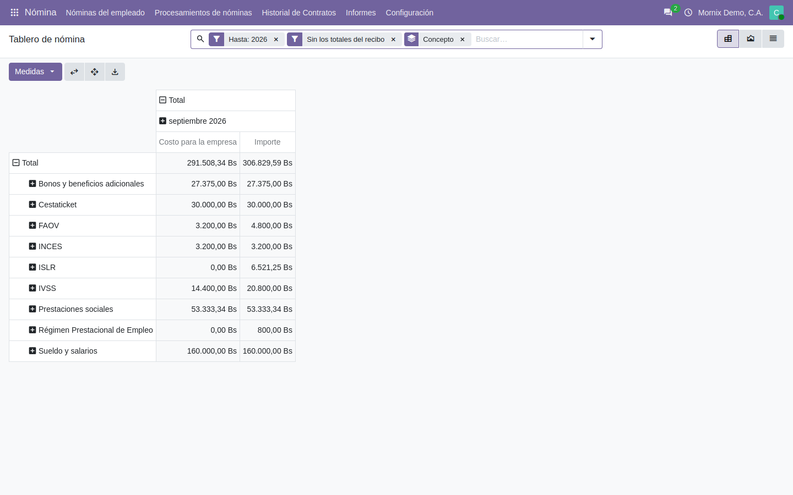
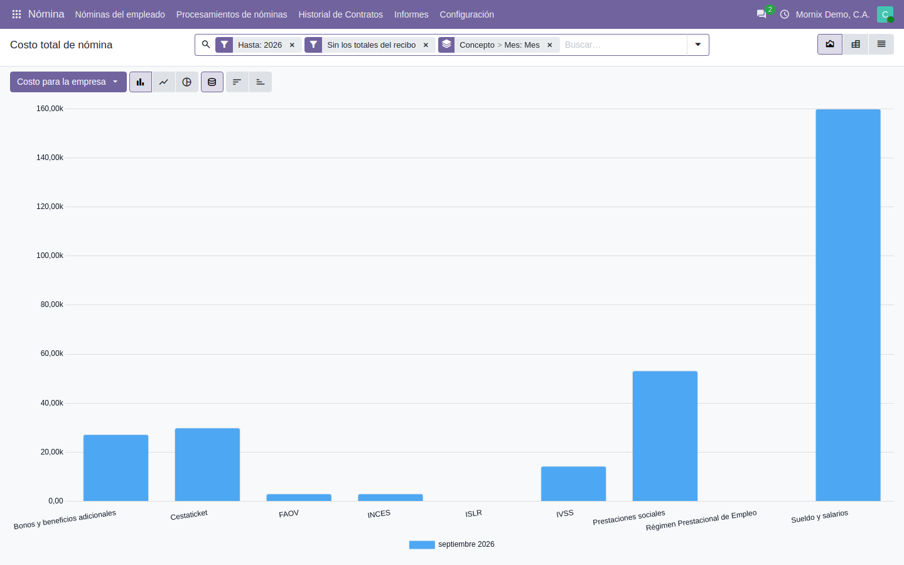

# El tablero de nómina

Responde con números las preguntas que se repiten cada cierre: cuánto cuesta la
nómina, en qué se va, cuánto de cestaticket, cuánto se ha acumulado de
prestaciones, cuánto de parafiscales y cuánto de ISLR.

**Nómina → Informes → Tablero de nómina** (y **Costo total de nómina**, que es
el mismo dato entrando por el gráfico).

**Para qué**: el recibo dice lo que cobra una persona; el tablero dice lo que la
nómina le cuesta a la empresa y en qué se va, **por concepto**, sumando todos
los recibos. Son las cifras que pide gerencia al cierre, contabilidad para
provisionar, y el contador para las declaraciones parafiscales.

**Por qué mira líneas y no recibos**: el análisis de nómina suma recibos
completos (bruto, neto). Para saber cuánto fue cestaticket o cuánto se retuvo de
ISLR hay que sumar **líneas** de un concepto en muchos recibos, y para eso cada
regla salarial lleva su **concepto**. El tablero es esa suma.

## 1. Las dos columnas, y por qué no dan lo mismo

| Medida | Qué suma |
|---|---|
| **Costo para la empresa** | Asignaciones **más aportes patronales**: lo que de verdad sale de la empresa |
| **Importe** | Lo que vale cada línea, retenciones incluidas |

**Por qué**: una retención —ISLR, IVSS del trabajador— **no es costo**: ya está
dentro del sueldo del que se descuenta; la empresa la paga al Estado en vez de
al trabajador, pero no paga más. Por eso en la fila del ISLR el costo es 0 y el
importe no: el importe dice cuánto se retuvo, que es otra pregunta.

**Ejemplo, con el recibo de Argenis Rondón** (quincena 2 de septiembre):

| Concepto | Naturaleza | Importe | Costo para la empresa |
|---|---|---:|---:|
| Sueldo | Asignación | 8.250,00 | 8.250,00 |
| Cestaticket | Asignación | 2.000,00 | 2.000,00 |
| Bono en divisa | Asignación | 1.825,00 | 1.825,00 |
| IVSS | Deducción al trabajador | 330,00 | 0,00 |
| IVSS | Aporte patronal | 742,50 | 742,50 |
| RPE | Deducción al trabajador | 41,25 | 0,00 |
| FAOV | Deducción al trabajador | 82,50 | 0,00 |
| FAOV | Aporte patronal | 165,00 | 165,00 |
| INCES | Aporte patronal | 165,00 | 165,00 |
| ISLR | Deducción al trabajador | 362,25 | 0,00 |
| Prestaciones sociales | Aporte patronal | 2.750,00 | 2.750,00 |
| **Total** | | | **15.897,50** |

El trabajador recibe 11.259,00; la empresa gasta 15.897,50. La diferencia
(4.638,50) son los 816,00 que se retuvieron para el Estado y los 3.822,50 de
aportes que nunca pasan por la cuenta del trabajador.

> **Las retenciones se leen en positivo.** En el recibo valen negativo, porque
> así se calcula el neto; en el tablero se muestran como lo que son: «se
> retuvieron 6.521,25», no «-6.521,25».

## 2. Los indicadores

Cada uno es un filtro, ya puesto en el desplegable del buscador:

| Filtro | Qué contesta | Por qué se pide |
|---|---|---|
| **Cestaticket** | Cuánto se paga de bono de alimentación | Es el segundo concepto más grande de la nómina venezolana, y se declara y provisiona aparte del salario |
| **Prestaciones sociales** | Cuánto se ha acumulado de garantía de prestaciones | Es un pasivo: se acumula cada mes y se paga al terminar la relación laboral. Contabilidad lo provisiona con esta cifra |
| **Parafiscales (IVSS, RPE, FAOV, INCES)** | Cuánto se aporta y cuánto se retiene por cada uno | Son las planillas mensuales ante cada ente; la suma de aporte + retención es lo que se paga |
| **ISLR retenido** | El acumulado de retención, por empleado o por periodo | Es lo que se entera al SENIAT y lo que va en el comprobante ARC de cada empleado a fin de año |
| **Bonos y beneficios adicionales** | Cuánto pesan sobre el costo | Los bonos en divisa son la parte de la nómina que más se mueve con la tasa |
| **Con importe en divisa** | Solo lo que tiene equivalente en divisa | Para ver la nómina «en dólares» a la tasa de cada lote |

Y tres que separan quién paga qué: **Asignaciones**, **Aportes patronales** y
**Retenciones al trabajador**.

## 3. Las consultas típicas, paso a paso

El tablero abre con dos filtros puestos —**el año en curso** y **Sin los
totales del recibo**— y agrupado por **Concepto**. Todo lo que sigue parte de
ahí. Los números son los de la demo: ocho empleados, dos quincenas de
septiembre de 2026.

### Cuánto costó la nómina este mes, por departamento

1. **Nómina → Informes → Costo total de nómina.**
2. En el buscador, pulse el filtro de fecha (**Hasta: 2026**) y cambie el
   periodo al **mes** que quiere.
3. Pulse la agrupación **Concepto > Mes** para quitarla, y en el desplegable
   elija **Agrupar por → Departamento**.
4. La medida ya es **Costo para la empresa**. Cada barra es un departamento.
5. Para verlo en tabla, pulse el icono de pivote (arriba a la derecha).

**Ejemplo** (quincena 2 de septiembre):

| Departamento | Asignaciones | Aportes patronales | Costo para la empresa |
|---|---:|---:|---:|
| Operaciones | 40.475,00 | 13.436,67 | 53.911,67 |
| Administración | 39.150,00 | 14.595,00 | 53.745,00 |
| Mantenimiento | 12.075,00 | 3.822,50 | 15.897,50 |
| Ventas | 10.575,00 | 3.127,50 | 13.702,50 |
| **Total** | **102.275,00** | **34.981,67** | **137.256,67** |

Los aportes son el **34 %** de las asignaciones: por cada 100 Bs de sueldo y
bonos, la empresa pone 34 más en prestaciones, IVSS, FAOV e INCES. Es la cifra
que hay que tener delante al negociar un aumento.

### Cuánto ISLR se le ha retenido a cada empleado en el año

1. **Nómina → Informes → Tablero de nómina.**
2. Desplegable del buscador → **ISLR retenido**.
3. Quite la agrupación **Concepto** y agrupe por **Empleado**.
4. Lea la columna **Importe**: es lo retenido. La columna **Costo para la
   empresa** sale a 0, y así debe ser.
5. Para el acumulado mes a mes: en las columnas del pivote pulse **Total → Hasta
   → Mes**.

**Ejemplo** (las dos quincenas de septiembre):

| Empleado | ISLR retenido (Importe) | Costo para la empresa |
|---|---:|---:|
| Carolina Escalante | 1.489,50 | 0,00 |
| Yorbelis Marcano | 1.069,50 | 0,00 |
| Luis Barrios | 859,50 | 0,00 |
| Argenis Rondón | 724,50 | 0,00 |
| Daniela Pérez | 679,50 | 0,00 |
| Jesús Villalba | 679,50 | 0,00 |
| Marielys Chirinos | 634,50 | 0,00 |
| Rafael Quintero | 384,75 | 0,00 |
| **Total** | **6.521,25** | **0,00** |

Es la tabla que alimenta la declaración mensual de retenciones y, en diciembre,
el **ARC** de cada empleado.

### Aportes del patrono contra retenciones del trabajador en parafiscales

1. **Tablero de nómina** → filtro **Parafiscales (IVSS, RPE, FAOV, INCES)**.
2. Filas: **Concepto**. Columnas: pulse **Total → Naturaleza**.
3. Salen dos columnas por concepto: **Aporte patronal** y **Deducción al
   trabajador**. La primera cuesta a la empresa; la segunda, no.

**Ejemplo, con el recibo de Argenis**, que es como se lee cada fila:

| Concepto | Deducción al trabajador | Aporte patronal | Total a enterar |
|---|---:|---:|---:|
| IVSS | 330,00 (4 %) | 742,50 (9 %) | 1.072,50 |
| RPE | 41,25 (0,5 %) | — (2 % en la nómina real) | 41,25 |
| FAOV | 82,50 (1 %) | 165,00 (2 %) | 247,50 |
| INCES | — | 165,00 (2 %) | 165,00 |

La suma de las dos columnas es lo que va en la planilla de cada ente; la
columna de aporte es lo que cuesta. La demo no tiene aporte patronal de RPE;
la nómina real lleva el 2 %.

### Cuánto se ha acumulado de prestaciones

1. **Tablero de nómina** → filtro **Prestaciones sociales**.
2. Agrupe por **Empleado** para el acumulado por persona, o por **Mes** para
   ver cómo crece.
3. **Costo para la empresa** es el acumulado del periodo elegido. Amplíe el
   filtro de fecha para tener el histórico.

**Ejemplo.** En septiembre la garantía acumulada de los ocho empleados es
**53.333,34 Bs**; Carolina Escalante, con el sueldo más alto (42.000), aporta
14.000,00 de esa cifra; Rafael Quintero, 3.000,00. Es el importe que
contabilidad provisiona como pasivo laboral —y el que habría que tener
disponible si mañana se liquidara a todo el mundo.

### Distribución de gastos por regla salarial

1. **Tablero de nómina**, sin filtros de concepto.
2. Quite **Concepto** y agrupe por **Regla salarial**.
3. Cada fila es una regla, con su costo y su importe. Es lo que contabilidad
   suele pedir como «distribución por regla».

**Ejemplo** (quincena 2 de septiembre):

| Regla salarial | Costo para la empresa | % del costo |
|---|---:|---:|
| Sueldo básico quincenal | 75.500,00 | 55,0 % |
| Garantía de prestaciones sociales | 25.166,67 | 18,3 % |
| Cestaticket | 14.000,00 | 10,2 % |
| Bono en divisa | 12.775,00 | 9,3 % |
| Aporte patronal IVSS, FAOV, INCES (13 % del básico) | 9.815,00 | 7,2 % |
| **Total** | **137.256,67** | **100 %** |

Casi la mitad del costo **no es sueldo**: prestaciones, cestaticket, bonos y
aportes suman el 45 %. Es la tabla que contabilidad usa para distribuir el gasto
de nómina entre cuentas.

Todo se exporta a hoja de cálculo con el botón de descarga del pivote.

## 4. De dónde salen los conceptos

Cada **regla salarial** lleva su concepto. **Nómina → Configuración → Reglas
salariales**: la columna **Concepto del tablero** lo muestra, y se puede
cambiar.

**Por qué se propone solo**: el sistema lo deduce del código de la regla
—`CESTA` es cestaticket, `ISLR` es ISLR, `FAOVPAT` es FAOV— para que una
nómina ya configurada salga clasificada sin trabajo. Y **lo que se ponga a mano
manda**, porque hay códigos que no dicen nada («REGLA07») y solo quien conoce
la nómina sabe qué son.

### Paso a paso: corregir la clasificación de una regla

1. **Nómina → Configuración → Reglas salariales.**
2. Desplegable del buscador → **Agrupar por → Concepto del tablero**. Las
   reglas en **Otro** son las que hay que mirar.
3. Abra la regla y cambie **Concepto del tablero** al que corresponda.
4. Al guardar, la casilla **Concepto fijado a mano** queda marcada: la
   propuesta automática no vuelve a tocarla, ni siquiera si luego cambia el
   código de la regla.
5. Para volver a la propuesta automática: desmarque **Concepto fijado a mano**
   y guarde.
6. El tablero refleja el cambio en cuanto se recarga: no hay que recalcular
   ningún recibo.

**Ejemplo.** Una empresa tiene la regla `BONOALIM` «Bono de alimentación
adicional». El código no contiene `CESTA`, así que el sistema la deja en
**Otro** y el indicador **Cestaticket** sale corto en 3.000 Bs por quincena. Se
abre la regla, se pone **Concepto del tablero: Cestaticket**, se guarda, y el
tablero suma 17.000 en vez de 14.000 al instante: no hubo que tocar ningún
recibo.

> **Si un total sale corto, mire aquí primero.** El filtro **Reglas sin
> clasificar** del tablero enseña las líneas de esas reglas: suman en «Otro»,
> no desaparecen, pero mientras estén ahí el desglose miente por omisión.

## 5. Qué entra y qué no

- Entran los recibos **por verificar, hechos y pagados**. La pre-nómina cuenta
  a propósito: el tablero sirve sobre todo **antes** de cerrar la quincena, que
  es cuando todavía se puede corregir.
- Los recibos en **borrador** no entran.
- **El bruto y el neto del recibo no suman**: son la suma de lo demás. Están
  clasificados como «Total del recibo» y el tablero los oculta por defecto; si
  quiere cuadrar contra un recibo concreto, quite el filtro **Sin los totales
  del recibo** y aparecen.

**Por qué se ocultan los totales**: si el bruto (12.075) sumara junto al sueldo
(8.250), el cestaticket (2.000) y el bono (1.825), el costo de Argenis saldría
en 27.972,50 en vez de 15.897,50: todo contado dos veces. Los totales se
guardan para cuadrar, no para sumar.
