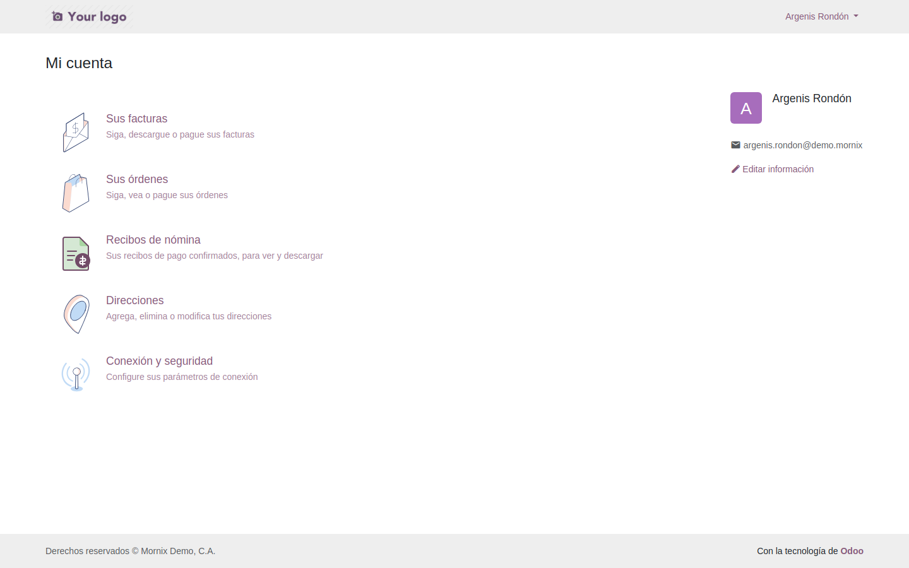
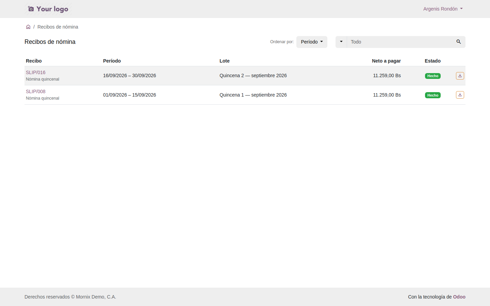
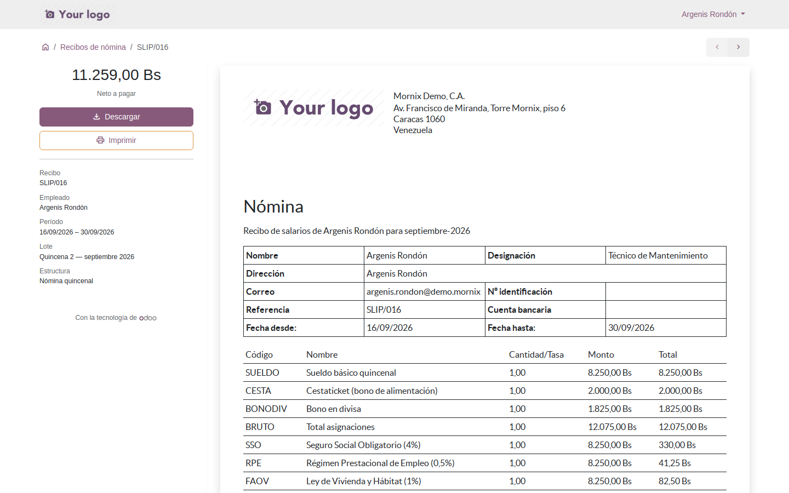

# El portal del empleado: sus recibos de nómina

Cada empleado entra con su usuario de portal, ve sus recibos de nómina
confirmados y descarga el PDF. Sin pedirlo a Recursos Humanos, sin correo de
por medio.

## Para qué

Cada quincena, la misma escena: alguien de nómina imprime o envía por correo
los recibos, y durante el mes le piden copias —para un crédito, para la
declaración de ISLR, porque se perdió—. Con el portal el recibo **está siempre
disponible** para su dueño, y Recursos Humanos deja de ser el archivo de todos.

## Por qué está hecho así

- **Es el portal estándar de Odoo**, el mismo «Mi cuenta» que ve un cliente
  con sus facturas o un proveedor con sus retenciones. El empleado no aprende
  una pantalla nueva; nómina no mantiene un sistema aparte.
- **Solo recibos confirmados.** Un recibo en borrador o en espera todavía puede
  cambiar; publicarlo sería enseñar una cifra que quizá no se pague. El empleado
  ve la nómina cuando nómina la confirma, y esa es también la señal de «ya está
  pagada».
- **La restricción está en los permisos, no en la pantalla.** El usuario de
  portal tiene derecho de lectura **solo** sobre los recibos de su empleado, y
  eso vale para la página, para el PDF y para cualquier consulta por API. Aunque
  alguien adivine el enlace de otro recibo, el sistema lo rechaza.
- **El PDF es el de nómina.** Es el informe «Recibo de nómina» de siempre; si
  la localización trae el recibo venezolano, es ese el que sale. No hay dos
  formatos que mantener.

## 1. Dar acceso a un empleado

**Empleados → ficha del empleado → botón Acceso al portal** (en la cabecera,
junto a «Crear usuario»).

**Por qué desde la ficha y no desde Contactos**: el acceso al portal es una
acción sobre un **contacto** de Odoo, y cada empleado tiene uno —su contacto de
trabajo— que Recursos Humanos no suele ver. El botón lo encuentra y abre el
asistente con ese contacto ya elegido.

### Antes

El empleado necesita **correo de trabajo** en su ficha: la invitación al portal
se envía por correo, con el enlace para fijar la contraseña. Sin correo, el
botón lo dice: *«El empleado … no tiene correo de trabajo. El acceso al portal
se envía por correo: cárguelo en la ficha primero.»*

### Paso a paso

1. **Empleados → abra la ficha.** Compruebe **Correo electrónico del trabajo**.
2. Pulse **Acceso al portal**. Se abre el asistente estándar «Otorgar acceso al
   portal» con el contacto del empleado en la lista.
3. Marque la casilla de la fila y pulse **Otorgar acceso**. Odoo crea el usuario
   de portal y envía la invitación al correo del empleado.
4. El empleado abre el correo, fija su contraseña y entra a
   `https://<su servidor>/my`.
5. Para quitar el acceso más adelante: mismo botón, y en el asistente
   **Revocar acceso**.

**Ejemplo.** Argenis Rondón, correo `argenis.rondon@demo.mornix`. Se pulsa
**Acceso al portal**, se marca su fila, **Otorgar acceso**. A los dos minutos
tiene el correo; entra con `argenis.rondon@demo.mornix` y la contraseña que
eligió. En **Mi cuenta** ve la tarjeta **Recibos de nómina** con un **2**: las
dos quincenas de septiembre que ya están confirmadas.

> **Portal, no usuario interno.** «Crear usuario», el botón de al lado, crea un
> usuario **interno** —con licencia y acceso a las aplicaciones—. Para ver
> recibos basta el usuario de portal, que no consume licencia y solo ve «Mi
> cuenta».

## 2. Lo que ve el empleado

### Mi cuenta

La tarjeta **Recibos de nómina** lleva el número de recibos confirmados a su
nombre. Si es cero, la tarjeta dice que todavía no hay ninguno.

### El listado

Una fila por recibo, con lo que el empleado busca primero:

| Columna | Qué dice |
|---|---|
| **Recibo** | El número (`SLIP/016`) y, debajo, la estructura (*Nómina quincenal*) |
| **Período** | Del 16/09/2026 al 30/09/2026 |
| **Lote** | «Quincena 2 — septiembre 2026» |
| **Neto a pagar** | Lo que le depositaron: 11.259,00 Bs |
| **Estado** | Siempre **Hecho**: es lo único que se publica |
| ⬇ | Descarga directa del PDF |

Se puede **ordenar** por período o por número y **buscar** por número de recibo
o por nombre del lote («septiembre»).

### El recibo

1. Pulse el número del recibo en el listado.
2. A la izquierda, el **neto a pagar** en grande, **Descargar** e **Imprimir**,
   y los datos del recibo: número, empleado, período, lote y estructura.
3. A la derecha, el recibo tal como sale en PDF, para leerlo sin descargarlo.
4. **Descargar** baja el archivo con nombre `Recibo_de_nomina_SLIP_016_2026_09_16.pdf`.

**Ejemplo.** Argenis abre `SLIP/016`: neto **11.259,00 Bs**, período 16/09/2026
– 30/09/2026, lote «Quincena 2 — septiembre 2026». En el PDF ve el detalle que
está en la guía [Procesar una quincena](02-la-quincena.md): sueldo 8.250,00,
cestaticket 2.000,00, bono 1.825,00, y las cuatro deducciones. Si entra un
compañero con su propio usuario y escribe la dirección de ese recibo, vuelve a
«Mi cuenta»: no es suyo.

## 3. Qué entra y qué no

| Recibo | ¿Lo ve el empleado? | Por qué |
|---|---|---|
| **Hecho** (confirmado) | **Sí** | Es el que se pagó |
| **En espera** (por verificar) | No | Todavía puede cambiar |
| **Borrador** | No | Ni siquiera está calculado en firme |
| **Rechazada** (cancelado) | No | No es un pago |
| De otro empleado | No | La regla de permisos lo excluye, aunque tenga el enlace |

Un recibo que se **cancela** después de confirmado desaparece del portal en el
acto; si se corrige y se vuelve a confirmar, reaparece.

## Errores frecuentes

| Síntoma | Causa |
|---|---|
| El botón «Acceso al portal» avisa que falta el correo | La ficha no tiene **Correo electrónico del trabajo** |
| El empleado entra y la tarjeta dice 0 recibos | Sus recibos están **En espera**: nómina no los ha confirmado |
| El empleado no ve la tarjeta de recibos | Su usuario no está enlazado al empleado: el contacto del usuario no es el contacto de trabajo de la ficha. Revoque y otorgue el acceso desde el botón de la ficha |
| El PDF sale en inglés | El empleado no tiene idioma en su contacto: póngalo en español desde Contactos |
| Un usuario interno entra a «Mis recibos» y no ve nada | No hay ningún empleado con su usuario en **Usuario relacionado**; enlácelo en la ficha del empleado |
