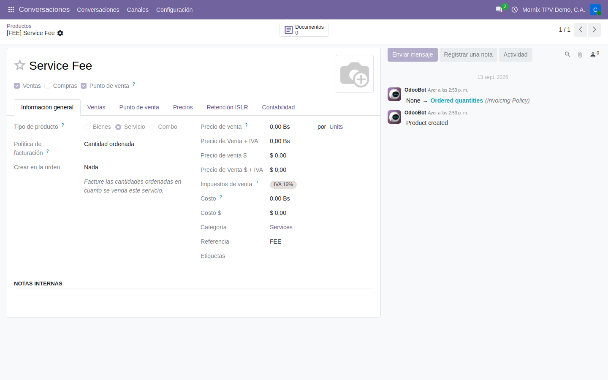
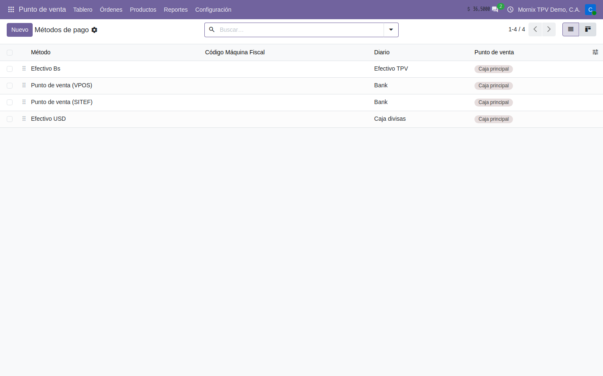
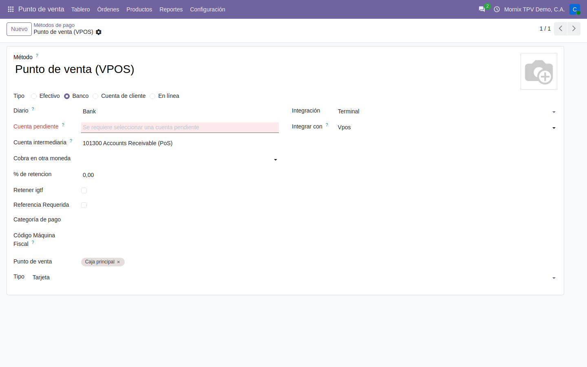
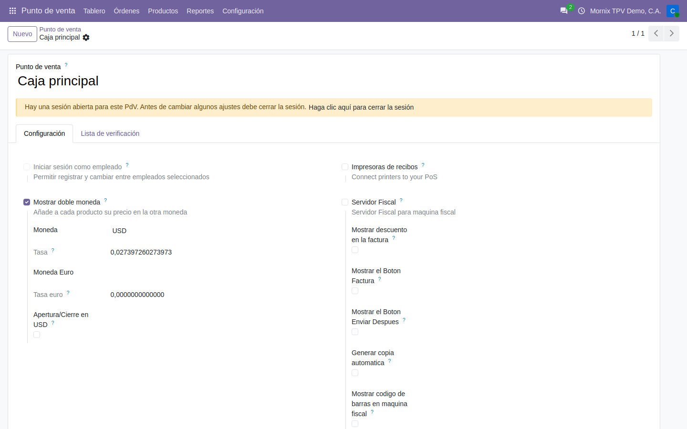

# Cómo se configura la caja

Lo que hay que dejar puesto **una vez** para que el TPV abra: los productos que
se venden en caja, los métodos de pago y la moneda de exhibición.

## El orden importa

1. **Productos** — marcar los que salen en caja y ponerles precio.
2. **Métodos de pago** — efectivo y los terminales.
3. **La caja** — la doble moneda y qué métodos ofrece.

## 1. Los productos que salen en caja

Un producto aparece en el TPV solo si lleva marcada la casilla **Punto de
venta** de su ficha. No basta con que exista ni con que tenga precio.

### Paso a paso: poner un producto en la caja

1. **Punto de venta → Productos → Productos → Nuevo** (o abra uno que exista).
2. **Nombre** del producto.
3. En la cabecera, junto a **Ventas** y **Compras**, marque **Punto de venta**.
   Es la casilla que decide si sale en la caja.
4. **Tipo de producto**: *Bienes* para mercancía, *Servicio* para lo que no se
   inventaría.
5. **Precio de venta $**: el precio en divisa. **Es el que se escribe.** El
   **Precio de venta** en bolívares se calcula solo, con la tasa del día, y
   sale de solo lectura.
6. **Impuestos de venta**: el IVA que le corresponde.
7. Pestaña **Punto de venta**: **Categoría** (la del TPV, que agrupa los
   productos en la pantalla de venta) y **Por pesar** si se vende por peso.
8. **Guardar.**

> **El precio en bolívares no se escribe a mano.** Sale de `Precio de venta $ ×
> tasa`. Si los productos salen todos a 0,00 en la caja, lo que falta es la
> tasa del día en Contabilidad, no el precio. Ver
> [Doble moneda](../10-contabilidad/06-doble-moneda.md).

## 2. Los métodos de pago

**Punto de venta → Configuración → Métodos de pago.**

Cada método dice por dónde entra el dinero. En la demo hay tres: **Efectivo
Bs** contra el diario de efectivo, y los dos puntos bancarios de la casa —**VPOS**
y **SITEF**— contra el diario de banco.

### Paso a paso: crear el método de efectivo

1. **Punto de venta → Configuración → Métodos de pago → Nuevo.**
2. **Método**: «Efectivo Bs».
3. **Tipo**: *Efectivo*. **Es obligatorio en Odoo 20**: un método sin tipo no se
   deja guardar.
4. **Diario**: el diario de efectivo de la caja.
5. **Punto de venta**: la caja (o cajas) donde se ofrece.
6. **Guardar.**

### Paso a paso: crear el método del punto de venta bancario

1. **Nuevo.** **Método**: «Punto de venta (VPOS)».
2. **Tipo**: *Banco*. Al elegirlo aparecen los campos del terminal.
3. **Diario**: el diario de banco donde entra lo cobrado con el punto.
4. **Cuenta pendiente**: la cuenta de pagos pendientes del banco. **Es
   obligatoria** para un método de tipo Banco —sale en rojo mientras esté
   vacía— y sin ella el método no se guarda.
5. **Integración**: *Terminal*.
6. **Integrar con**: el terminal de la casa, **VPOS** o **SITEF**. Aquí es
   donde antes estaba «Usar terminal de pago»: en Odoo 20 el terminal se elige
   en este campo. Para VPOS, abajo, **Tipo**: *Tarjeta*.
7. **Punto de venta**: la caja.
8. **Guardar.** Repita para el segundo terminal.

> **Dos cosas cambiaron en Odoo 20.** El **Tipo** es obligatorio, y el
> terminal ya no se elige en «Usar terminal de pago» sino en **Integrar con**.
> Un método traído de la versión anterior llega sin ninguno de los dos y hay
> que ponérselos, o la caja no lo ofrece.

## 3. La caja

**Punto de venta → Configuración → Punto de venta → Caja principal.**

### Paso a paso: dejar la caja con doble moneda

1. **Punto de venta → Configuración → Punto de venta**, abra **Caja principal**
   (o **Nuevo** para otra caja: **Punto de venta** es su nombre).
2. Pestaña **Configuración**, bloque de la localización:
   - **Mostrar doble moneda**: marcado. Añade a cada producto y a cada línea
     su precio en la otra moneda.
   - **Moneda**: **USD**, la moneda de exhibición.
   - **Tasa**: se llena sola con la tasa vigente. **No la toque** (ver abajo).
   - **Apertura/Cierre en USD**: si la caja se cuenta también en divisa al
     abrir y al cerrar.
   - **Servidor Fiscal**: la máquina fiscal, cuando la haya.
3. Más abajo, **Métodos de pago**: marque los que ofrece esta caja.
4. **Guardar.**

> **La tasa se ve aquí, pero no se pone aquí.** El campo **Tasa** es la tasa
> de la moneda en Contabilidad, y se muestra como Odoo la guarda: dólares por
> bolívar (`0,0273972…`), no bolívares por dólar. En la caja se ve del derecho
> —`USD: 36.5` en la cabecera—. Para cambiarla se carga la tasa del día en
> Contabilidad; tocarla aquí no es el camino.

> **Con la caja abierta no se cambian los ajustes.** Odoo avisa en una franja
> amarilla: *«Hay una sesión abierta para este PdV. Antes de cambiar algunos
> ajustes debe cerrar la sesión»*. Es de Odoo, no de la localización.

## 4. El IGTF

**Contabilidad → Configuración → Ajustes → IGTF**: la tasa del impuesto y el
producto con el que se cobra.

> El IGTF **no está portado a Odoo 20 todavía**. La configuración se guarda,
> pero no se aplica: el cobro es justo la parte que no funciona. No se use esta
> caja para cobrar en divisa hasta que se cierre esa parte.
