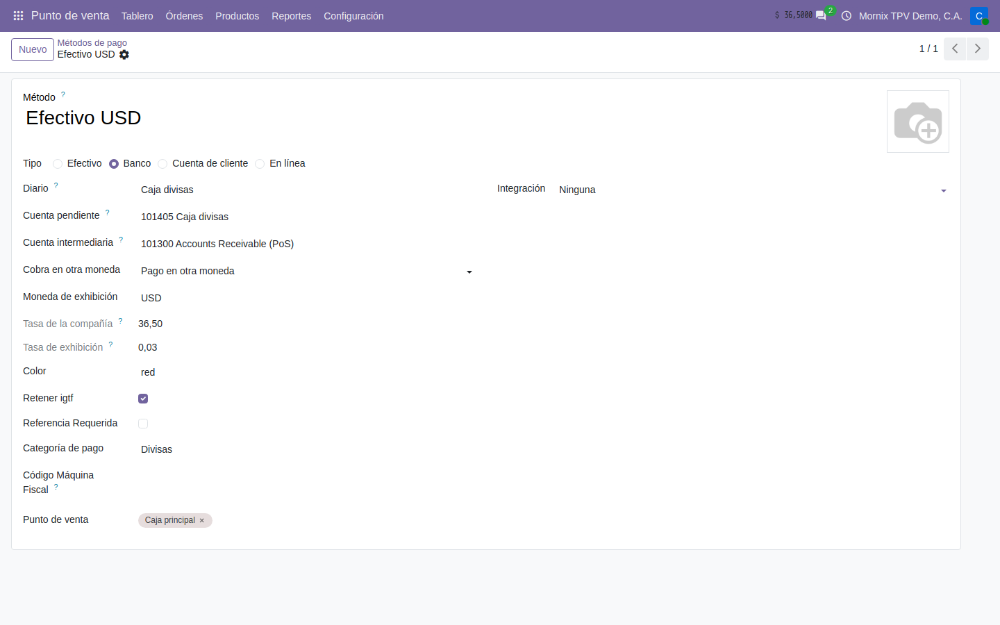
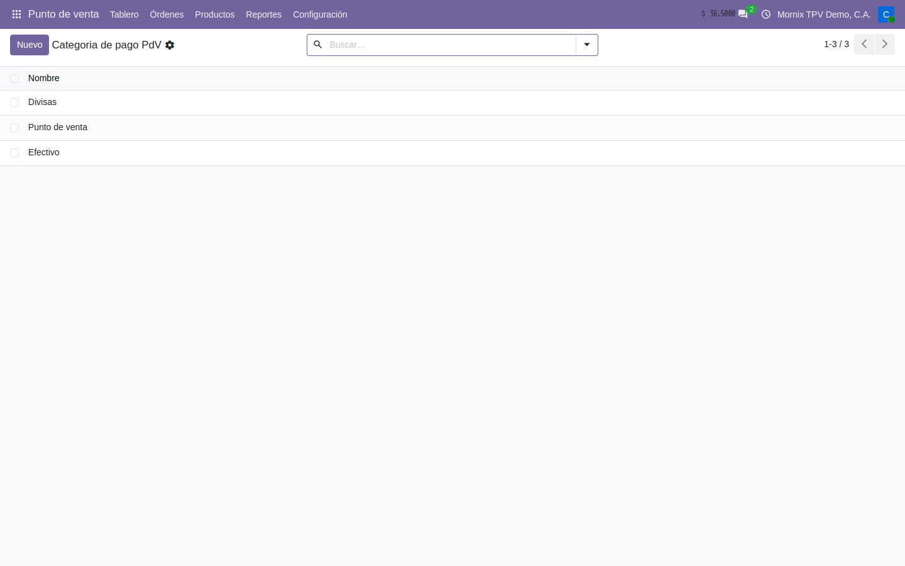
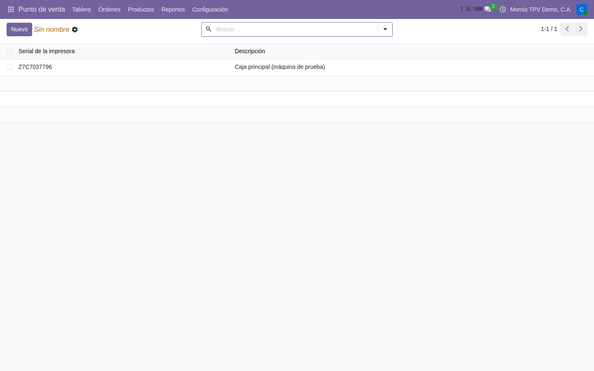
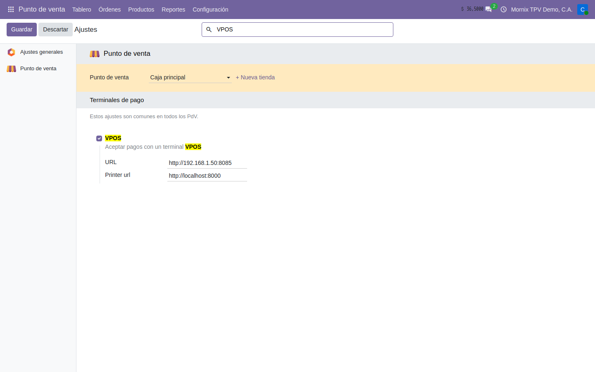
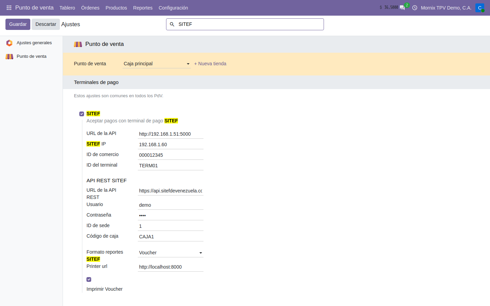

# Cómo se configura la caja

Lo que hay que dejar puesto **una vez** para que el TPV abra y cobre como
trabaja el comercio: los productos que salen en caja, los métodos de pago —en
bolívares, en divisa, con punto bancario o con retención—, la caja en sí, la
máquina fiscal y los terminales.

Esta guía va por **casos de uso**: cada apartado dice qué se quiere lograr, qué
hay que tener antes y el paso a paso con los nombres exactos de los campos.
Los datos de ejemplo son los de la caja de demostración («Caja principal»).

## El orden importa

1. **Productos** — marcar los que salen en caja y ponerles precio.
2. **Métodos de pago** — efectivo Bs, divisa, punto bancario, retenciones.
3. **La caja** — doble moneda, apertura en divisa, qué métodos ofrece.
4. **Máquina fiscal** — la impresora y el servidor fiscal, si hay.
5. **Terminales** — la conexión VPOS o SITEF, en **Ajustes**.
6. **IGTF** — la tasa y el producto con que se cobra.

| Si el comercio… | Necesita los apartados |
|---|---|
| Cobra solo en bolívares, en efectivo y con punto | 1, 2 (casos A y C o D), 3, 5 |
| Cobra también en dólares en efectivo | + 2 (caso B) y 6 |
| Recibe pago móvil, transferencias o Zelle | + 2 (caso E) |
| Vende a contribuyentes especiales | + 2 (caso F) |
| Tiene impresora fiscal | + 4 |
| Tiene varias cajas o varios cajeros | + 3 (casos de varias cajas y de empleados) |

## 1. Los productos que salen en caja

Un producto aparece en el TPV solo si lleva marcada la casilla **Punto de
venta** de su ficha. No basta con que exista ni con que tenga precio.

### Paso a paso: poner un producto en la caja

1. **Punto de venta → Productos → Productos → Nuevo** (o abra uno que exista).
2. **Nombre** del producto.
3. En la cabecera, junto a **Ventas** y **Compras**, marque **Punto de venta**.
   Es la casilla que decide si sale en la caja.
4. **Tipo de producto**: *Bienes* para mercancía, *Servicio* para lo que no se
   inventaría.
5. **Precio de venta $**: el precio en divisa. **Es el que se escribe.** El
   **Precio de venta** en bolívares se calcula solo, con la tasa del día, y
   sale de solo lectura.
6. **Impuestos de venta**: el IVA que le corresponde.
7. Pestaña **Punto de venta**: **Categoría** (la del TPV, que agrupa los
   productos en la pantalla de venta) y **Por pesar** si se vende por peso.
8. **Guardar.**

> **El precio en bolívares no se escribe a mano.** Sale de `Precio de venta $ ×
> tasa`. Si los productos salen todos a 0,00 en la caja, lo que falta es la
> tasa del día en Contabilidad, no el precio. Ver
> [Doble moneda](../10-contabilidad/06-doble-moneda.md).

### Casos de uso de productos

| Caso | Cómo se configura |
|---|---|
| **Mercancía por unidad** (lo normal) | *Bienes*, **Punto de venta** marcado, **Precio de venta $**, IVA general en **Impuestos de venta**. |
| **Producto por peso** (charcutería, frutas) | Igual, y en la pestaña **Punto de venta** marque **Por pesar**. La caja pide la cantidad con decimales y la unidad de medida debe ser *kg*. |
| **Producto exento de IVA** (alimentos de la cesta básica, medicinas) | En **Impuestos de venta** ponga el impuesto **Exento** de la localización, no lo deje vacío: la máquina fiscal necesita saber que la línea es exenta para imprimirla en su columna. |
| **Servicio** (delivery, instalación) | **Tipo de producto**: *Servicio*. No mueve inventario ni entra en la validación de existencias. |
| **Producto que no sale en caja** pero sí se vende por factura | Deje **Punto de venta** sin marcar. Sigue existiendo para Ventas y Contabilidad. |
| **Precio distinto según la caja** | Use una **lista de precios** por caja (**Punto de venta → Productos → Listas de precios**) y asígnela en la caja, apartado **Precios**. El precio en divisa de la ficha es el de la lista por defecto. |

### Caso de uso: no vender lo que no hay

El TPV valida las existencias **contra el almacén de la caja**: al añadir un
producto de tipo *Bienes* comprueba la cantidad disponible en el almacén del
**Tipo de operación** de la caja, y si es cero muestra el aviso **Sin stock**:
*«El producto seleccionado no posee existencias»*.

No hay nada que activar; viene con la instalación. Lo que sí hay que cuidar:

1. **Punto de venta → Configuración → Punto de venta → Caja principal**,
   apartado **Inventario**: el **Tipo de operación** debe ser el de la tienda
   donde está la caja. Es de ese almacén de donde lee las existencias.
2. Con dos tiendas, cada caja con su tipo de operación. Una caja de la tienda
   B que apunte al almacén A dirá que hay stock de lo que no tiene delante.
3. Los servicios y los productos no inventariables no se validan.

## 2. Los métodos de pago

**Punto de venta → Configuración → Métodos de pago.**

Cada método dice **por dónde entra el dinero** (el diario) y **cómo se cobra**
(efectivo, banco, terminal, otra moneda, retención). En la demo hay cuatro:
**Efectivo Bs**, **Efectivo USD**, **Punto de venta (VPOS)** y **SITEF**.

### Las tres reglas de Odoo 20 que hay que conocer antes

Odoo las impone al guardar, y explican por qué la divisa se configura como se
configura más abajo:

1. **Una sola caja puede tener un solo método de tipo *Efectivo*.** Al guardar
   una caja con dos, Odoo la rechaza: *«You cannot have more than one cash
   payment method on a point of sale configuration»*.
2. **Todos los métodos van en la moneda de la compañía.** Un método sobre un
   diario en USD se rechaza: *«All payment methods must be in the same currency
   as the Sales Journal»*. Los dólares se cobran sobre un diario en bolívares
   que **muestra** dólares.
3. **Dos métodos de efectivo no comparten diario**, aunque estén en cajas
   distintas: *«You cannot use the same journal on multiples cash payment
   methods»*.

> **Con una sesión abierta no se tocan los métodos.** Odoo no deja modificar un
> método de pago mientras una caja que lo usa tenga sesión abierta. Cierre la
> caja primero.

### Campos de la localización en el método

Debajo de los campos de Odoo (**Tipo**, **Diario**, **Cuenta pendiente**,
**Integración**) el método trae los de la casa:

| Campo | Para qué sirve |
|---|---|
| **Cobra en otra moneda** | *Pago en otra moneda*: el cajero teclea el importe en la divisa y la caja lo convierte a Bs con la tasa. *Retencion IVA* y *Retencion Base*: el método descuenta una retención en vez de cobrar (caso F). |
| **Moneda de exhibición** | La divisa del método (USD, EUR). Obligatoria con *Pago en otra moneda*; sin ella el método no se guarda: *«Debe seleccionar una moneda para el pago en otra moneda»*. |
| **Tasa de la compañía** / **Tasa de exhibición** | Solo lectura: la tasa vigente de esa moneda, del derecho (36,50) y del revés (0,03). |
| **Color** | El color del botón en la pantalla de pago (`red`, `green`, `blue`…). Sirve para distinguir de un vistazo la divisa del efectivo Bs. |
| **Retener igtf** | Marca el método como cobro en divisa a efectos del IGTF: la caja añade el 3 % sobre lo pagado con él. |
| **Referencia Requerida** | La caja no deja cerrar el pago sin escribir una referencia (número de transferencia, de pago móvil, de voucher). |
| **% de retención** | Porcentaje que descuenta el método cuando es *Retencion IVA* o *Retencion Base*. Debe ser mayor que 0. |
| **Categoría de pago** | Agrupa métodos para los reportes de cierre: Efectivo, Punto de venta, Divisas. Ver más abajo. |
| **Código Máquina Fiscal** | El código con el que la impresora fiscal identifica este medio de pago (01 efectivo, 02 tarjeta…). Lo indica el manual de la impresora. |

### Caso A — Efectivo en bolívares

Es el método base: el que abre y cierra la caja con el conteo.

1. **Punto de venta → Configuración → Métodos de pago → Nuevo.**
2. **Método**: «Efectivo Bs».
3. **Tipo**: *Efectivo*. **Es obligatorio en Odoo 20**: un método sin tipo no se
   deja guardar.
4. **Diario**: el diario de efectivo de la caja (tipo *Efectivo*, en Bs). Con
   varias cajas, un diario de efectivo por caja (regla 3).
5. **Categoría de pago**: *Efectivo*. **Código Máquina Fiscal**: el que pida la
   impresora para efectivo.
6. **Punto de venta**: la caja (o cajas) donde se ofrece.
7. **Guardar.**

### Caso B — Efectivo en dólares (con IGTF)

El comercio recibe billetes en dólares y quiere que el cajero teclee «20 $» y
la caja anote los bolívares equivalentes a la tasa del día, más el IGTF. Por
las reglas 1 y 2, el método **no puede ser de tipo Efectivo ni estar en USD**:
se monta como un método de tipo *Banco* sobre un diario propio en bolívares
que representa la caja de divisas.

**Antes**: un diario para la caja de divisas. **Contabilidad → Configuración →
Diarios → Nuevo**: nombre «Caja divisas», **Tipo**: *Banco*, **Código**:
`CSHDV`, moneda vacía (bolívares). Guardar.

1. **Métodos de pago → Nuevo.** **Método**: «Efectivo USD».
2. **Tipo**: *Banco*.
3. **Diario**: «Caja divisas».
4. **Cuenta pendiente**: la cuenta del diario «Caja divisas» (sale en rojo
   mientras esté vacía; un método de tipo Banco no se guarda sin ella).
5. **Integración**: *Ninguna* (no hay terminal, son billetes).
6. **Cobra en otra moneda**: *Pago en otra moneda*.
7. **Moneda de exhibición**: *USD*. **Tasa de la compañía** se llena sola con
   la tasa del día.
8. **Color**: `green`, para distinguirlo del efectivo Bs en la pantalla.
9. **Retener igtf**: marcado. Es lo que hace que la caja cargue el 3 %.
10. **Categoría de pago**: *Divisas*. **Código Máquina Fiscal**: el de
    «divisa» de la impresora.
11. **Punto de venta**: la caja. **Guardar.**

Con esto, al cobrar, el botón **Efectivo USD** pide el importe en dólares, lo
convierte con la tasa que ve en la cabecera y añade la línea de IGTF. El
efectivo en dólares **no entra en el conteo de apertura y cierre** de la caja
(eso es solo para el método de tipo Efectivo); para contarlo se marca
**Apertura/Cierre en USD** en la caja (apartado 3).

> **Sin tasa del día, la conversión da cero.** El método lee la tasa con fecha
> de hoy. Si Contabilidad no la tiene cargada, la cabecera de la caja dice
> `USD: 0` y el método no convierte. Es lo primero que hay que mirar cuando
> «el dólar no cobra».

Para **euros**, el mismo método con **Moneda de exhibición**: *EUR* y su
propio diario «Caja euros».

### Caso C — Punto de venta bancario VPOS

El cobro con tarjeta pasa por el terminal VPOS conectado a la caja: la caja
envía el importe y el terminal devuelve aprobado o rechazado.

**Antes**: activar VPOS en **Ajustes** (apartado 5) y tener el diario de banco
del punto.

1. **Nuevo.** **Método**: «Punto de venta (VPOS)».
2. **Tipo**: *Banco*. Al elegirlo aparecen los campos del terminal.
3. **Diario**: el diario de banco donde entra lo cobrado con el punto.
4. **Cuenta pendiente**: la cuenta de pagos pendientes del banco. **Es
   obligatoria** para un método de tipo Banco —sale en rojo mientras esté
   vacía— y sin ella el método no se guarda.
5. **Integración**: *Terminal*.
6. **Integrar con**: **VPOS**. Aquí es donde antes estaba «Usar terminal de
   pago»: en Odoo 20 el terminal se elige en este campo.
7. **Tipo** (el de VPOS, aparece debajo): la operación que dispara el botón.

   | Tipo | Cuándo |
   |---|---|
   | *Tarjeta* | El cobro normal con tarjeta de débito o crédito. **Es el que se usa en el 99 % de los casos.** |
   | *Cambio* | Devolver efectivo al cliente cargándolo a su tarjeta (vuelto en punto). |
   | *Compra Con Cards* | Cobro con tarjetas de beneficios (Cards). |
   | *Anulación* | Anular la última transacción del terminal. |
   | *Cashea* | Venta financiada con Cashea a través del terminal. |

   Cada tipo es **un método distinto**: si se ofrece tarjeta y Cashea, se crean
   dos métodos VPOS, cada uno con su tipo.
8. **Categoría de pago**: *Punto de venta*. **Código Máquina Fiscal**: el de
   tarjeta.
9. **Punto de venta**: la caja. **Guardar.**

> **Dos cosas cambiaron en Odoo 20.** El **Tipo** es obligatorio, y el
> terminal ya no se elige en «Usar terminal de pago» sino en **Integrar con**.
> Un método traído de la versión anterior llega sin ninguno de los dos y hay
> que ponérselos, o la caja no lo ofrece.

### Caso D — Punto de venta bancario SITEF

Igual que VPOS hasta el paso 5. En **Integrar con** elija **SITEF** y en
**Tipo SITEF** la operación:

| Tipo SITEF | Cuándo |
|---|---|
| *SITEF (PinPad)* | Cobro con tarjeta en el PinPad. El habitual. |
| *Pago Móvil* | El terminal genera la operación de pago móvil y valida la llegada. |
| *Transferencia* | Igual, para transferencias bancarias. |
| *Zelle* | Cobro en Zelle validado por la plataforma. |
| *Cashea* | Venta financiada con Cashea: la caja crea la orden en Cashea y espera la aprobación. |
| *Vuelto* | Devolver la diferencia al cliente por pago móvil. |

Un método por cada tipo que se ofrezca. Todos comparten la conexión que se
configura en **Ajustes** (apartado 5): IP, comercio, terminal y credenciales.

### Caso E — Pago móvil, transferencia o Zelle sin terminal

Cuando no hay integración y el cajero comprueba el pago en el teléfono del
banco, lo que hace falta es **que no se pueda cerrar sin la referencia**:

1. **Nuevo.** **Método**: «Pago móvil Banesco».
2. **Tipo**: *Banco*. **Diario**: el banco donde llega. **Cuenta pendiente**.
3. **Integración**: *Ninguna*.
4. **Referencia Requerida**: marcado. La caja exige escribir el número de
   referencia antes de validar.
5. Para **Zelle** u otro cobro en dólares sin terminal: además **Cobra en otra
   moneda**: *Pago en otra moneda*, **Moneda de exhibición**: *USD* y, si aplica,
   **Retener igtf**.
6. **Categoría de pago**, **Código Máquina Fiscal**, **Punto de venta**.
   **Guardar.**

### Caso F — Cliente contribuyente especial (retención en caja)

Un contribuyente especial retiene parte del IVA al pagar y entrega el
comprobante. En la caja eso se registra con un método que **descuenta** en vez
de cobrar:

1. **Nuevo.** **Método**: «Retención IVA 75 %».
2. **Tipo**: *Banco*. **Diario**: un diario propio «Retenciones IVA TPV» (tipo
   *Varios* o *Banco*, en Bs), con su **Cuenta pendiente** en la cuenta de
   retenciones de IVA por cobrar.
3. **Cobra en otra moneda**: *Retencion IVA*.
4. **% de retención**: `75`. Con *Retencion IVA* el porcentaje se aplica **sobre
   el IVA de la venta**; con *Retencion Base* se aplica **sobre la base
   imponible** (para retenciones municipales o de ISLR).
5. **Referencia Requerida**: marcado, para anotar el número del comprobante.
6. **Punto de venta**: la caja. **Guardar.**

Al cobrar, el cajero elige el cliente (con su RIF), pulsa el método y la caja
calcula solo el importe retenido; el resto se cobra con los demás métodos.
Se crea un segundo método al 100 % si hay clientes con esa alícuota.

### Caso G — Cuenta de cliente (fiado)

Es de Odoo: **Tipo**: *Cuenta de cliente*. La venta queda como deuda del
cliente y se cobra después desde Contabilidad. Exige elegir el cliente en la
venta; conviene combinarlo con la búsqueda por cédula o RIF (apartado 7).

### Las categorías de pago

**Punto de venta → Configuración → Categoria de pagos** (también en
Contabilidad → Configuración). Son etiquetas libres que agrupan métodos en los
reportes de cierre y en el Reporte Z: «Efectivo», «Punto de venta»,
«Divisas». Cree una por cada grupo que el cierre deba totalizar por separado y
asígnela en **Categoría de pago** de cada método. Sin categoría, el método
sale suelto en el cierre.

## 3. La caja

**Punto de venta → Configuración → Punto de venta → Caja principal.**

### Paso a paso: dejar la caja con doble moneda

1. **Punto de venta → Configuración → Punto de venta**, abra **Caja principal**
   (o **Nuevo** para otra caja: **Punto de venta** es su nombre).
2. Pestaña **Configuración**, bloque de la localización:
   - **Mostrar doble moneda**: marcado. Añade a cada producto y a cada línea
     su precio en la otra moneda.
   - **Moneda**: **USD**, la moneda de exhibición.
   - **Tasa**: se llena sola con la tasa vigente. **No la toque** (ver abajo).
   - **Moneda Euro** y **Tasa euro**: solo si además se exhibe en euros.
   - **Apertura/Cierre en USD**: si la caja se cuenta también en divisa al
     abrir y al cerrar.
   - **Servidor Fiscal**: la máquina fiscal, cuando la haya (apartado 4).
3. Más abajo, **Métodos de pago**: marque los que ofrece esta caja.
4. **Guardar.**

> **La tasa se ve aquí, pero no se pone aquí.** El campo **Tasa** es la tasa
> de la moneda en Contabilidad, y se muestra como Odoo la guarda: dólares por
> bolívar (`0,0273972…`), no bolívares por dólar. En la caja se ve del derecho
> —`USD: 36.5` en la cabecera—. Para cambiarla se carga la tasa del día en
> Contabilidad; tocarla aquí no es el camino.

> **Con la caja abierta no se cambian los ajustes.** Odoo avisa en una franja
> amarilla: *«Hay una sesión abierta para este PdV. Antes de cambiar algunos
> ajustes debe cerrar la sesión»*. Es de Odoo, no de la localización.

### Caso de uso: la caja se cuenta en dólares

Si el comercio guarda los dólares en la misma gaveta y quiere que el cajero
declare cuántos billetes en divisa había al abrir y cuántos al cerrar:

1. En la caja, marque **Apertura/Cierre en USD**.
2. Al abrir, la ventana de apertura pide el efectivo en Bs **y** el efectivo en
   USD. Al cerrar, igual, y la diferencia se calcula por moneda.
3. El método «Efectivo USD» del caso B debe estar en la caja: es lo que se
   compara con el conteo.

### Caso de uso: varios cajeros en la misma caja

1. En la caja, marque **Iniciar sesión como empleado** («Permitir registrar y
   cambiar entre empleados seleccionados») y **Guardar**. La primera vez Odoo
   instala el módulo de empleados del TPV; tarda un momento.
2. Vuelva a abrir la caja: aparecen los campos para elegir qué **empleados**
   pueden entrar y cuáles tienen permisos de **gerente** (anular, descontar,
   cerrar).
3. Cada empleado necesita un **PIN** en su ficha de empleado, pestaña de
   ajustes, para cambiar de cajero sin cerrar la sesión.
4. Cada venta queda registrada con el cajero que la hizo, y el cierre las
   agrupa por empleado.

### Caso de uso: dos cajas en la misma tienda

1. **Punto de venta → Configuración → Punto de venta → Nuevo**: «Caja 2».
2. Repita la doble moneda y el servidor fiscal, con **su propia máquina
   fiscal** (una impresora por caja: el serial es único).
3. Métodos de pago: los de banco y divisa **se comparten** (marque «Caja 2» en
   su campo **Punto de venta**). El **efectivo Bs no**: cree «Efectivo Bs caja
   2» sobre un **segundo diario de efectivo** (regla 3).
4. Si la caja 2 está en otra tienda, cambie su **Tipo de operación** al almacén
   de esa tienda (apartado 1, validación de existencias).

### Caso de uso: el cliente por defecto

Para que las ventas sin cliente salgan a «Consumidor final», en la caja,
apartado **Facturación**, ponga en **Cliente predeterminado** el contacto
«Consumidor final» con su RIF genérico. La máquina fiscal lo imprime así
cuando el cajero no elige a nadie.

## 4. La máquina fiscal

Dos piezas: la **impresora** (un registro con su serial) y el **servidor
fiscal** (el programa que corre en el equipo de la caja y habla con la
impresora por el puerto).

### Paso a paso: registrar la impresora

1. **Punto de venta → Configuración → Impresora Fiscal → Nuevo.**
2. **Serial de la impresora**: el serial que imprime la propia máquina en sus
   tiques (`Z7C7037796`). Es lo que la vincula con los reportes Z.
3. **Descripción**: dónde está («Caja principal, tienda centro»).
4. **Guardar.** Una impresora por caja.

### Paso a paso: conectar la caja al servidor fiscal

En la ficha de la caja, columna derecha:

1. **Servidor Fiscal**: marcado («Servidor Fiscal para maquina fiscal»).
2. **Servidor Fiscal** (la lista): el fabricante del programa.

   | Valor | Cuándo |
   |---|---|
   | *Prueba* | Sin impresora: la caja simula la impresión y sigue. **Para montar y probar** sin gastar papel fiscal. |
   | *HK* | Impresoras The Factory HKA, con su servidor de impresión. |
   | *PNP* | Impresoras PNP, con su servidor. |
3. **Maquina Fiscal**: la impresora registrada arriba.
4. **IP Servidor**: la dirección del servidor de impresión, con protocolo y
   puerto: `http://localhost:5000` si corre en el mismo equipo de la caja,
   `http://192.168.1.20:5000` si corre en otro.
5. Las casillas de comportamiento:
   - **Mostrar descuento en la factura**: imprime el descuento de cada línea
     en el tique fiscal. Sin marcar, imprime el precio ya rebajado.
   - **Mostrar el Boton Factura**: en la pantalla de pago aparece el botón para
     pedir factura fiscal en vez de tique.
   - **Mostrar el Boton Enviar Despues**: permite cerrar la venta y enviar la
     impresión más tarde (si la impresora se traba, la venta no se pierde).
   - **Generar copia automatica**: imprime una copia no fiscal detrás de cada
     documento.
   - **Mostrar codigo de barras en maquina fiscal**: imprime la referencia de
     la orden como código de barras al pie del tique.
   - **Reporte Z al cerrar**: *Automático* lo imprime solo al cerrar la sesión;
     *Manual* añade un botón **ReporteZ** en la ventana de cierre para que el
     cajero lo dispare cuando toque.
6. **Guardar.**

> **Empiece en Prueba.** Con *Prueba* se puede recorrer toda la caja —venta,
> pago, cierre— sin impresora conectada. Cambie a *HK* o *PNP* solo cuando el
> servidor de impresión responda en la **IP Servidor**; si no responde, cada
> venta se queda esperando la impresora.

Los reportes Z emitidos quedan en **Contabilidad → Reportes → Informes de
Venezuela → Libro de ventas Reportes Z**, con su período, el rango de facturas
y el detalle de ventas.

## 5. Los terminales, en Ajustes

**Punto de venta → Configuración → Ajustes**, bloque **Terminales de pago**.
Estos ajustes **son comunes a todas las cajas**: la conexión se pone una vez y
los métodos de pago de los casos C y D la usan.

### VPOS

1. Escriba `VPOS` en el buscador de Ajustes para ir directo.
2. Marque **VPOS** («Aceptar pagos con un terminal VPOS»).
3. **URL**: la dirección del servicio VPOS que corre junto al terminal, con
   puerto (`http://192.168.1.50:8085`).
4. **Printer url**: el servicio de impresión del voucher, si el comprobante
   del punto se imprime aparte (`http://localhost:8000`).
5. **Guardar.**

### SITEF

1. Escriba `SITEF` en el buscador de Ajustes.
2. Marque **SITEF** («Aceptar pagos con terminal de pago SITEF»).
3. Conexión al terminal:
   - **URL de la API**: el servicio local del PinPad (`http://192.168.1.51:5000`).
   - **SITEF IP**: la IP del terminal.
   - **ID de comercio** y **ID del terminal**: los que asigna SITEF al afiliar.
4. **API REST SITEF**, para pago móvil, transferencias, Zelle y Cashea:
   - **URL de la API REST**: la de SITEF de Venezuela (viene precargada).
   - **Usuario** y **Contraseña**: las credenciales que entrega SITEF.
   - **ID de sede** y **Código de caja**: identifican la tienda y la caja ante
     la plataforma; deben coincidir con lo registrado en SITEF.
5. **Formato reportes SITEF**: *Voucher*, *PDF* o *Excel*, según cómo quiera el
   cierre del terminal. **Printer url** e **Imprimir Voucher**: si el voucher
   sale por el servicio de impresión.
6. **Guardar.**

> **Ajustes exige una moneda sincronizada.** Si al abrir Ajustes del TPV sale
> *«Operación no válida: Verifique que tiene monedas activas y con
> 'Sincronizar' en verdadero»*, falta marcar **Sincronizar** en la moneda USD
> (**Contabilidad → Configuración → Monedas → USD**). Es la misma marca que
> hace que la tasa del BCV se cargue sola cada día.

## 6. El IGTF

**Contabilidad → Configuración → Ajustes → Configuración IGTF**: la **Tasa
IGTF (%)** (3) y el **Producto IGTF**, que es el producto de servicio con el que
se añade la línea del impuesto a la venta. Se configura una vez por compañía;
los métodos con **Retener igtf** marcado son los que lo disparan.

> El IGTF **no está portado a Odoo 20 todavía**. La configuración se guarda,
> pero no se aplica: el cobro es justo la parte que no funciona. No se use esta
> caja para cobrar en divisa hasta que se cierre esa parte.

## 7. Lo que ya viene puesto

Dos comportamientos de la caja que no tienen configuración:

- **Descuento al total.** En la pantalla de venta, el botón **Descuento al
  total** pide un porcentaje de 0 a 100 y lo aplica a todas las líneas. Sin
  productos en la orden avisa: *«Agregue productos a la orden antes de aplicar
  el descuento»*. Quién puede usarlo se controla con los permisos de gerente
  del caso de varios cajeros.
- **Buscar clientes por cédula o RIF.** El buscador de clientes de la caja
  encuentra por el campo **NIF** del contacto: teclear `V12345678` o
  `J-12345678-9` trae al cliente. Los contactos deben tener el RIF cargado con
  el formato de la localización.

## 8. Qué está comprobado en Odoo 20

| Parte | Estado |
|---|---|
| Productos con doble precio, categorías, por pesar | **Funciona**: se ve en la caja línea a línea. |
| Crear los métodos de los casos A a F y guardarlos | **Funciona**: la demo los tiene creados con estas reglas. |
| Caja con doble moneda, apertura en USD, empleados | **Funciona**: la caja abre y muestra `USD: 36.5`. |
| Impresora fiscal y servidor en *Prueba* | **Se configura y guarda**. La impresión real con HK o PNP no se ha probado en esta versión. |
| Ajustes de VPOS y SITEF | **Se guardan**. El cobro con terminal depende de la pantalla de pago. |
| Pantalla de pago (efectivo USD, IGTF, retenciones, terminal) | **No funciona todavía**: al pulsar **Pago** la pantalla se queda en blanco. Es el punto abierto del TPV. |
| Reporte Z | Depende del pago: no comprobado. |

El detalle técnico de lo que falta está en la ficha
[Punto de venta](../../modulos/tpv.md).
