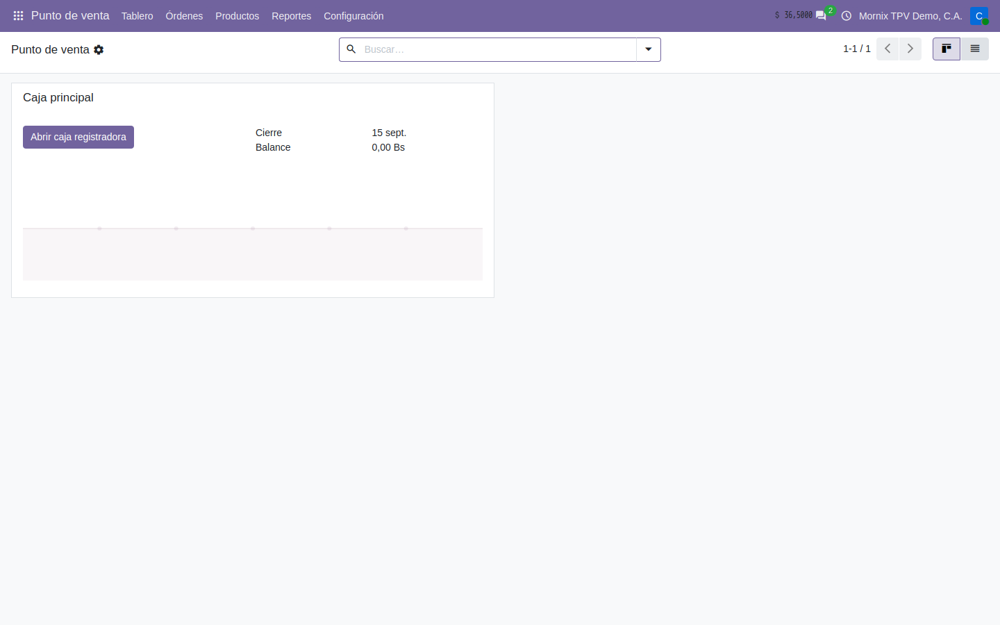
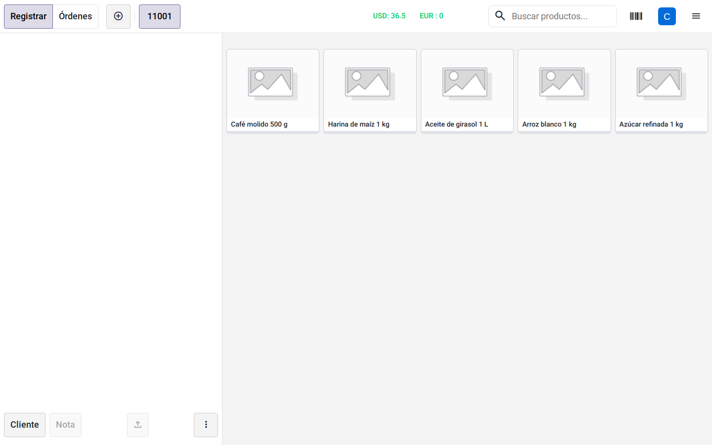
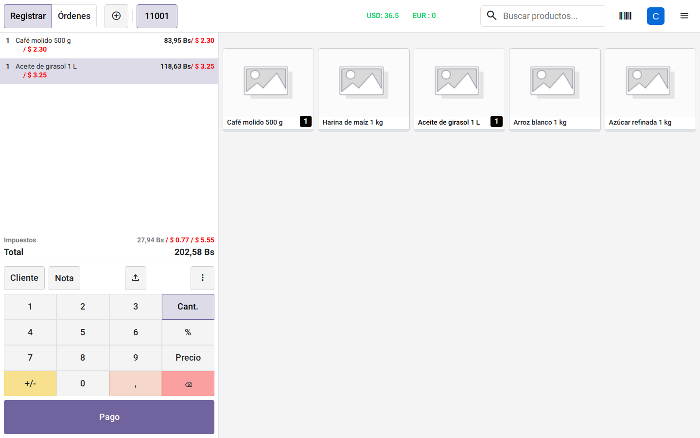

# Abrir la caja y vender

El día a día: abrir la caja, armar la venta y ver el importe en las dos monedas.

## 1. Abrir la caja

**Punto de venta → Tablero.** Cada caja es una tarjeta.

El botón de la tarjeta dice lo que va a pasar:

- **Abrir caja registradora** — no hay sesión abierta: se abre una nueva.
- **Seguir vendiendo** — ya hay una sesión abierta y se vuelve a ella.

### Paso a paso: abrir la caja al empezar el día

1. **Punto de venta → Tablero → Abrir caja registradora** en la tarjeta de la
   caja.
2. Espere. **El TPV tarda en abrir**: no es una pantalla más del sistema, es
   una aplicación aparte que se descarga entera la primera vez, con sus
   productos y su sesión. Veinte segundos con la pantalla en blanco son
   normales; el segundo arranque es rápido.
3. **Solo la primera vez**, Odoo pregunta cómo se exhiben los precios. Elija
   **Impuestos incluidos**: en el comercio venezolano el precio se exhibe con
   el IVA dentro. No vuelve a preguntar.
4. Aparece el **control de apertura**: escriba el **efectivo inicial** que hay
   en la gaveta (y en divisa, si la caja tiene «Apertura/Cierre en USD») y
   pulse **Abrir caja registradora**.
5. Resultado: la pantalla de venta, con los productos a la derecha y el
   carrito vacío a la izquierda. En la cabecera, la tasa del día (`USD: 36.5`).

### Paso a paso: volver a una caja ya abierta

1. **Punto de venta → Tablero → Seguir vendiendo.**
2. Entra directo a la pantalla de venta, sin control de apertura.

## 2. Armar la venta

### Paso a paso: una venta

1. **Toque el producto** en la cuadrícula de la derecha: entra al carrito con
   cantidad 1. Tocarlo otra vez suma uno más.
2. Para cambiar la cantidad: seleccione la línea en el carrito, pulse **Cant.**
   en el teclado y escriba el número.
3. Para un descuento en la línea: **%** y el porcentaje. Para cambiar el
   precio: **Precio** y el nuevo importe.
4. **+/-** invierte el signo (una devolución en la misma venta); **⌫** borra el
   último dígito y, con la cantidad en 0, quita la línea.
5. **Cliente** (botón sobre el teclado) para poner la venta a nombre de alguien:
   se busca por nombre, **cédula o RIF**.
6. **Nota** añade un comentario a la línea seleccionada.

La doble moneda está a la vista en tres sitios:

- **En la cabecera**, la tasa del día: `USD: 36.5`.
- **En cada línea**, el importe en bolívares y, debajo en rojo, el mismo importe
  en divisa.
- **En el pie**, los impuestos y el total.

El recorrido entero, del tablero al carrito:

## 3. Dónde se corta hoy

**Al pulsar «Pago» la caja se queda en blanco.** No es una pantalla vacía: se
cae el TPV entero y hay que recargar el navegador. La venta que estuviera
armada se pierde.

### Qué hacer si pasa

1. Recargue la página del navegador (F5).
2. La caja vuelve a la pantalla de venta con el carrito vacío.
3. No repita el intento de cobro: fallará igual.

Es un fallo conocido y localizado —la lógica de IGTF y doble moneda del pago
llama a métodos que Odoo 20 renombró—, no un problema de configuración ni de
permisos. Está en la ficha técnica
[Punto de venta](../../modulos/tpv.md), con el detalle de qué falta.

Por lo tanto, **en Odoo 20 esta caja todavía no factura**. Lo que va después del
carrito —cobrar, imprimir en la máquina fiscal, el voucher del punto, el cierre
de caja y el reporte Z— no está comprobado en esta versión y no debe darse por
bueno. Estas guías se amplían con esos pasos en cuanto el cobro funcione.
