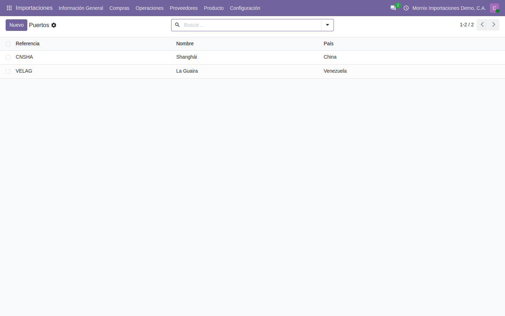
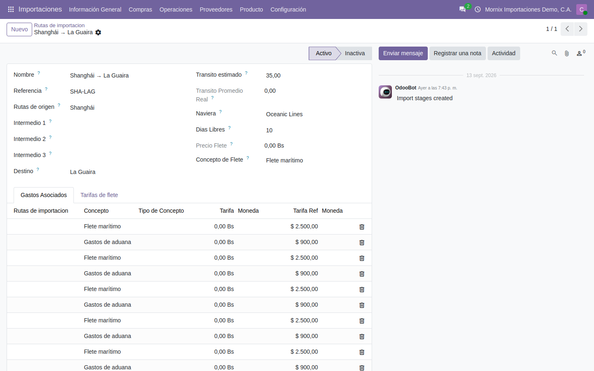
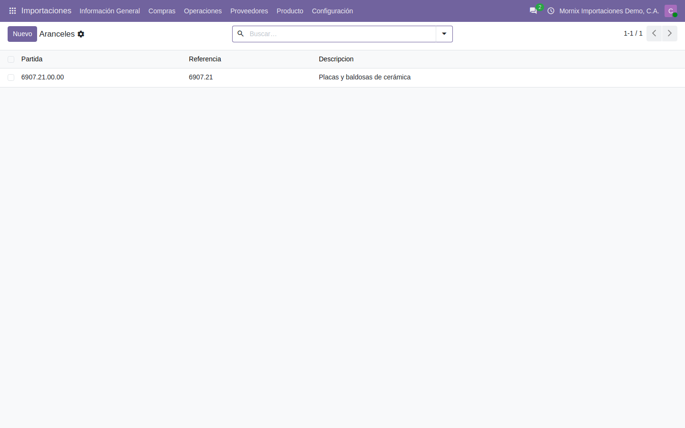
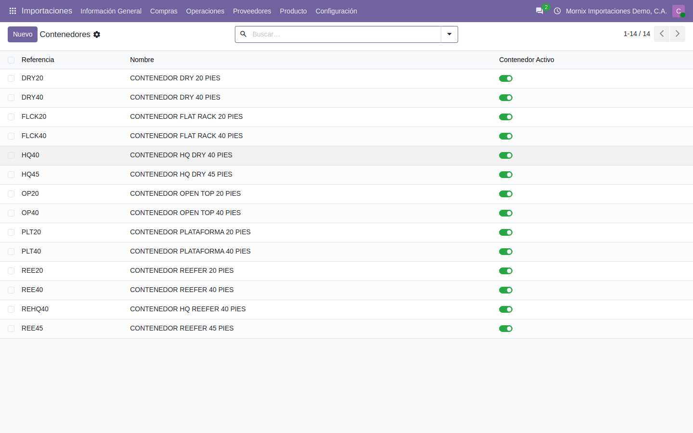
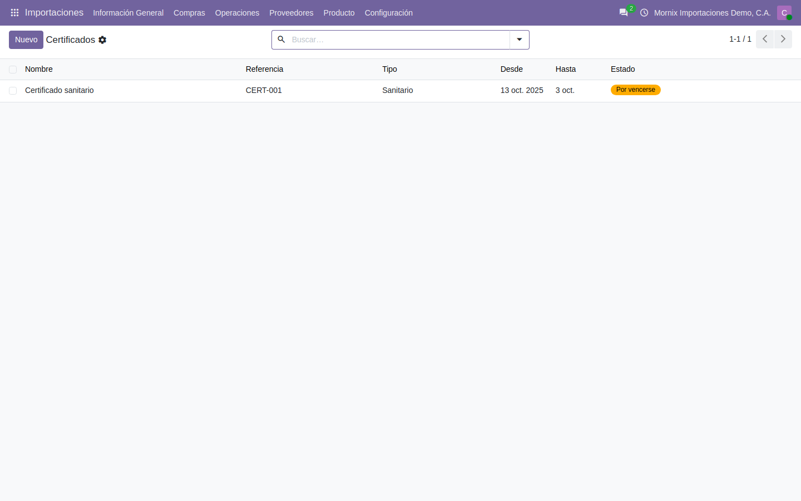
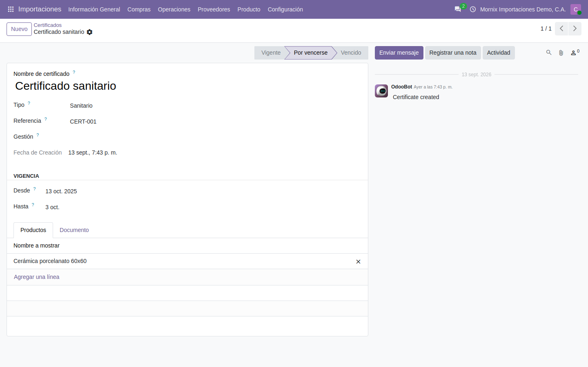

# Cómo se configuran los catálogos

Un expediente de importación se apoya en catálogos que se dejan puestos **una
vez**: los puertos, la naviera, la ruta, el almacén, los aranceles y los
certificados. Todo vive en **Importaciones → Configuración**.

## El orden importa

Cada pieza necesita la anterior:

1. **Puertos** — de origen y de destino.
2. **Navieras** — cada una con su contacto.
3. **Productos de servicio** — el flete, la aduana, el seguro: con los que se
   facturan los gastos del viaje.
4. **Rutas** — unen puertos y naviera, y llevan los gastos del viaje.
5. **Almacenes**, **aranceles**, **certificados**, **etiquetas** y el **agente
   aduanal** — se añaden cuando hagan falta.

## 1. Puertos

### Paso a paso

1. **Importaciones → Configuración → Puertos → Nuevo.** La lista se edita en
   línea: aparece una fila vacía.
2. **Referencia**: el código del puerto, único por compañía. Conviene el código
   internacional: `CNSHA` para Shanghái, `VELAG` para La Guaira.
3. **Nombre** y **País**.
4. Pulse fuera de la fila o **Guardar**. Repita para cada puerto: al menos uno
   de origen y uno de destino.

## 2. Navieras

Cada naviera se apoya en un **contacto** de Odoo: si ya está en la agenda, se
enlaza; si no, se crea primero el contacto.

### Paso a paso

1. **Importaciones → Configuración → Navieras → Nuevo.**
2. **Nombre**: «Oceanic Lines». **Referencia**: `OCL`.
3. **Contacto**: el contacto de Odoo de la naviera (es a quien se le factura el
   flete). Si no existe, escriba el nombre y pulse *Crear y editar*.
4. Pestaña **Gastos Asociados**: los gastos fijos que esta naviera cobra por
   viaje (manejo, documentación…), uno por línea, con su concepto y su tarifa.
5. Pestaña **Tarifario de Demora**: lo que cobra por día de retraso en la
   devolución del contenedor, cuando hay.
6. **Guardar.**

## 3. Los productos de servicio del viaje

Los gastos —flete, aduana, seguro, almacenaje— se facturan como **servicios**, y
el módulo necesita reconocerlos para llevarlos al costo.

### Paso a paso: crear el concepto de flete

1. **Punto de venta → Productos** o **Inventario → Productos → Productos → Nuevo.**
2. **Nombre**: «Flete marítimo». **Tipo de producto**: *Servicio*.
3. Marque **Puede ser costo en destino** (es lo que permite repartirlo sobre la
   mercancía).
4. **Tipo de concepto**: *Flete marítimo*. Los demás valores —*Flete
   terrestre*, *Seguro*, *Gastos de aduana*, *Gastos de almacenaje*, *Gastos
   generales*— clasifican cada servicio en el reparto.
5. **Guardar.** Repita para los gastos de aduana, el seguro y lo que se
   facture aparte.

> Sin las dos marcas —*Servicio* con **Puede ser costo en destino** y su **Tipo
> de concepto**— el producto no aparece en la lista desplegable de la ruta ni
> entra en el reparto del costo. Es el motivo más frecuente de «no me sale el
> flete».

## 4. Rutas

**Importaciones → Configuración → Rutas de importación.**

La ruta es la que sabe por dónde va la mercancía y cuánto cuesta el viaje.

### Paso a paso

1. **Importaciones → Configuración → Rutas de importación → Nuevo.**
2. **Nombre**: «Shanghái → La Guaira». **Referencia**: `SHA-LAG`.
3. **Rutas de origen**: el puerto de salida. **Destino**: el de llegada.
   **Intermedio 1, 2 y 3**: las escalas, si las hay.
4. **Naviera**: la del paso 2. **Días Libres**: los que concede antes de cobrar
   almacenaje del contenedor.
5. **Tránsito estimado**: los días que se espera que tarde. **Tránsito
   Promedio Real** se calcula solo con las importaciones ya hechas por esa ruta.
6. **Concepto de Flete**: el producto de servicio del paso 3. Al elegirlo, se
   añade solo una línea en **Gastos Asociados**.
7. Pestaña **Gastos Asociados**: complete la **tarifa** de la línea del flete y
   añada los demás gastos habituales del viaje (aduana, seguro).
8. Pestaña **Tarifas de flete**: el precio del flete por tipo de contenedor, si
   la naviera lo cotiza así.
9. **Guardar.** La ruta queda **Activa**; **Inactiva** la retira de las listas
   sin borrarla.

> **La ruta no se guarda sin su línea de flete.** En **Gastos Asociados** tiene
> que haber una línea con el mismo producto que el **Concepto de Flete**; Odoo
> la propone al elegirlo, y si se borra, la ruta se niega a guardar con
> *«En la pestaña de gastos asociados tiene que haber al menos una línea con el
> concepto de flete»*.

## 5. Almacenes

### Paso a paso

1. **Importaciones → Configuración → Almacenes → Nuevo.**
2. **Nombre** y **Referencia** (`ALM-LG`).
3. Pestañas **Tarifa de demora**, **Tarifa de vigilancia** y **Gastos
   asociados**: lo que el almacén cobra por día de estadía, por vigilancia y
   por manejo. Alimentan el cálculo de los gastos de destino.
4. **Guardar.**

## 6. Aranceles

### Paso a paso

1. **Importaciones → Configuración → Aranceles → Nuevo.**
2. **Partida**: el código arancelario, por ejemplo `6907.21.00.00`.
   **Referencia**: una corta, única por compañía.
3. **Descripción**: qué mercancía cubre.
4. **Tasa**: el porcentaje del arancel, **entre 0 y 100**. El sistema no deja
   guardar otra cosa.
5. **Tipo de certificado**: los certificados que exige esa partida, si los hay.
6. Pestaña **Exenciones**: los acuerdos comerciales que rebajan la tasa.
7. **Guardar.**
8. Enlace la partida en la ficha del producto importado, pestaña de
   importaciones, campo **Partida arancelaria**.

## 7. Contenedores

Vienen **precargados** —dry de 20 y 40 pies, y los demás tipos habituales— con
sus medidas interiores, su capacidad cúbica, su tara y su carga máxima. La
instalación los copia a cada compañía de la base. Si hace falta uno nuevo:
**Nuevo**, nombre, referencia, medidas y **carga máxima**, y la casilla de
contenedor activo.

## 8. Certificados

### Paso a paso: el tipo y el certificado

1. **Importaciones → Configuración → Tipos de certificado → Nuevo**: nombre y
   referencia («Sanitario», `SANIT`). **Guardar.**
2. **Importaciones → Configuración → Certificados → Nuevo.**
3. **Nombre de certificado**, **Tipo** (el del paso 1), **Referencia**.
4. **Gestión**: el contacto que lo tramita.
5. **Desde** y **Hasta**: la vigencia. El estado —**Vigente**, **Por vencerse**,
   **Vencido**— lo calcula el sistema con la fecha **Hasta**.
6. Pestaña **Productos**: la mercancía que ampara.
7. Pestaña **Documento**: el PDF del certificado.
8. **Guardar.**

| Estado | Cuándo |
|---|---|
| **Vigente** | Faltan más de 30 días |
| **Por vencerse** | Faltan 30 días o menos |
| **Vencido** | Ya pasó la fecha |

> **El aviso llega donde se compra.** En la línea del pedido de compra aparece
> un sello por producto: verde si el certificado está vigente, ámbar si está
> por vencer, rojo si venció y gris si el producto no tiene certificado. Es la
> razón de ser de este catálogo.

> Una tarea automática recalcula los estados cada día. Sin ella, un certificado
> vence y el sello sigue verde hasta que alguien abra la ficha.

## 9. El agente aduanal y las etiquetas

- **Agente aduanal**: es un contacto de Odoo con la casilla **Agente aduanal**
  marcada (**Contactos → abrir el contacto → pestaña de importaciones**). Solo
  los contactos con esa casilla salen en el campo **Agente aduanal** del
  expediente.
- **Etiquetas**: **Importaciones → Configuración → Etiquetas → Nuevo**, nombre y
  color. Sirven para agrupar y filtrar expedientes («urgente», «perecedero»).
