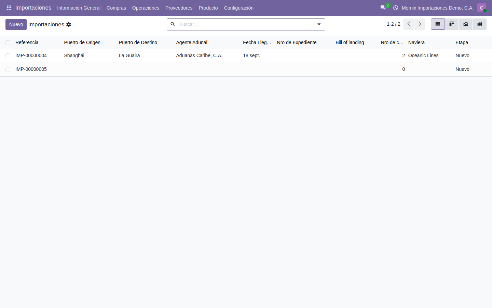
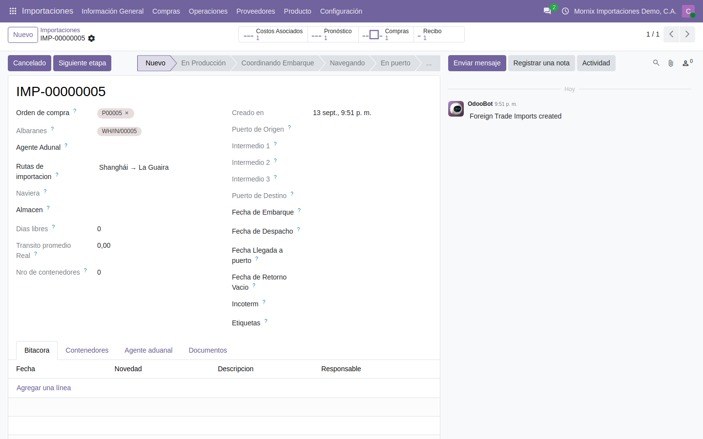
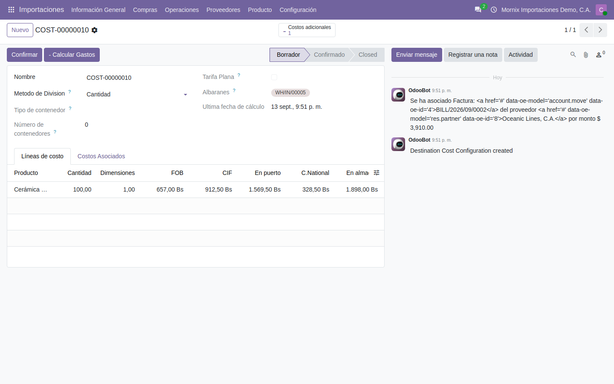
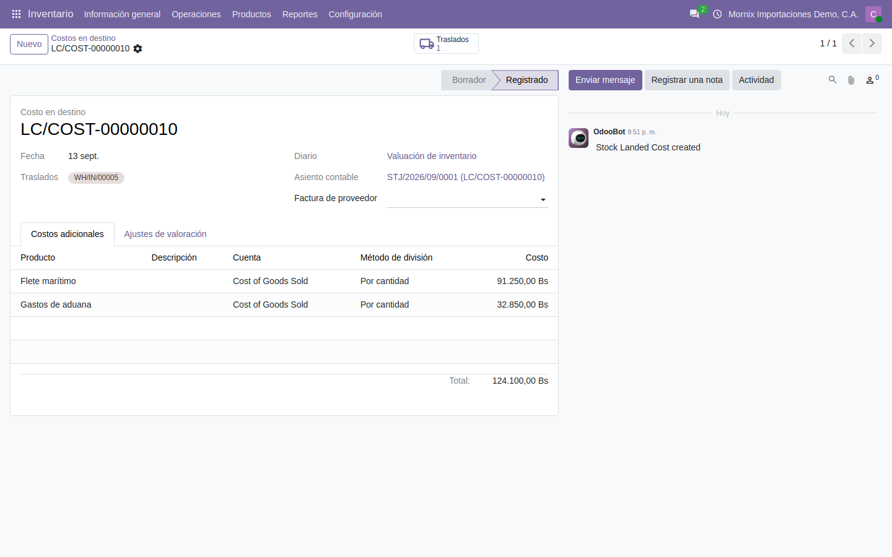

# El expediente de importación

Es el documento que acompaña a la mercancía desde que se compra hasta que entra
al almacén, y el sitio donde se mira en qué punto va cada embarque.

## 1. Abrir el expediente

**Importaciones → Información General → Importaciones.**



**Nuevo** abre un expediente con folio propio —`IMP-00000001`, `IMP-00000002`…—
que asigna el sistema. El «Nuevo folio» que se ve mientras se llena es solo el
marcador de pantalla: el folio real aparece al guardar.



Lo que hay que llenar:

| Campo | Notas |
|---|---|
| **Orden de compra** | Obligatorio: el expediente existe por una compra |
| **Agente aduanal** | Solo salen los contactos marcados como agente aduanal |
| **Rutas de importación** | Al elegirla, propone naviera, puertos y días libres |
| **Almacén** | Dónde se recibe la mercancía |
| **Fechas** | Embarque, despacho, llegada a puerto y retorno del vacío |
| **Etiquetas** | Para agrupar y filtrar («urgente», «perecedero») |

> **La naviera y los puertos no se escriben.** Son de solo lectura y los pone la
> ruta. Si hay que cambiarlos para un embarque concreto, se cambia la ruta o se
> crea otra.

## 2. Las pestañas

- **Bitácora** — el diario del expediente: fecha, novedad, descripción y quién
  la registró. Es donde queda por escrito la demora, la inspección o el cambio
  de buque.
- **Contenedores** — uno por línea, con su número y su tipo del catálogo. El
  contador del encabezado los cuenta solo.
- **Agente aduanal** — número y fecha del expediente aduanal.
- **Documentos** — hasta diez adjuntos con su descripción.

## 3. Cómo avanza

El expediente recorre sus etapas con el botón **Siguiente etapa**:

```
Nuevo → En Producción → Coordinando Embarque → Navegando → En puerto
      → Recibido → Folio cerrado
```

y **Cancelado** para el que no llega a puerto.

> **Un expediente solo se borra en «Nuevo».** En cuanto avanza —o en cuanto
> tiene un pedido confirmado o un albarán hecho— el sistema se niega: se
> archiva, no se borra. Es deliberado: el expediente es la trazabilidad de una
> compra internacional.

## 4. Los costos de destino

Cada expediente nace con su **costo de destino** asociado, que es donde se
juntan los gastos del viaje —flete, seguro, aduana, almacenaje, vigilancia— para
repartirlos después sobre el costo de la mercancía.



Desde ahí se generan los **costos adicionales** de Odoo (`stock.landed.cost`),
que son los que suben el costo del producto recibido.

### Cómo llegan los gastos

**No se escriben a mano.** Entran solos al **publicar la factura del
proveedor** —la del flete, la del agente de aduanas— con el **expediente puesto
en la factura**. Cada línea de servicio que sea «costo en destino» se convierte
en un gasto asociado, con su importe en bolívares y en divisa.

> Si los gastos no aparecen, lo que falta casi siempre es el expediente en la
> factura, o que el producto del servicio no tenga marcado «Puede ser costo en
> destino».

### El camino entero, con números

Así queda una importación de principio a fin (es el ejemplo comprobado en la
base de pruebas):

| Paso | Importe |
|---|---|
| Compra: 100 unidades a 18 USD | 1.800 USD = 65.700 Bs |
| Flete marítimo | 2.500 USD = 91.250 Bs |
| Gastos de aduana | 900 USD = 32.850 Bs |
| **Costo final de la mercancía** | **189.800 Bs — 1.898 Bs por unidad** |

El botón **Crear costo adicional** arma el documento de Odoo con una línea por
gasto; al validarlo, el costo sube y queda el asiento de valoración.



> **Ojo con el producto.** En Odoo 20 un producto de tipo «bienes» que **no
> esté marcado como almacenable** deja hacer todo el camino —se recibe, se
> reparte, el costo unitario sube— **sin generar un solo asiento contable**. Si
> el valor en inventario sale 0 con el costo unitario ya subido, es eso.

> **La contrapartida del gasto la elige el sistema**, y hoy toma la primera
> cuenta de gasto que encuentra —en el ejemplo, *Cost of Goods Sold*—. Si su
> contabilidad necesita otra, hay que decirlo: está anotado como pendiente.

> **Hace falta el permiso «Inventario / Administrador»** para abrir esta ficha:
> enseña los costos adicionales, y ese modelo no lo lee un usuario de inventario
> corriente. Con permisos de usuario la pantalla se queda cargando sin decir por
> qué.
