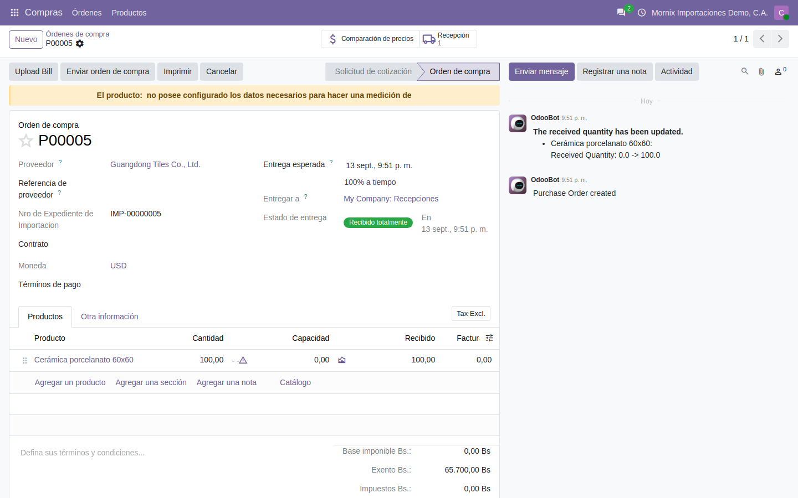

# El expediente de importación

Es el documento que acompaña a la mercancía desde que se compra hasta que entra
al almacén, y el sitio donde se mira en qué punto va cada embarque.

**Para qué**: que cualquiera —compras, almacén, contabilidad, gerencia— sepa en
qué etapa está un embarque, qué contenedores trae, qué pasó por el camino y
cuánto lleva gastado, sin preguntarle al que lleva la importación.

**Por qué un expediente y no la orden de compra**: la orden de compra termina
cuando se recibe y se factura. La importación tiene un mes de vida entre las
dos, con eventos que no caben en una compra —zarpe, escalas, llegada a puerto,
nacionalización, retorno del contenedor— y gastos de otros proveedores que hay
que atarle. El expediente es el hilo que los une; la orden de compra es una de
sus piezas.

## El flujo

1. **El proveedor** queda marcado como extranjero.
2. **Se crea la orden de compra** al proveedor extranjero y se confirma.
3. **Se abre el expediente** y se le enlaza la compra.
4. **Avanza por etapas** mientras la mercancía viaja; la bitácora y los
   contenedores se registran por el camino.
5. **Se recibe** la mercancía en el almacén.
6. **Se reparte el costo** del viaje sobre la mercancía —eso es la guía
   siguiente, [El costo de destino](03-el-costo-de-destino.md).

**Ejemplo que seguimos**: 100 unidades de baldosas a 18 $ compradas a
Guangdong Tiles Co., Ltd., de Shanghái a La Guaira por Oceanic Lines, a 36,50
Bs por dólar.

## 1. El proveedor extranjero

**Por qué**: el módulo distingue la compra internacional por el **tipo de
persona** del proveedor: solo las órdenes a un proveedor **no domiciliado**
ofrecen el campo del expediente. Es la misma marca que usa la localización para
no pedirle RIF venezolano y para no retenerle IVA: un dato, tres consecuencias.

### Paso a paso

1. **Contactos → abrir el proveedor** (o **Nuevo**).
2. **Tipo de contacto**: *Compañía*.
3. **Tipo de Persona compañía**: **PJND Persona Jurídica No Domiciliada**. Es lo
   que le dice al sistema que no lleva RIF venezolano y que sus compras son
   importaciones.
4. **País** del proveedor.
5. **Guardar.**

**Ejemplo.** «Guangdong Tiles Co., Ltd.», *Compañía*, **PJND**, país China. Si
se dejara como *PJ Persona Jurídica*, la orden de compra saldría sin el campo
del expediente y la localización pediría un RIF con formato J-…: los dos
síntomas de «se me olvidó el tipo de persona».

## 2. La orden de compra



**Para qué**: es la compra de la mercancía, en la moneda del proveedor. Aporta
al expediente **qué** se importa, **cuánto** y a **qué precio**: el FOB del costo
de destino.

### Paso a paso

1. **Importaciones → Compras → Solicitudes de cotización → Nuevo** (es la misma
   pantalla de Compras, ya filtrada a proveedores extranjeros).
2. **Proveedor**: el del paso 1. Al elegirlo aparece **Nro de Expediente de
   Importacion** en la cabecera. Déjelo vacío por ahora si el expediente aún no
   existe; se enlaza desde el expediente en el paso 3.
3. **Moneda**: la de la compra, normalmente **USD**. La **Tasa** se llena con la
   del día.
4. Pestaña **Productos → Agregar un producto**: la mercancía, cantidad y precio
   en divisa. En cada línea, el **sello del certificado** dice si el producto
   está amparado (verde), por vencer (ámbar), vencido (rojo) o sin certificado
   (gris).
5. Pestaña **Otra información**: **Incoterm**, y cuando la aduana los emita,
   **N° de Planilla de Importación**, **N° de Expediente de Importación**
   (el de la aduana, distinto del folio interno) y su fecha.
6. **Confirmar orden.** El estado pasa a **Orden de compra** y se crea la
   **Recepción** (botón arriba).

**Ejemplo.** Proveedor Guangdong Tiles, **Moneda USD**, **Tasa 36,50**, una
línea: «Baldosa cerámica 60×60», **100** unidades a **18,00 $** → total
**1.800,00 $ = 65.700,00 Bs**. Incoterm **FOB**: el precio incluye poner la
mercancía a bordo en Shanghái; el flete y el seguro los paga el comprador y por
eso llegarán como facturas aparte al costo de destino. Con Incoterm **CIF** el
precio ya incluiría flete y seguro y no habría factura de la naviera que
repartir.

**Por qué la tasa importa aquí**: los 65.700 Bs son el FOB en bolívares del
costo de destino. Si la compra se confirma un día en que la tasa no está
cargada, el FOB sale a 0 y todo el reparto nace mal.

## 3. Abrir el expediente

**Importaciones → Información General → Importaciones.**


### Paso a paso

1. **Importaciones → Información General → Importaciones → Nuevo.**
2. **Orden de compra**: elija la orden del paso 2. Solo salen las de
   proveedores extranjeros que no tengan ya expediente. Puede enlazar varias.
3. **Rutas de importación**: la ruta. Al elegirla se rellenan solos **Naviera**,
   **Puerto de Origen**, los **Intermedios**, **Puerto de Destino** y **Días
   libres**: son de solo lectura, los pone la ruta.
4. **Agente aduanal**: solo salen los contactos marcados como agente aduanal.
5. **Almacén**: dónde se recibe la mercancía.
6. Fechas: **Fecha de Embarque**, **Fecha de Despacho**, **Fecha Llegada a
   puerto**, **Fecha de Retorno Vacío**. Se van completando según se sepan.
7. **Incoterm** y **Etiquetas**.
8. **Guardar.** El expediente toma su folio —`IMP-00000001`— y nace con su
   **previsión** y su **costo de destino** enlazados (botones **Pronóstico** y
   **Costos Asociados**, arriba).


**Por qué varias órdenes en un expediente**: un contenedor suele llevar
mercancía de dos o tres pedidos al mismo proveedor, o de proveedores distintos
consolidados por un agente. El flete es uno; el costo de destino lo reparte
entre todas las líneas de todas las órdenes enlazadas.

**Ejemplo.** `IMP-00000001`: orden `P00001` (las baldosas), ruta `SHA-LAG` —se
rellenan Oceanic Lines, `CNSHA`, `VELAG`, 7 días libres—, agente aduanal
**Aduanas Caribe, C.A.**, almacén **Almacén La Guaira**, Incoterm FOB, etiqueta
«Urgente». Al guardar, el botón **Costos Asociados** ya enseña un costo de
destino vacío esperando facturas.

> **La naviera y los puertos no se escriben.** Si hay que cambiarlos para un
> embarque concreto, se cambia la ruta o se crea otra. Así el tránsito promedio
> y las tarifas de demora se calculan sobre datos comparables.

## 4. Las pestañas: lo que se registra por el camino

### Contenedores

**Para qué**: saber qué contenedores trae el embarque, por número, para
seguirlos con la naviera y calcular la demora de cada uno al devolverlo.

1. Pestaña **Contenedores → Agregar una línea**.
2. **Nro Container**: el número del contenedor (`MSCU-4412239`).
3. **Tipo de contenedor**: del catálogo.
4. El contador **Nro de contenedores** de la cabecera se actualiza solo.

**Ejemplo.** Un **20' dry** `MSCU-4412239`. Llega a puerto el 05/10, se
devuelve vacío el 17/10: 12 días, 7 libres, **5 de demora**. A 85 $ por día
según la tarifa de Oceanic Lines, 425 $ que la naviera facturará y que
entrarán al costo de destino como gasto nacional.

### Bitácora

**Para qué**: es el diario del expediente: lo que queda por escrito para cuando
alguien pregunte qué pasó y por qué la mercancía tardó una semana más.

1. Pestaña **Bitácora → Agregar una línea**.
2. **Fecha**, **Novedad** (el tipo: demora, inspección, cambio de buque…),
   **Descripción**. El **Responsable** se pone solo.

**Ejemplo.**

| Fecha | Novedad | Descripción |
|---|---|---|
| 01/09/2026 | Embarque | Zarpó en el buque *Ocean Star* v. 0912 |
| 20/09/2026 | Cambio de buque | Trasbordo en Cartagena; nueva ETA 08/10 |
| 08/10/2026 | Inspección | Reconocimiento físico ordenado por la aduana; 2 días |
| 12/10/2026 | Nacionalización | Planilla pagada; carga liberada |

Con eso, cuando el costo de destino muestre 425 $ de demora, la bitácora
explica que fueron los dos días de inspección y el trasbordo.

### Agente aduanal

Número y fecha del expediente aduanal, y los datos que el agente va entregando.

### Documentos

Hasta diez adjuntos con su descripción: BL, factura comercial, lista de empaque,
certificados, planilla. **Por qué aquí y no en el chatter**: son los papeles que
la aduana o una auditoría piden por nombre; un adjunto etiquetado «BL» se
encuentra; uno perdido entre cuarenta mensajes, no.

## 5. Avanzar por etapas

El expediente recorre sus etapas con el botón **Siguiente etapa**:

```
Nuevo → En Producción → Coordinando Embarque → Navegando → En puerto
      → Recibo → Folio cerrado
```

**Para qué**: que la lista de expedientes diga de un vistazo dónde está cada
embarque, y que cada etapa exija lo que hace falta para la siguiente.

**Por qué las etapas tienen requisitos**: desde **Navegando** el agente aduanal
y el almacén son obligatorios porque, con el buque en el mar, ya no hay tiempo
de buscarlos cuando llegue: la aduana empieza a contar días libres desde la
descarga.

### Paso a paso

1. Con la mercancía en fabricación: **Siguiente etapa** → **En Producción**.
2. Cuando se coordina el embarque: **Siguiente etapa** → **Coordinando
   Embarque**.
3. Zarpó: **Siguiente etapa** → **Navegando**. **Desde aquí el Agente aduanal
   y el Almacén son obligatorios**: si están vacíos, el sistema no deja
   avanzar.
4. Llegó: **Siguiente etapa** → **En puerto**. Aparece **Enviar por correo**
   para avisar.
5. Salió de aduana y entró al almacén: **Siguiente etapa** → **Recibo**
   (así está rotulado el estado «recibido»).
6. Con el costo repartido y todo cuadrado: **Cerrar importación** → **Folio
   cerrado**. Ya no se edita.
7. **Cancelado** en cualquier momento antes de cerrar. **Borrador** devuelve
   un expediente cerrado o cancelado al inicio, si hace falta corregir.

**Ejemplo, con fechas:**

| Etapa | Fecha | Qué la disparó |
|---|---|---|
| Nuevo | 01/08/2026 | Se confirma la compra y se abre el expediente |
| En Producción | 05/08/2026 | El proveedor confirma fecha de fabricación |
| Coordinando Embarque | 25/08/2026 | Booking con Oceanic Lines |
| Navegando | 01/09/2026 | Zarpe (**Fecha de Embarque**) |
| En puerto | 05/10/2026 | Descarga en La Guaira (**Fecha Llegada a puerto**) |
| Recibo | 12/10/2026 | Recepción validada en el almacén |
| Folio cerrado | 20/10/2026 | Costo de destino repartido y facturas registradas |

Tránsito real: 34 días contra 35 estimados; es lo que alimenta el **Tránsito
Promedio Real** de la ruta.

> **Un expediente solo se borra en «Nuevo».** En cuanto avanza —o en cuanto
> tiene un pedido confirmado o un albarán hecho— el sistema se niega: se
> archiva, no se borra. Es deliberado: el expediente es la trazabilidad de una
> compra internacional, y la aduana puede pedirla años después.

## 6. Recibir la mercancía

**Para qué**: meter la mercancía al inventario, con su cantidad y su valor de
compra. Es el paso que hace posible el reparto del costo: sin recepción no hay
nada sobre lo que repartir.

### Paso a paso

1. En el expediente, botón **Recibo** (arriba; también desde la orden de
   compra, **Recepción**, o en **Inventario → Recepciones**).
2. Abra el albarán. En cada línea, la **cantidad** recibida.
3. **Validar.** El albarán pasa a **Hecho**, la mercancía entra al almacén y el
   albarán aparece en el campo **Albaranes** del expediente.
4. Si el producto es **almacenable** (casilla **Rastrear inventario** en su
   ficha), la recepción queda valorada y el reparto del costo tendrá efecto
   contable. Si no lo es, ver el aviso de la guía siguiente.

**Ejemplo.** Se reciben las **100** baldosas. El inventario sube 100 unidades
valoradas a **657,00 Bs** cada una (18 $ × 36,50): **65.700,00 Bs** en total.
Ese 657 es el «coste previo» que el reparto del costo va a subir hasta 1.898.
Si llegaran 98 porque dos se rompieron, se reciben 98: el flete se reparte
entre 98 y cada unidad carga un poco más.

Con la mercancía recibida, el camino sigue en
[El costo de destino](03-el-costo-de-destino.md).
