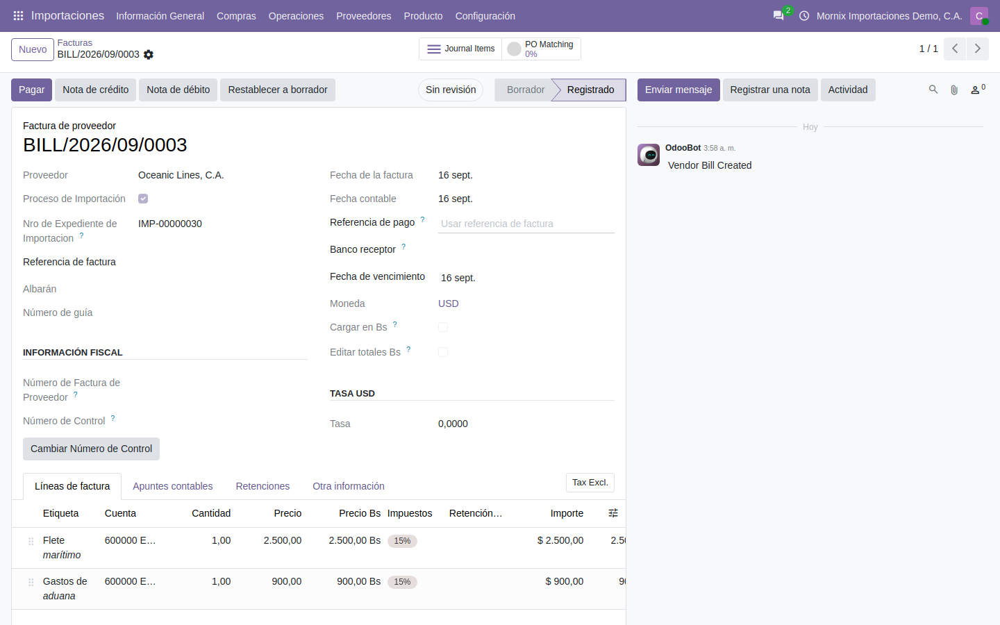

# El costo de destino

Es donde los gastos del viaje —flete, seguro, aduana, almacenaje— acaban
sumados al costo de la mercancía. Cada expediente nace con su costo de destino
enlazado; esta guía es cómo se llena y cómo se reparte.

**Para qué**: saber cuánto costó **de verdad** cada unidad puesta en el almacén,
para valorar el inventario bien y para fijar el precio de venta con margen
real. Una baldosa que se compró a 18 $ no cuesta 18 $: cuesta 18 $ más lo que
costó traerla.

**Por qué no basta con contabilizar los gastos**: si la factura de la naviera va
a una cuenta de gasto del mes, el estado de resultados de octubre carga con un
flete de mercancía que se venderá en enero, y el inventario queda valorado a
657 Bs la unidad cuando costó 1.898. Repartir el gasto sobre la mercancía lo
lleva al inventario y sale al costo de ventas cuando cada unidad se vende.

## El flujo

1. **Llegan las facturas** del viaje —la naviera, el agente de aduanas— y se
   registran **con el expediente puesto**. Los gastos entran solos al costo de
   destino.
2. **Se calcula**: el costo por unidad en puerto y en almacén.
3. **Se reparte**: se crea el costo adicional de Odoo, se calcula y se valida.
   El costo del producto sube y queda el asiento.

Así queda el ejemplo comprobado en la base de pruebas:

| Paso | Importe |
|---|---|
| Compra: 100 unidades a 18 USD | 1.800 USD = 65.700 Bs |
| Flete marítimo | 2.500 USD = 91.250 Bs |
| Gastos de aduana | 900 USD = 32.850 Bs |
| **Costo final de la mercancía** | **189.800 Bs — 1.898 Bs por unidad** |

El flete y la aduana suman **3.400 $ contra 1.800 $ de mercancía**: traerla costó
casi el doble que comprarla. Vender la baldosa a 25 $ «porque costó 18» sería
vender por debajo del costo.

## 1. Registrar la factura del viaje

**Por qué los gastos no se escriben a mano** en el costo de destino: entran al
**publicar la factura del proveedor** con el expediente puesto. Así cada gasto
tiene detrás un documento contable, el importe en bolívares es el de la
factura —a su tasa, no a la del día del reparto— y no hay forma de que el costo
de destino diga una cifra y contabilidad otra.

### Paso a paso

1. **Importaciones → Proveedores → Facturas → Nuevo** (es la pantalla de
   facturas de proveedor de Contabilidad).
2. **Proveedor**: la naviera, el agente de aduanas, la aseguradora.
3. Marque la casilla **Proceso de Importación**. Al marcarla aparece **Nro de
   Expediente de Importacion**: elija el expediente. **Es el campo que lo
   conecta todo**: sin él, la factura se contabiliza igual pero el costo de
   destino no se entera.
4. **Fecha de la factura**, **Número de Factura de Proveedor** y **Número de
   Control** (los pide la localización).
5. **Moneda**: la de la factura. Si viene en divisa, la **Tasa** se toma del
   día; el importe en bolívares lo calcula el sistema.
6. Pestaña **Líneas de factura → Agregar una línea**: el servicio (*Flete
   marítimo*, *Gastos de aduana*…), cantidad e importe. **Tienen que ser los
   productos de servicio marcados como costo en destino**: una línea con otro
   producto no llega al reparto.
7. **Confirmar.** La factura pasa a **Registrado**.
8. Resultado: en el costo de destino del expediente, pestaña **Costos
   Asociados**, aparece una línea por cada servicio de la factura, con su
   importe en bolívares y en divisa. Y el chatter del costo de destino registra
   qué factura la trajo.

**Ejemplo.** Factura de **Oceanic Lines** en USD, **Proceso de Importación**
marcado, expediente `IMP-00000001`, dos líneas: *Flete marítimo* 1 × 2.500,00 $
y *Gastos de aduana* 1 × 900,00 $ (en la demo el mismo proveedor factura los
dos; en la realidad la aduana la factura el agente). Total **3.400,00 $ =
124.100,00 Bs** a 36,50. Al confirmar, **Costos Asociados** muestra:

| Concepto | Tipo | USD | Bs | Factura |
|---|---|---:|---:|---|
| Flete marítimo | CIF | 2.500,00 | 91.250,00 | BILL/2026/09/0001 |
| Gastos de aduana | Costo nacional | 900,00 | 32.850,00 | BILL/2026/09/0001 |

Si la factura de la naviera llega a 37,20 el 10 de octubre, el flete entra a
93.000,00 Bs y el costo unitario final será 1.915,50: **la tasa de cada factura
es la que cuenta**, porque es la que se pagó.

> Si los gastos no aparecen, lo que falta casi siempre es el expediente en la
> factura —la casilla marcada pero el número sin elegir—, o que el producto del
> servicio no tenga marcado **Puede ser costo en destino**.

> Si la factura se devuelve a borrador (**Restablecer a borrador**), sus gastos
> asociados **se quitan** del costo de destino, y vuelven al confirmarla otra
> vez. No quedan gastos huérfanos.

## 2. Calcular el costo de destino

**Para qué**: repartir los gastos entre los productos del expediente y obtener
el costo unitario **en puerto** y **en almacén**, en las dos monedas, **antes**
de tocar la contabilidad. Es el paso de revisar: aquí se ve si el número tiene
sentido.

### Paso a paso

1. Abra el expediente y pulse el botón **Costos Asociados** (arriba), o
   **Importaciones → Operaciones → Costo en destino**.
2. **Método de División**: cómo se reparten los gastos entre los productos.
   - *Cantidad*: a partes iguales por unidad.
   - *Peso* / *Volumen*: proporcional al peso o al volumen del producto (hay
     que tenerlos en la ficha).
   - *Capacidad del contenedor*: según cuánto ocupa cada producto en el
     contenedor; pide **Tipo de contenedor** y **Número de contenedores**.
3. **Tarifa Plana**: márquela solo si se paga un monto fijo por el viaje en
   lugar de los gastos detallados; entonces escriba el importe en divisa.
4. **Calcular Gastos.** El sistema lee las órdenes de compra del expediente y
   arma la pestaña **Líneas de costo**: una fila por producto con su cantidad y:

   | Columna | Qué es |
   |---|---|
   | **FOB** | El precio de compra por unidad, en bolívares y en divisa |
   | **CIF** | Lo que le toca de flete y seguro |
   | **Costo nacional** | Lo que le toca de aduana, almacenaje, flete terrestre y gastos generales |
   | **En puerto** | FOB + CIF |
   | **En almacén** | En puerto + costo nacional: el costo unitario final |
   | **Precio de venta** | En almacén más el % de utilidad de la ficha del producto |

5. Revise que **En almacén** cuadre con lo que espera. En el ejemplo: 657 de
   FOB + 912,50 de CIF + 328,50 nacional = **1.898 Bs**.
6. **Confirmar** deja el cálculo en firme (**Confirmado**). Si hay que
   retocar, **Restablecer a borrador**.

### Ejemplo: la línea de las baldosas, por cantidad

| Columna | Cálculo | Bs | USD |
|---|---|---:|---:|
| FOB | 18 $ × 36,50 | 657,00 | 18,00 |
| CIF | 91.250 ÷ 100 unidades | 912,50 | 25,00 |
| **En puerto** | FOB + CIF | **1.569,50** | **43,00** |
| Costo nacional | 32.850 ÷ 100 | 328,50 | 9,00 |
| **En almacén** | En puerto + nacional | **1.898,00** | **52,00** |
| Precio de venta | En almacén + 30 % de utilidad | 2.467,40 | 67,60 |

La baldosa que se compró a 18 $ vale 43 $ en el puerto y 52 $ en el almacén. El
precio de venta lo propone el sistema con el porcentaje de utilidad de la ficha
del producto; con 30 %, 67,60 $.

### Por qué importa el método de división

Con un solo producto todos los métodos dan lo mismo. Con dos, no. Supóngase que
en el mismo contenedor viajan **100 baldosas** (18 $, 20 kg cada una) y **20
lavamanos** (45 $, 15 kg cada uno), y los mismos 3.400 $ de gastos
(124.100 Bs):

| Método | Baldosas (100 u, 2.000 kg) | Lavamanos (20 u, 300 kg) |
|---|---:|---:|
| **Cantidad** (120 unidades: 1.034,17 Bs por unidad) | 103.416,67 Bs → **+1.034,17 por baldosa** | 20.683,33 Bs → **+1.034,17 por lavamanos** |
| **Peso** (2.300 kg: 53,96 Bs por kg) | 107.913,04 Bs → **+1.079,13 por baldosa** | 16.186,96 Bs → **+809,35 por lavamanos** |

Por cantidad, el lavamanos —que pesa menos y ocupa menos— carga tanto flete
como una baldosa; por peso, carga lo que pesa. El total repartido es el mismo
(124.100 Bs): lo que cambia es **qué producto lo absorbe**, y con él su margen.
El método bueno es el que se parece a cómo cobra la naviera: por peso o volumen
para carga suelta, por capacidad del contenedor si el contenedor es completo.

## 3. Repartir sobre la mercancía

El reparto es un **costo adicional** de Odoo (`Inventario → Operaciones →
Costos en destino`): sube el costo del producto recibido y deja el asiento.

**Por qué dos pasos —calcular y repartir— y no uno**: el cálculo (apartado 2)
es una hoja de trabajo que se puede rehacer cuantas veces haga falta; el reparto
**toca el inventario y la contabilidad**, y una vez validado se deshace solo con
un contra-asiento. Se calcula hasta que cuadre; se reparte una vez.

### Paso a paso

1. En el costo de destino, pulse **Crear costos de destino**. Necesita que la
   recepción esté validada (campo **Albaranes** lleno) y que haya gastos
   asociados; si falta algo, lo dice en un aviso y no crea nada.
2. Se abre el **costo adicional** ya armado: los **Traslados** (la recepción),
   una línea por gasto en **Costos adicionales**, con su **Cuenta**, su
   **Método de división**, su **Costo** en bolívares y, al lado, la **Tasa** de
   la factura del gasto y su **Costo $**.
3. **Calcular.** La pestaña **Ajustes de valoración** enseña, por producto, el
   coste previo y lo que se le reparte.
4. **Validar.** El estado pasa a **Registrado**, se genera el **Asiento
   contable** (`STJ/…`) y el costo unitario del producto sube.
5. Compruebe en la ficha del producto: **Costo** debe ser el «En almacén» del
   paso 2 (1.898 Bs en el ejemplo), y **Inventario → Reportes → Valoración**
   debe sumar mercancía más gastos (189.800 Bs).

### Ejemplo: lo que deja el reparto

**Ajustes de valoración**, tras **Calcular**:

| Producto | Cantidad | Coste previo | Reparto | Coste nuevo | Valor original $ | Costo adicional $ | Valor nuevo $ |
|---|---:|---:|---:|---:|---:|---:|---:|
| Baldosa cerámica 60×60 | 100 | 65.700,00 | +124.100,00 | 189.800,00 | 1.800,00 | +3.400,00 | 5.200,00 |
| *por unidad* | | *657,00* | *+1.241,00* | *1.898,00* | *18,00* | *+34,00* | *52,00* |

**Asiento** `STJ/2026/10/0001`, tras **Validar**:

| Cuenta | Debe | Haber |
|---|---:|---:|
| Inventario de mercancías | 124.100,00 | |
| Contrapartida del gasto (ver aviso abajo) | | 124.100,00 |

Lo que se lee: el inventario pasó de 65.700 a **189.800 Bs**; la contrapartida
descarga el gasto de la factura de la naviera, que ya no pesa en el resultado
del mes: saldrá al costo de ventas baldosa a baldosa, a 1.898 cada una.

**Y si ya se vendió parte:** si al repartir quedan 80 baldosas en existencia,
Odoo sube el costo de esas 80 y lleva la parte de las 20 vendidas directo al
costo de ventas del periodo. Por eso conviene repartir **antes** de empezar a
vender la mercancía del contenedor.

## 4. Lo que hay que saber

> **Ojo con el producto.** En Odoo 20 un producto de tipo «bienes» que **no
> esté marcado como almacenable** («Rastrear inventario» en su ficha) deja
> hacer todo el camino —se recibe, se reparte, el costo unitario sube— **sin
> generar un solo asiento contable**. Si el valor en inventario sale 0 con el
> costo unitario ya subido, es eso.

> **La contrapartida del gasto la elige el sistema**, y hoy toma la primera
> cuenta de gasto que encuentra —en el ejemplo, *Cost of Goods Sold*—, no la
> cuenta de la factura. Si su contabilidad necesita otra, hay que decirlo:
> está anotado como pendiente.

> **El reparto también va en divisa.** Cada gasto del costo adicional lleva su
> **Costo $** y su **Tasa** (la de su factura), y cada ajuste su **Valor original
> $** y **Costo adicional $**. Al validar, el valor en divisa de la recepción
> sube con el reparto y el **Coste promedio $** del producto —y el **Costo $**
> de su ficha— se recalculan. El detalle está en la guía
> [El costo en divisa](../20-inventario/02-el-costo-en-divisa.md).

> **Permisos.** Para abrir el costo de destino hace falta **Inventario /
> Administrador** (enseña los costos adicionales); para registrar la factura
> del viaje con la localización puesta, **Contabilidad / características
> completas**. Con menos permisos la pantalla se queda cargando o da «Error de
> acceso», sin decir por qué.

## 5. Resumen: de 18 $ a 52 $

| Momento | Costo unitario | Quién lo puso |
|---|---:|---|
| Precio del proveedor (FOB) | 18,00 $ = 657,00 Bs | La orden de compra, a su tasa |
| + flete y seguro (CIF) | 43,00 $ = 1.569,50 Bs | La factura de la naviera, repartida |
| + aduana y gastos nacionales (en almacén) | 52,00 $ = 1.898,00 Bs | La factura del agente, repartida |
| Precio de venta sugerido (30 %) | 67,60 $ = 2.467,40 Bs | El % de utilidad de la ficha |

Cada cifra tiene detrás un documento —una orden, dos facturas, un costo
adicional con su asiento—, y el expediente los enlaza todos.
